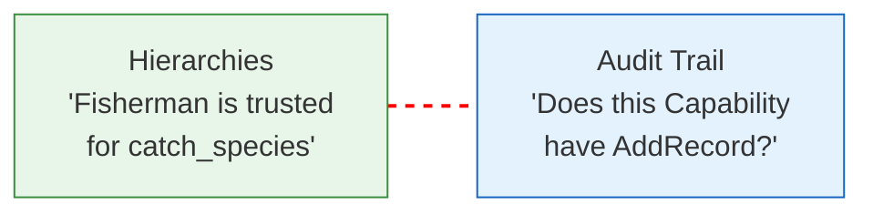
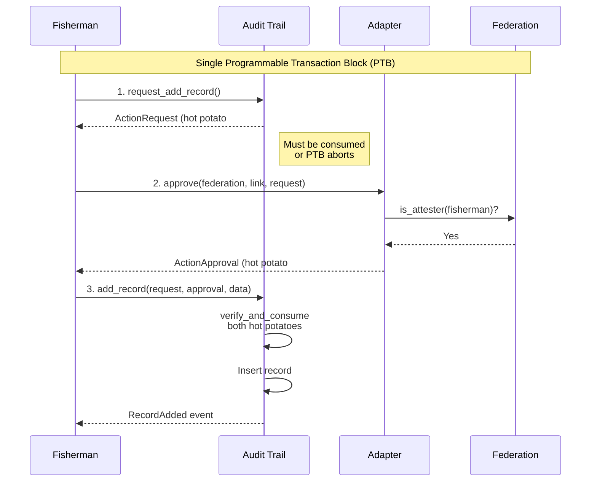
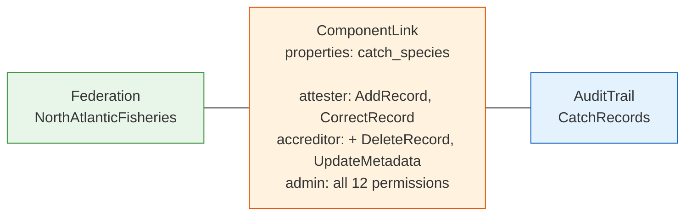
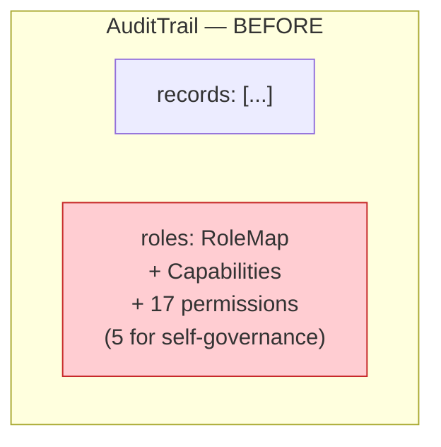
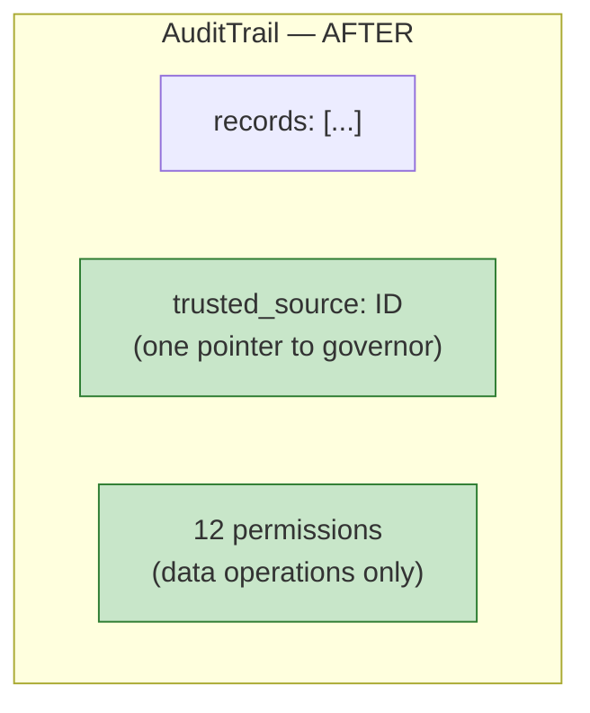
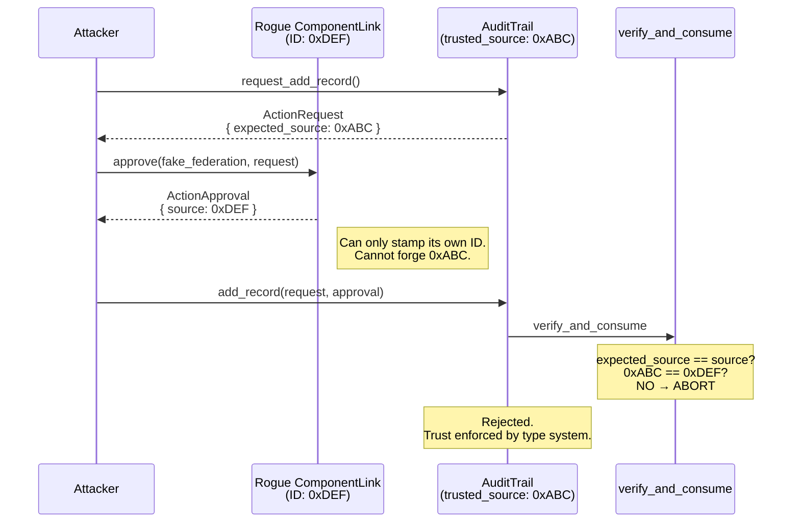
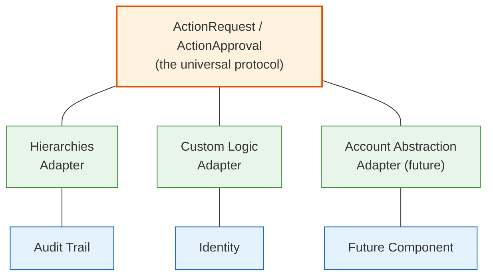

# Access Controller Bridge — TL;DR

**What**: A universal pattern for connecting Hierarchies (who is trusted) with Audit Trails (who can write records) — and any future component that needs authorization.

**Reading time**: ~15 minutes

> For the full technical proposal with Move code, threat analysis, and GDPR/ISO 27001 review, see [access-controller-bridge.md](access-controller-bridge.md).

---

## The Problem in 30 Seconds

Today, two IOTA Trust Framework components manage authorization **independently**:

| Component | What it does | How it handles authorization |
| --- | --- | --- |
| **Hierarchies** | Manages trust delegation — "the Maritime Authority trusts this fisherman to report catches" | Federation with root authorities, accreditors, attesters |
| **Audit Trails** | Stores tamper-proof records — "Catch #42: Atlantic Cod, 320kg" | Its own built-in RBAC system (roles, capabilities, 17 permissions) |

**The disconnect**: A fisherman accredited by a federation still needs a *separately issued* Capability token from each individual audit trail to write records. The federation's trust and the trail's permissions are completely unaware of each other.



**No connection between the two systems.**

---

## The Core Idea

**Remove the built-in RBAC from the audit trail. Make it a pure data container. Let hierarchies (or any authority) provide authorization externally.**

The mechanism: two "hot potato" objects that flow through a single transaction.

### What Is a Hot Potato?

A Move object without `drop` ability. Once created, it **must** be consumed before the transaction ends — otherwise the entire transaction aborts. You literally cannot ignore it.

### The Three-Step Flow



**Step 1**: The trail creates an `ActionRequest` — "someone wants to AddRecord on trail X."

**Step 2**: The adapter checks the federation — "is this fisherman accredited for catch_species?" — and produces an `ActionApproval`.

**Step 3**: The trail verifies the approval matches the request and adds the record. Both hot potatoes are consumed.

If step 2 fails (fisherman not accredited), the ActionRequest can't be consumed, and the **entire transaction aborts**. No record is added. Authorization is structurally enforced.

---

## How Hierarchies Connects — Without Being Misused

Hierarchies is a **trust delegation framework**, not a permission database. It manages domain-level trust: "this fisherman is trusted to report catches." It does NOT store "User X can click button Y."

The bridge respects this by using two natural dimensions that already exist in hierarchies:

### Dimension 1: Your Role = What Type of Operations You Can Do

| Your Federation Role | What You Can Do on Components |
| --- | --- |
| **Root Authority** (Maritime Authority) | Admin: delete trails, migrate, configure locking |
| **Accreditor** (Regional Inspector) | Manage: delete/correct records, update metadata |
| **Attester** (Licensed Fisherman) | Write: add records, correct own records |

### Dimension 2: Your Property Scope = Which Components You Can Access

- Accredited for "catch_species" → can access the **CatchRecords** trail
- Accredited for "vessel_safety" → can access the **SafetyInspections** trail
- Not accredited for either → can access **nothing**

A **ComponentLink** object connects a specific federation to a specific trail, defining this mapping:



---

## What Changes in the Audit Trail

### Before (current)



### After (proposed)



The 5 self-governance permissions (`AddRoles`, `UpdateRoles`, `DeleteRoles`, `AddCapabilities`, `RevokeCapabilities`) disappear. The trail no longer manages its own access control.

---

## The Security Model: Why Rogue Adapters Can't Cheat

A critical question: what stops an attacker from creating their own federation and ComponentLink to bypass authorization?

**Answer**: Protocol-level source binding via Move's field privacy.

The trail stores the ID of the ComponentLink it trusts (`trusted_source`). Every ActionRequest includes this ID. Every ActionApproval includes the actual ID of the ComponentLink that produced it — and this ID is **unforgeable** because:

1. The `ActionApproval` can only be created through a constructor that requires `&UID` (a reference to the authority object's internal identifier)
2. `&UID` is only accessible from within the module that defines the struct (Move's field privacy)
3. A malicious module **cannot access** the real ComponentLink's UID
4. Object IDs are unique and assigned by the runtime — you can't create an object with a chosen ID



---

## Permission Lifecycle — All From the Federation

Every permission change is a federation operation. The trail is never touched.

| Action | What You Do | Trail Changed? |
| --- | --- | --- |
| **Grant access** | Accredit the fisherman in the federation | No |
| **Revoke access** | Revoke accreditation in the federation | No |
| **Promote** (attester → accreditor) | Grant accreditation-to-accredit | No |
| **Demote** (accreditor → attester) | Revoke accreditation-to-accredit | No |
| **Change what attesters can do** | Update the ComponentLink permissions | No |
| **Revoke an entire property domain** | Revoke property in federation | No |

**Revocation is immediate.** No stale Capability tokens in wallets. Every operation checks live federation state. The moment accreditation is revoked, all access stops.

---

## Concrete Example: Fisherman Adds a Catch Record

**Setup** (one-time):

1. Maritime Authority creates federation "NorthAtlanticFisheries"
2. Adds property "catch_species" (values: Cod, Haddock, Mackerel)
3. Creates CatchRecords audit trail
4. Creates ComponentLink connecting the federation to the trail
5. Accredits fisherman for "catch_species"

**Daily operation** (every time a fisherman logs a catch):

```move
// Single transaction (PTB):

// 1. Trail creates the request
let request = audit_trail::request_add_record(&trail, ctx);

// 2. Adapter checks federation, produces approval
let approval = hierarchies_adapter::approve(
    &federation, &component_link, &request, clock, ctx,
);

// 3. Trail consumes both, adds the record
audit_trail::add_record(
    &mut trail, request, approval,
    catch_data, some(b"Atlantic Cod, 320kg, Zone 5a"), clock, ctx,
);
```

**If the fisherman's license is suspended**: the inspector revokes their accreditation. Next time step 2 runs, it aborts. No record added. Immediate.

---

## What About Other Authority Sources?

The pattern is not tied to hierarchies. Any system can produce `ActionApproval` objects:



When Account Abstraction ships, it becomes just another adapter. No component changes needed.

---

## Incremental Delivery

| Step | What | Depends On |
| --- | --- | --- |
| **1** | Add `ActionRequest`/`ActionApproval` types to `tf_components` | Nothing |
| **2** | Refactor audit trail: remove embedded RBAC, accept external authorization | Step 1 |
| **3** | Build the hierarchies adapter + ComponentLink (the bridge) | Steps 1 + 2 |
| **4** | AA adapter when Account Abstraction ships | Step 1 |

Each step is independently deployable and valuable.

---

## Key Compliance Notes

The full proposal includes a GDPR and ISO 27001 analysis. The highlights:

**Strengths**:

- Least privilege (three trust levels with escalating permissions)
- Immediate revocation (no stale tokens)
- Full audit trail (every operation is an on-chain event)
- Segregation of duties (governance / management / operations)

**Watch out for**:

- Don't store personal data directly on-chain (use hashes, keep data off-chain) — GDPR right to erasure
- Need audit events for ComponentLink changes — ISO 27001
- Need a recovery mechanism for root authority key loss — single point of failure
- Need rate limiting for compromised attesters

---

## One Sentence Summary

> Remove the audit trail's built-in RBAC. Let hierarchies federations be the authority source. Connect them through a protocol-level hot-potato pattern (ActionRequest/ActionApproval) where trust is enforced by Move's type system — not by whitelists, not by registries, not by the components themselves.
