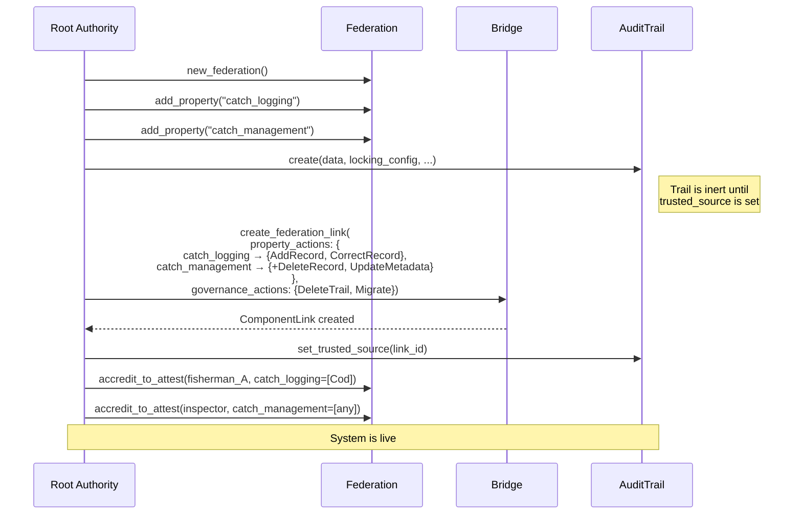
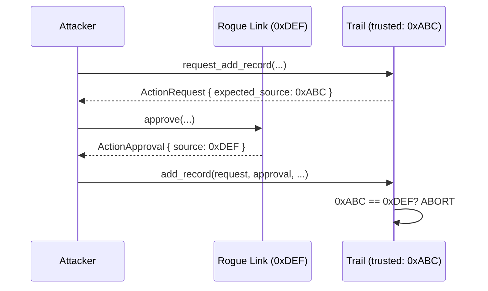
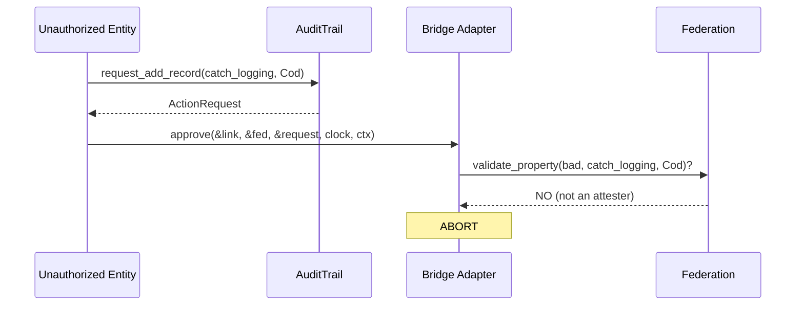
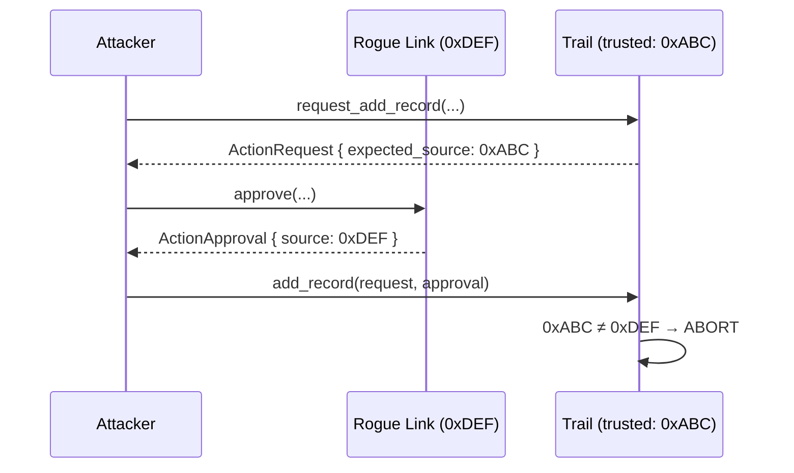
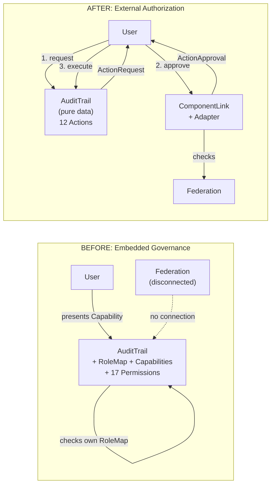

# Access Controller Bridge: Architectural Proposal

## Integrating Hierarchies, Audit Trails, and Future Components via a Universal Authorization Pattern

**Status**: Proposal \
**Date**: 2026-03-20 \
**Scope**: IOTA Trust Framework — cross-component authorization architecture

---

## Table of Contents

1. [Problem Statement](#1-problem-statement)
2. [Current State Analysis](#2-current-state-analysis)
3. [Architectural Critique](#3-architectural-critique)
4. [Guiding Principles](#4-guiding-principles)
5. [The Authorization Receipt Pattern](#5-the-authorization-receipt-pattern)
6. [Attester as the Output of Hierarchies](#6-attester-as-the-output-of-hierarchies)
7. [The Type System: Phantom P + Concrete Fields](#7-the-type-system-phantom-p--concrete-fields)
8. [Detailed Design](#8-detailed-design)
9. [The ComponentLink](#9-the-componentlink)
10. [The Approve Flow](#10-the-approve-flow)
11. [Standalone Mode](#11-standalone-mode)
12. [Impact on the Audit Trail](#12-impact-on-the-audit-trail)
13. [Permission Lifecycle](#13-permission-lifecycle)
14. [Account Abstraction Considerations](#14-account-abstraction-considerations)
15. [Security Analysis](#15-security-analysis)
16. [Compliance Analysis (GDPR, ISO 27001)](#16-compliance-analysis-gdpr-iso-27001)
17. [Trade-offs and Alternatives Considered](#17-trade-offs-and-alternatives-considered)
18. [Conclusion](#18-conclusion)

- [Appendix A: Architecture Diagram](#appendix-a-architecture-diagram)
- [Appendix B: End-to-End Examples](#appendix-b-end-to-end-examples)
- [Appendix C: Flow Diagrams](#appendix-c-flow-diagrams)
- [Appendix D: Referenced Materials](#appendix-d-referenced-materials)

---

## 1. Problem Statement

The IOTA Trust Framework is a modular suite of components — Hierarchies, Notarization (including Audit Trails), Identity — that together establish trust in digital multi-stakeholder environments.

Currently these components solve authorization independently:

- **Hierarchies** manages delegated trust through federations, accreditations, and attestations. It answers: *"Is entity X trusted to make claims about property Y?"*
- **Audit Trails** embeds a full RBAC system (`RoleMap` from `tf_components`) inside each trail instance. It answers: *"Can holder of Capability C perform action A on this specific trail?"*
- **Notarization** (base) relies on Move's native object ownership — owner controls the object.

There is no mechanism for these authorization models to communicate. An entity accredited by a federation to attest domain properties still needs a separately-issued `Capability` from the trail's embedded `RoleMap` to add a record. The two systems exist in parallel, disconnected.

---

## 2. Current State Analysis

### 2.1 Hierarchies (`hierarchies::main`)

Hierarchies implements an **organized delegation of trust** — authority distributed according to competence and context. A certified fish inspector's catch report carries weight because of demonstrated capability; a fishing vessel's sustainability claim carries weight because of accreditation by a recognized maritime authority.

The Federation is the core governance object:

```text
Federation
  ├── Properties         (what claims are recognized: "catch_species", "fishing_zone", etc.)
  ├── Root Authorities   (ultimate governance — define properties, manage accreditations)
  ├── Accreditations to Accredit  (right to DELEGATE trust to others)
  └── Accreditations to Attest    (right to MAKE verifiable claims)
```

The trust chain models three roles:

| Role | Meaning | Interfaces With |
| --- | --- | --- |
| Root Authority | Defines the domain, manages all governance | The federation itself |
| Accreditor | Can delegate trust to others within property scope | The trust chain |
| Attester | Can make verifiable claims within property scope | The real world |

Each accreditation is **scoped to specific properties** with specific allowed values — an entity accredited for `catch_species = [Cod, Haddock]` cannot attest `catch_species = Mackerel` or `vessel_safety` at all.

**Key characteristic**: Hierarchies is an **authority source** that expresses domain-level trust. Its properties represent real-world domain concepts, not operational buttons. The **attester** is the output — the entity at the leaf of the trust chain that actually interfaces with the real world.

### 2.2 Audit Trails (`audit_trail::main`)

The Audit Trail is a shared object storing sequential, tamper-proof records with embedded RBAC:

```move
public struct AuditTrail<D: store + copy> has key, store {
    id: UID,
    records: LinkedTable<u64, Record<D>>,      // DATA
    roles: RoleMap<Permission, RecordTags>,     // GOVERNANCE (embedded)
    locking_config: LockingConfig,
    // ...
}
```

The `Permission` enum defines 17 distinct operations — 12 domain operations and 5 self-governance permissions (`AddRoles`, `UpdateRoles`, `DeleteRoles`, `AddCapabilities`, `RevokeCapabilities`).

Every protected operation requires presenting a `tf_components::Capability` validated against the trail's embedded `RoleMap`.

**Key characteristic**: The audit trail is both the **resource** (records) and the **governor** (its embedded RoleMap decides access). Authorization is fully self-contained per trail instance.

### 2.3 Notarization (`iota_notarization::notarization`)

The Notarization object is **owned** (not shared). Authorization is Move's native object ownership. `TimeLock` adds temporal constraints. Correct for single-owner objects.

### 2.4 Product-Core (`tf_components`)

Shared primitives:

- **`Capability`**: Transferable authorization token. Persistent (`key` + `store`). Scoped to a target, with role, temporal validity, optional address binding.
- **`RoleMap<P, D>`**: Generic RBAC. Embedded inside managed objects. Self-governing via admin Capabilities. Uses a denylist for revocation. Requires off-chain tracking.
- **`TimeLock`**: Time-based restrictions. Orthogonal to authorization.

---

## 3. Architectural Critique

### 3.1 The Audit Trail Embeds Governance Inside the Resource

The `RoleMap` living inside `AuditTrail` creates fundamental problems:

**Every trail is a governance silo.** Each trail creates its own admin, roles, and capabilities from scratch. No way to express "entity X is authorized across all trails in domain Y."

**Permission lifecycle is entangled with data lifecycle.** The same object stores records (which persist for decades) and authorization rules (which evolve as organizations change).

**It reinvents what hierarchies solves.** Hierarchies exists to manage delegated trust. Yet the audit trail ignores it entirely.

**5 of 17 permissions are self-governance.** These exist because the trail manages its own access control. Externalize authorization and they disappear.

### 3.2 The Analogy

A fisherman's authority to log certified catches comes from the maritime authority, not from the logbook. The audit trail should verify you hold a valid fishing license — not decide who gets one.

### 3.3 Persistent Tokens Create Stale Authorization

The `Capability` model uses persistent bearer tokens with denylist-based revocation. The Capability object persists in the user's wallet after revocation. If the denylist check has a bug, or if the Capability is presented to a system that doesn't share the denylist, revocation leaks.

The RoleMap README itself acknowledges: *"Users of the RoleMap need to have an off-chain tracking mechanism for issued capabilities, their IDs and optional constraints."*

---

## 4. Guiding Principles

### 4.1 Separation of Concerns

Components define **what operations exist** (action codes). They do not decide **who is authorized** — that is delegated to external authority sources.

Within the bridge, two orthogonal concerns are cleanly separated:

- **ComponentLink**: "What actions can this property grant?" (policy)
- **Federation**: "Is this entity accredited for this property+value?" (attestation)

### 4.2 Composability via PTBs

IOTA's programmable transaction blocks compose multiple package calls in a single atomic transaction. Authorization works within this model: request → approve → execute, all in one PTB.

### 4.3 Move-Native Idioms

**Hot potatoes** (types without `drop`) enforce that authorization cannot be skipped. **`&UID` witness** provides unforgeable source identity. **Phantom types** provide compile-time safety between components.

The closest precedent is IOTA's **Kiosk TransferPolicy** pattern — generalized from transfer authorization to any operation authorization.

### 4.4 Component Agnosticism

The pattern works for any shared object with protected operations: audit trails, identity credentials, future data registries.

### 4.5 Authority Source Agnosticism

The component stores one `trusted_source: ID`. It doesn't know or care whether the authority is a federation-backed ComponentLink, a standalone ComponentLink, or a future AA adapter. Any authority that can pass its `&UID` to `new_approval` works.

### 4.6 Respect Hierarchies' Design

Hierarchies models a trust chain: Root Authority → Accreditor → Attester. The **attester** is the output — the operational entity. `validate_property` is designed for attesters. The bridge uses hierarchies exactly as designed, calling only existing public APIs. No modifications to hierarchies. No new functions needed.

### 4.7 No Invented Concepts

Properties remain domain concepts. The bridge translates attestation rights into operational permissions using existing APIs. No new paradigms.

---

## 5. The Authorization Receipt Pattern

### 5.1 Core Idea

Two hot-potato types defined in `tf_components`:

- **`ActionRequest<phantom P>`** — created by a component before a protected operation. Declares what action is needed and under what property scope. No `drop` — **must be consumed**.
- **`ActionApproval<phantom P>`** — produced by an authority source after verifying authorization. No `drop` — **must be consumed** by the component to complete the operation.

The phantom type `P` is a per-component marker type, ensuring compile-time type-safe matching. The concrete fields (action code, property scope) are accessible by any generic adapter without knowing P.

### 5.2 The Flow (Within a Single PTB)

```text
1. Component.request_action()   → ActionRequest<P>    (hot potato: must be fulfilled)
2. AuthorityAdapter.approve()   → ActionApproval<P>    (hot potato: must be consumed)
3. Component.execute_action()   ← consumes both        (operation proceeds)
```

If step 2 fails (unauthorized), the `ActionRequest` cannot be consumed, and the entire PTB aborts. Authorization is structurally impossible to bypass.

### 5.3 Why Hot Potatoes

- **Cannot be skipped**: Must be consumed. No way to ignore authorization.
- **Cannot be replayed**: No `store` ability. Single-use within one transaction.
- **Type-safe**: `ActionApproval<AuditTrailPerm>` cannot satisfy `ActionApproval<IdentityPerm>`.
- **No stale tokens**: Ephemeral. Checks live state. No denylist, no off-chain tracking.
- **Auditable**: Created and consumed on-chain in a single transaction.

### 5.4 Precedent: IOTA Kiosk TransferPolicy

```text
Kiosk.list()     → TransferRequest  (hot potato)
Rule.check()     → adds Receipt      (rule satisfied)
Policy.confirm() ← consumes request  (transfer completes)
```

The proposed pattern generalizes this from "transfer authorization" to "any operation authorization."

---

## 6. Attester as the Output of Hierarchies

### 6.1 The Trust Chain

```text
Root Authority (Maritime Authority)
  └─ defines property "catch_logging" (values: Cod, Haddock, Mackerel)
  └─ defines property "catch_management" (values: allow_any)
  └─ accredits Regional Inspector as accreditor for both properties

Regional Inspector (Accreditor)
  └─ accredits Fisherman A as attester for catch_logging = [Cod, Haddock]
  └─ accredits Fisherman B as attester for catch_logging = [Mackerel]
  └─ accredits themselves as attester for catch_management = [allow_any]
```

The inspector is an **accreditor** (can delegate trust) AND an **attester** (can operate on components). These are independent roles in the federation. Being an accreditor doesn't give you component access — being an attester does.

### 6.2 Two Authorization Paths

| Path | Who | Condition | Example |
| --- | --- | --- | --- |
| **Operational** | Attesters only | `validate_property(name, value)` + ComponentLink maps property to action | Fisherman adds a catch record |
| **Governance** | Root authorities only | `is_root_authority` check. No property scope. | Maritime authority deletes a trail |

Accreditors, as accreditors, have **no** component access. Their job is trust delegation — a federation concern, not a component concern.

### 6.3 Why Accreditors Don't Need Component Access

An accreditor's job: "I trust Fisherman A to attest catch_species for Cod and Haddock."

This is a **federation operation** (`create_accreditation_to_attest`), not a component operation. The accreditor interacts with the **federation** object, not with the **trail** object.

If an accreditor also needs to manage trail records (delete erroneous entries, update metadata), they register as an attester for a management-scope property:

- **Accreditor for catch_logging**: can delegate trust (federation operation)
- **Attester for catch_management**: can manage catch records (component operation)

### 6.4 Why `validate_property` Is the Right API

`validate_property` only checks attesters — and that's the **design intent**:

```move
public fun validate_property(self: &Federation, attester_id: &ID, ...) -> bool {
    if (!self.is_attester(attester_id)) { return false };
    // ...
}
```

Attesters ARE the operational entities. The bridge doesn't fight this — it uses it. The entire operational authorization goes through ONE existing public function. Governance authorization goes through `is_root_authority`. That's the complete API surface. **No additions to hierarchies needed.**

### 6.5 How the Roles Play Out

```text
┌─────────────────────────┬──────────────────────────┬─────────────────────────────┐
│ Entity                  │ Federation Standing      │ Component Access             │
├─────────────────────────┼──────────────────────────┼─────────────────────────────┤
│ Maritime Authority      │ Root Authority           │ governance_actions only      │
│                         │                          │ (DeleteAuditTrail, Migrate)  │
├─────────────────────────┼──────────────────────────┼─────────────────────────────┤
│ Regional Inspector      │ Accreditor only          │ NO component access          │
│ (not attester)          │                          │                             │
├─────────────────────────┼──────────────────────────┼─────────────────────────────┤
│ Regional Inspector      │ Accreditor +             │ catch_management actions:    │
│ (also attester for      │ Attester for             │ {AddRecord, CorrectRecord,   │
│  catch_management)      │ catch_management         │  DeleteRecord, UpdateMetadata}│
├─────────────────────────┼──────────────────────────┼─────────────────────────────┤
│ Fisherman A             │ Attester for             │ catch_logging actions:        │
│                         │ catch_logging=[Cod]      │ {AddRecord, CorrectRecord}   │
│                         │                          │ Only for Cod records          │
├─────────────────────────┼──────────────────────────┼─────────────────────────────┤
│ Random entity           │ Nothing                  │ No access                    │
└─────────────────────────┴──────────────────────────┴─────────────────────────────┘
```

---

## 7. The Type System: Phantom P + Concrete Fields

### 7.1 The Problem

Move has no traits or interfaces. A generic function `approve<P>(request: &ActionRequest<P>)` cannot call `request.permission.scope` because it doesn't know P has a `.scope` field. The adapter needs to access the property scope to call `validate_property`, but if scope is inside P, the adapter can't reach it.

### 7.2 The Solution

**Don't put adapter-relevant data inside P.** Put the fields the adapter needs — action code and property scope — as concrete fields directly on ActionRequest. Make P a phantom type tag for compile-time safety between components.

Move allows accessing concrete fields of a `Struct<phantom P>` in a generic function. The adapter accesses `request.action` and `request.scope` directly, regardless of what P is. P flows through opaquely from `ActionRequest<P>` to `ActionApproval<P>`.

```move
// Phantom P — adapter can't see it, doesn't need to
// Concrete fields — adapter reads them directly
public struct ActionRequest<phantom P> {
    target: ID,
    action: u16,                     // concrete — adapter reads this
    scope: Option<PropertyScope>,    // concrete — adapter reads this
    requester: address,
    expected_source: ID,
}
```

Each component defines a zero-size marker type:

```move
module audit_trail::marker {
    public struct AuditTrailPerm has drop {}
}
```

The adapter is generic but only touches concrete fields:

```move
public fun approve<P>(
    link: &ComponentLink<P>,
    federation: &Federation,
    request: &ActionRequest<P>,
    clock: &Clock,
    ctx: &TxContext,
): ActionApproval<P> {
    // Concrete fields — accessible regardless of P
    let action = request.action;
    let scope = &request.scope;
    // ... all checks use concrete fields ...
}
```

The component pins P in its function signatures:

```move
public fun add_record(
    trail: &mut AuditTrail,
    request: ActionRequest<AuditTrailPerm>,   // P pinned
    approval: ActionApproval<AuditTrailPerm>,  // P pinned
    data: D,
) { ... }
```

An `ActionRequest<IdentityPerm>` **cannot** be passed here — the compiler rejects it.

### 7.3 Why This Works

| Concern | Mechanism |
| --- | --- |
| Cross-component type safety | Phantom P (compile-time) |
| What action is being requested | `action: u16` (concrete field, runtime data) |
| Under what property scope | `scope: Option<PropertyScope>` (concrete field, runtime data) |

P was never meant to carry data. It's a type-level tag. Phantom types for tagging is a well-understood pattern. The "confusion" objection (P is disconnected from data) misidentifies the purpose of P — it's not a data carrier, it's a type guard.

### 7.4 What We Gain

- **Compile-time type safety** between components. `ActionRequest<AuditTrailPerm>` ≠ `ActionRequest<IdentityPerm>`.
- **One generic adapter** for all components. Written once, monomorphized per P.
- **Direct field access** for the adapter. No generics gymnastics.
- **Simple ComponentLink**. `VecMap<PropertyName, VecSet<u16>>` — fully concrete data structures.
- **PropertyScope flows naturally**. Caller → ActionRequest → adapter → `validate_property`.

### 7.5 What We Accept

- **u16 action codes** instead of enum variants. `actions::add_record()` returns `1` instead of `Permission::AddRecord`. Minor readability cost. Each component defines named accessor functions that provide meaningful names.

---

## 8. Detailed Design

### 8.1 Core Types (`tf_components::authorization`)

```move
module tf_components::authorization;

use hierarchies::property_name::PropertyName;
use hierarchies::property_value::PropertyValue;

/// The scope under which an operation is authorized.
/// Caller provides this. Federation validates it.
public struct PropertyScope has copy, drop, store {
    property_name: PropertyName,
    property_value: PropertyValue,
}

/// Created by a component before a protected operation.
/// Hot potato: no `drop` — MUST be consumed.
///
/// Phantom P provides compile-time type safety between components.
/// Concrete fields (action, scope) are accessible by any generic adapter.
public struct ActionRequest<phantom P> {
    /// The shared object being acted upon
    target: ID,
    /// Component-specific action code (u16 constant)
    action: u16,
    /// Property scope. Required for operational actions. None for governance.
    scope: Option<PropertyScope>,
    /// The address requesting the action
    requester: address,
    /// The authority source this component trusts.
    expected_source: ID,
}

/// Produced by an authority source after verifying authorization.
/// Hot potato: no `drop` — MUST be consumed.
public struct ActionApproval<phantom P> {
    /// Must match the ActionRequest's target
    target: ID,
    /// The action that was approved
    action: u16,
    /// The scope that was approved
    scope: Option<PropertyScope>,
    /// Unforgeable identity of the authority object.
    /// Set by passing &UID — cannot be spoofed.
    source: ID,
}

/// Create a new action request (called by components).
public fun new_request<P>(
    target: ID,
    action: u16,
    scope: Option<PropertyScope>,
    requester: address,
    expected_source: ID,
): ActionRequest<P> {
    ActionRequest { target, action, scope, requester, expected_source }
}

/// Create a new action approval.
///
/// CRITICAL: requires `&UID` of the actual authority object.
/// Since struct fields are private in Move, only the module that
/// defines the authority type can access its UID.
/// This makes the `source` field unforgeable.
public fun new_approval<P>(
    authority_uid: &UID,
    target: ID,
    action: u16,
    scope: Option<PropertyScope>,
): ActionApproval<P> {
    ActionApproval {
        target,
        action,
        scope,
        source: object::uid_to_inner(authority_uid),
    }
}

/// Verify that an approval matches a request and consume both.
/// Called by the component to gate the protected operation.
public fun verify_and_consume<P>(
    request: ActionRequest<P>,
    approval: ActionApproval<P>,
) {
    let ActionRequest { target, action: _, scope: _, requester: _, expected_source } = request;
    let ActionApproval { target: approved_target, action: _, scope: _, source } = approval;
    assert!(target == approved_target);
    assert!(expected_source == source);  // SOURCE BINDING
}

// === Accessors ===

public fun request_target<P>(r: &ActionRequest<P>): ID { r.target }
public fun request_action<P>(r: &ActionRequest<P>): u16 { r.action }
public fun request_scope<P>(r: &ActionRequest<P>): &Option<PropertyScope> { &r.scope }
public fun request_requester<P>(r: &ActionRequest<P>): address { r.requester }

public fun scope_property_name(s: &PropertyScope): &PropertyName { &s.property_name }
public fun scope_property_value(s: &PropertyScope): &PropertyValue { &s.property_value }
```

### 8.2 Source Binding via `&UID` Witness

The component stores `trusted_source: ID` — the ID of its governing authority object (a ComponentLink). When creating a request, the component includes this as `expected_source`. The adapter passes its `&UID` to `new_approval`, stamping the approval with its own ID. `verify_and_consume` checks they match.

Move's field privacy guarantees this is unforgeable:

```text
  ComponentLink.id ──── only accessible by ──── bridge module
        │                                            │ calls
        ▼                                            ▼
  &UID ──────────── required by ──────── new_approval(&UID, ...)
                                                     │ produces
                                                     ▼
                                           ActionApproval { source: ID }
                                                     │ verified against
                                                     ▼
                              ActionRequest { expected_source: ID }
                                           │ set by component from
                                           ▼
                                    trail.trusted_source: ID
```

A rogue ComponentLink can only stamp its own ID. It cannot forge the trusted source's ID. No runtime registries, no whitelists — **the type system is the trust infrastructure**.

### 8.3 Action Codes

Each component defines its action codes as `u16` constants with public accessor functions:

```move
module audit_trail::actions;

// Operational actions (require property scope)
const ADD_RECORD: u16 = 1;
const CORRECT_RECORD: u16 = 2;
const DELETE_RECORD: u16 = 3;
const DELETE_ALL_RECORDS: u16 = 4;
const UPDATE_METADATA: u16 = 5;
const DELETE_METADATA: u16 = 6;
const UPDATE_LOCKING_CONFIG: u16 = 7;
const UPDATE_LOCKING_CONFIG_FOR_DELETE_RECORD: u16 = 8;
const UPDATE_LOCKING_CONFIG_FOR_DELETE_TRAIL: u16 = 9;
const UPDATE_LOCKING_CONFIG_FOR_WRITE: u16 = 10;

// Governance actions (no property scope)
const DELETE_AUDIT_TRAIL: u16 = 100;
const MIGRATE: u16 = 101;

// Public accessors
public fun add_record(): u16 { ADD_RECORD }
public fun correct_record(): u16 { CORRECT_RECORD }
public fun delete_record(): u16 { DELETE_RECORD }
public fun delete_all_records(): u16 { DELETE_ALL_RECORDS }
public fun update_metadata(): u16 { UPDATE_METADATA }
public fun delete_metadata(): u16 { DELETE_METADATA }
public fun update_locking_config(): u16 { UPDATE_LOCKING_CONFIG }
public fun delete_audit_trail(): u16 { DELETE_AUDIT_TRAIL }
public fun migrate(): u16 { MIGRATE }
// ...
```

The 5 self-governance permissions (`AddRoles`, `UpdateRoles`, `DeleteRoles`, `AddCapabilities`, `RevokeCapabilities`) are eliminated. Governance is external.

---

## 9. The ComponentLink

### 9.1 Structure

```move
module access_controller_bridge::main;

use tf_components::authorization::{Self, ActionRequest, ActionApproval, PropertyScope};
use hierarchies::main::Federation;
use hierarchies::property_name::PropertyName;

/// Connects an authority source to a specific component instance.
/// Defines which properties grant which actions, and which
/// actions are reserved for root authority governance.
///
/// Phantom P provides compile-time type safety — a
/// ComponentLink<AuditTrailPerm> can only approve
/// ActionRequest<AuditTrailPerm>.
public struct ComponentLink<phantom P> has key, store {
    id: UID,
    /// The component instance being governed
    target_id: ID,
    /// How authorization is determined
    authority: AuthorityMode,
    /// Maps property names to the action codes that property scope grants.
    /// An attester accredited for property X can perform the actions in
    /// property_actions[X].
    property_actions: VecMap<PropertyName, VecSet<u16>>,
    /// Action codes reserved for root authorities (governance operations).
    /// No property scope check — root authority status is sufficient.
    governance_actions: VecSet<u16>,
}

/// How the ComponentLink determines authorization.
public enum AuthorityMode has store {
    /// Standalone: managed directly. No federation needed.
    Standalone {
        groups: VecMap<String, GroupConfig>,
        admins: VecSet<address>,
    },
    /// Federation-backed: delegates trust determination to a
    /// hierarchies Federation.
    FederationBacked {
        federation_id: ID,
    },
}

/// A named group of addresses sharing the same action permissions.
public struct GroupConfig has copy, drop, store {
    members: VecSet<address>,
    actions: VecSet<u16>,
}
```

### 9.2 Property-to-Action Mapping

The `property_actions` map is the core authorization policy:

```text
ComponentLink for "CatchRecords" trail:
  property_actions:
    "catch_logging"    → {AddRecord, CorrectRecord}
    "catch_management" → {AddRecord, CorrectRecord, DeleteRecord,
                          UpdateMetadata, DeleteMetadata,
                          UpdateLockingConfig}
  governance_actions:    {DeleteAuditTrail, Migrate}
```

This means:
- An attester for `catch_logging = Cod` can AddRecord and CorrectRecord about Cod.
- An attester for `catch_management = allow_any` can also DeleteRecord and UpdateMetadata.
- Only root authorities can DeleteAuditTrail or Migrate.

### 9.3 Creation and Management

```move
/// Create a new federation-backed ComponentLink.
/// Only callable by a root authority of the specified federation.
public fun create_federation_link<P>(
    federation: &Federation,
    target_id: ID,
    property_actions: VecMap<PropertyName, VecSet<u16>>,
    governance_actions: VecSet<u16>,
    ctx: &mut TxContext,
): ComponentLink<P> {
    assert!(federation.is_root_authority(&ctx.sender().to_id()));

    let link = ComponentLink {
        id: object::new(ctx),
        target_id,
        authority: AuthorityMode::FederationBacked {
            federation_id: federation.federation_id(),
        },
        property_actions,
        governance_actions,
    };

    event::emit(ComponentLinkCreated {
        link_id: object::uid_to_inner(&link.id),
        federation_id: federation.federation_id(),
        target_id,
        created_by: ctx.sender(),
    });

    link
}

/// Create a standalone ComponentLink. Creator becomes the first admin.
public fun create_standalone_link<P>(
    target_id: ID,
    property_actions: VecMap<PropertyName, VecSet<u16>>,
    governance_actions: VecSet<u16>,
    ctx: &mut TxContext,
): ComponentLink<P> {
    let mut admins = vec_set::empty();
    admins.insert(ctx.sender());

    ComponentLink {
        id: object::new(ctx),
        target_id,
        authority: AuthorityMode::Standalone {
            groups: vec_map::empty(),
            admins,
        },
        property_actions,
        governance_actions,
    }
}

/// Update the property-to-action mapping.
/// Federation-backed: only root authority. Standalone: only admin.
public fun update_property_actions<P>(
    link: &mut ComponentLink<P>,
    federation: &Federation,
    property_actions: VecMap<PropertyName, VecSet<u16>>,
    ctx: &TxContext,
) {
    assert_governor(link, federation, ctx);
    link.property_actions = property_actions;

    event::emit(ComponentLinkUpdated {
        link_id: object::uid_to_inner(&link.id),
        updated_by: ctx.sender(),
    });
}

/// Update governance actions.
public fun update_governance_actions<P>(
    link: &mut ComponentLink<P>,
    federation: &Federation,
    governance_actions: VecSet<u16>,
    ctx: &TxContext,
) {
    assert_governor(link, federation, ctx);
    link.governance_actions = governance_actions;

    event::emit(ComponentLinkUpdated {
        link_id: object::uid_to_inner(&link.id),
        updated_by: ctx.sender(),
    });
}
```

### 9.4 Events (ISO 27001 A.8.15)

```move
public struct ComponentLinkCreated has copy, drop {
    link_id: ID,
    federation_id: ID,
    target_id: ID,
    created_by: address,
}

public struct ComponentLinkUpdated has copy, drop {
    link_id: ID,
    updated_by: address,
}

public struct ComponentLinkDeleted has copy, drop {
    link_id: ID,
    deleted_by: address,
}
```

---

## 10. The Approve Flow

### 10.1 Federation-Backed Approval

```move
/// Approve an action request based on the caller's trust standing
/// in the linked federation.
///
/// Two paths:
/// 1. Governance: root authority → governance_actions (no scope)
/// 2. Operational: attester → validate_property + property_actions
///
/// Accreditors have NO operational access. If they need component
/// access, they must also be registered as attesters.
public fun approve<P>(
    link: &ComponentLink<P>,
    federation: &Federation,
    request: &ActionRequest<P>,
    clock: &Clock,
    ctx: &TxContext,
): ActionApproval<P> {
    let requester_id = ctx.sender().to_id();
    let action = authorization::request_action(request);
    let scope = authorization::request_scope(request);
    let target = authorization::request_target(request);

    assert!(link.target_id == target);

    // Verify federation matches
    match (&link.authority) {
        AuthorityMode::FederationBacked { federation_id } => {
            assert!(*federation_id == federation.federation_id());
        },
        _ => abort, // Use approve_standalone for standalone mode
    };

    // Path 1: Governance — root authority, no property scope
    if (link.governance_actions.contains(&action)) {
        assert!(federation.is_root_authority(&requester_id));
        return authorization::new_approval<P>(
            &link.id, target, action, *scope,
        )
    };

    // Path 2: Operational — attester + property scope required
    assert!(scope.is_some());
    let s = scope.borrow();

    // Check 1: Federation — is caller an attester for this property+value?
    assert!(federation.validate_property(
        &requester_id,
        *authorization::scope_property_name(s),
        *authorization::scope_property_value(s),
        clock,
    ));

    // Check 2: ComponentLink — does this property grant this action?
    let prop_name = authorization::scope_property_name(s);
    assert!(link.property_actions.contains(prop_name));
    assert!(link.property_actions.get(prop_name).contains(&action));

    authorization::new_approval<P>(&link.id, target, action, *scope)
}
```

### 10.2 Why Only Two Checks

**Check 1** (`validate_property`): "Is this person an attester for this property+value?" One call to an existing public API. Handles attestation status, property name matching, value validation, and timespan validity.

**Check 2** (`property_actions` lookup): "Does this property grant this action?" A simple map lookup.

That's it. Two checks for operational authorization. One check (`is_root_authority`) for governance.

### 10.3 Caller-Provided Scope

The **caller** declares what property scope they're operating under. The fisherman says: "I want to AddRecord about catch_logging = Cod." The adapter validates this claim against the federation.

Why the caller provides scope rather than the bridge computing it:

| Criterion | Caller provides scope | Bridge computes scope |
| --- | --- | --- |
| Gas cost | 1 `validate_property` call | R × P × V calls |
| Traceability | Scope on-chain in ActionRequest | No scope in request |
| Role ambiguity | None — one scope per request | Multi-match problem |
| New hierarchies functions | None | Needs `has_property_scope` (doesn't exist) |
| Separation of concerns | Federation = authority on scope | Bridge redefines mapping |

---

## 11. Standalone Mode

### 11.1 Standalone Approval

```move
/// Approve for standalone ComponentLinks.
/// Checks sender against groups. No federation needed.
public fun approve_standalone<P>(
    link: &ComponentLink<P>,
    request: &ActionRequest<P>,
    ctx: &TxContext,
): ActionApproval<P> {
    let requester = ctx.sender();
    let action = authorization::request_action(request);
    let target = authorization::request_target(request);

    assert!(link.target_id == target);

    let (groups, admins) = match (&link.authority) {
        AuthorityMode::Standalone { groups, admins } => (groups, admins),
        _ => abort,
    };

    // Path 1: Governance — admin addresses
    if (link.governance_actions.contains(&action)) {
        assert!(admins.contains(&requester));
        return authorization::new_approval<P>(
            &link.id, target, action,
            *authorization::request_scope(request),
        )
    };

    // Path 2: Operational — check groups
    let group_names = groups.keys();
    let mut i = 0;
    let mut authorized = false;

    while (i < group_names.length()) {
        let group = groups.get(&group_names[i]);
        if (group.members.contains(&requester) &&
            group.actions.contains(&action)) {
            authorized = true;
            break
        };
        i = i + 1;
    };

    assert!(authorized);

    authorization::new_approval<P>(
        &link.id, target, action,
        *authorization::request_scope(request),
    )
}
```

Standalone mode ignores property scope validation — there's no federation. For simple scenarios where all users in a group have the same permissions, this is sufficient. If you need property-level scoping, use a federation.

### 11.2 Standalone Permission Management

```move
/// Add a member to a standalone group. Admin only.
public fun add_group_member<P>(
    link: &mut ComponentLink<P>,
    group_name: String,
    member: address,
    ctx: &TxContext,
) {
    assert_standalone_admin(link, ctx.sender());
    match (&mut link.authority) {
        AuthorityMode::Standalone { groups, .. } => {
            groups.get_mut(&group_name).members.insert(member);
        },
        _ => abort,
    };
}

/// Remove a member from a standalone group. Admin only.
public fun remove_group_member<P>(
    link: &mut ComponentLink<P>,
    group_name: String,
    member: address,
    ctx: &TxContext,
) {
    assert_standalone_admin(link, ctx.sender());
    match (&mut link.authority) {
        AuthorityMode::Standalone { groups, .. } => {
            groups.get_mut(&group_name).members.remove(&member);
        },
        _ => abort,
    };
}
```

Revocation is immediate — remove an address, their next `approve_standalone()` call fails.

### 11.3 Migration: Standalone → Federation

One-way upgrade:

```move
/// Upgrade to federation-backed mode.
/// Caller must be standalone admin AND federation root authority.
public fun upgrade_to_federation<P>(
    link: &mut ComponentLink<P>,
    federation: &Federation,
    ctx: &TxContext,
) {
    assert_standalone_admin(link, ctx.sender());
    assert!(federation.is_root_authority(&ctx.sender().to_id()));

    link.authority = AuthorityMode::FederationBacked {
        federation_id: federation.federation_id(),
    };
}
```

The component is untouched — same `trusted_source: ID`.

---

## 12. Impact on the Audit Trail

### 12.1 What Is Removed

- The `roles: RoleMap<Permission, RecordTags>` field
- The 5 self-governance permissions
- All role/capability administration functions
- `create()` no longer returns a `Capability`

### 12.2 Refactored AuditTrail

```move
public struct AuditTrail<D: store + copy> has key, store {
    id: UID,
    creator: address,
    created_at: u64,
    sequence_number: u64,
    records: LinkedTable<u64, Record<D>>,
    locking_config: LockingConfig,
    immutable_metadata: Option<ImmutableMetadata>,
    updatable_metadata: Option<String>,
    version: u64,
    /// The authority source this trail trusts.
    trusted_source: ID,
}
```

### 12.3 Marker Type and Request Functions

```move
module audit_trail::marker;

/// Phantom type marker for audit trail authorization.
public struct AuditTrailPerm has drop {}
```

```move
module audit_trail::main;

use audit_trail::marker::AuditTrailPerm;
use audit_trail::actions;
use tf_components::authorization::{Self, ActionRequest, ActionApproval, PropertyScope};

/// Request authorization to add a record.
/// Caller provides the property scope they claim to operate under.
public fun request_add_record<D: store + copy>(
    trail: &AuditTrail<D>,
    property_name: PropertyName,
    property_value: PropertyValue,
    ctx: &TxContext,
): ActionRequest<AuditTrailPerm> {
    authorization::new_request<AuditTrailPerm>(
        trail.id(),
        actions::add_record(),
        option::some(PropertyScope { property_name, property_value }),
        ctx.sender(),
        trail.trusted_source,
    )
}

/// Request authorization to delete the trail (governance — no scope).
public fun request_delete_trail<D: store + copy>(
    trail: &AuditTrail<D>,
    ctx: &TxContext,
): ActionRequest<AuditTrailPerm> {
    authorization::new_request<AuditTrailPerm>(
        trail.id(),
        actions::delete_audit_trail(),
        option::none(),
        ctx.sender(),
        trail.trusted_source,
    )
}

/// Add a record with external authorization.
public fun add_record<D: store + copy>(
    trail: &mut AuditTrail<D>,
    request: ActionRequest<AuditTrailPerm>,
    approval: ActionApproval<AuditTrailPerm>,
    stored_data: D,
    record_metadata: Option<String>,
    clock: &Clock,
    ctx: &mut TxContext,
) {
    assert!(trail.version == PACKAGE_VERSION);
    assert!(!locking::is_write_locked(&trail.locking_config, clock));
    assert!(authorization::request_action(&request) == actions::add_record());

    authorization::verify_and_consume(request, approval);

    let caller = ctx.sender();
    let timestamp = clock::timestamp_ms(clock);
    let seq = trail.sequence_number;

    let record = record::new(stored_data, record_metadata, seq, caller, timestamp);
    linked_table::push_back(&mut trail.records, seq, record);
    trail.sequence_number = seq + 1;

    event::emit(RecordAdded {
        trail_id: trail.id(),
        sequence_number: seq,
        added_by: caller,
        timestamp,
    });
}
```

### 12.4 What the Component Sees

The audit trail is **completely unaware** of how authorization works. It stores one `trusted_source: ID`, creates requests with it, and consumes approvals. It doesn't know whether it's governed by a federation, a standalone group, or a future AA adapter.

The trail is a **pure data component** — records, locking, events. No embedded governance.

---

## 13. Permission Lifecycle

All permission lifecycle operations happen at the federation or ComponentLink level. The component is never modified.

### 13.1 Granting Access

Grant accreditation in the federation. The fisherman's next `approve()` call succeeds. No changes to any trail or ComponentLink.

### 13.2 Revoking Access

Revoke accreditation. Immediate and universal. No stale tokens — every operation checks live federation state.

**Comparison**: In the current model, revoking access means adding a Capability ID to a denylist. The Capability object still exists in the user's wallet. In the proposed model, there is no token to revoke — the authority check is against live state.

### 13.3 Changing Scope

Add or remove accreditations for different properties. Immediate effect.

### 13.4 Changing the Permission Mapping

Update `property_actions` on the ComponentLink. Only root authorities (federation) or admins (standalone) can do this. Immediately effective.

### 13.5 Promoting / Demoting

Promotion: grant `accreditation_to_accredit` (trust delegation) and/or `accreditation_to_attest` for additional properties (operational access).

Demotion: revoke the relevant accreditations. Immediate.

### 13.6 Summary

| Operation | Embedded RBAC (current) | Access Controller Bridge |
| --- | --- | --- |
| Grant access | Create role + issue Capability per trail | Single federation accreditation |
| Revoke access | Add to denylist. Token still in wallet | Revoke accreditation. Immediate |
| Change scope | Issue new Capability, revoke old, per trail | Update accreditation. Immediate everywhere |
| Change action-to-property mapping | N/A | Update ComponentLink. One object |
| Multi-trail governance | Manual per-trail setup | One federation + one ComponentLink per trail |

### 13.7 Bootstrapping: Full Initial Setup



---

## 14. Account Abstraction Considerations

### 14.1 Authentication vs. Authorization

Account Abstraction (AA) introduces AI Accounts with programmable authentication. AA addresses **authentication** ("Is this Alice?"). The ActionRequest/Approval pattern addresses **authorization** ("Alice MAY add records"). They are orthogonal.

### 14.2 AA as an Authority Source

An AA adapter translates authenticated context into `ActionApproval`. The `trusted_source: ID` can point to an AA adapter just as easily as to a ComponentLink.

```move
module aa_bridge::adapter;

public fun approve<P>(
    auth_context: &AuthContext,
    request: &ActionRequest<P>,
): ActionApproval<P> {
    // AuthenticatorFunction already verified authorization
    // during authentication. Extract the result.
}
```

### 14.3 Why the Pattern Is AA-Ready

The protocol doesn't care HOW the approval is produced. AA is just another adapter. When AA ships, existing components and ComponentLinks continue to work.

---

## 15. Security Analysis

### 15.1 Source Binding (Rogue ComponentLink Attack)

**Attack**: An attacker creates their own federation and ComponentLink targeting someone else's trail.

**Mitigation**: `verify_and_consume` checks `expected_source == source`. The trail's `trusted_source` points to the legitimate ComponentLink (0xABC). The rogue ComponentLink (0xDEF) can only stamp its own ID. `0xABC ≠ 0xDEF` → ABORT.



### 15.2 Cross-Component Confusion

**Mitigated by phantom P at compile time.** `ActionRequest<AuditTrailPerm>` cannot satisfy `ActionRequest<IdentityPerm>`. The compiler rejects it.

Source binding provides independent runtime protection. Phantom P is defense in depth.

### 15.3 Accreditor Tries to Write Records

```text
Inspector (accreditor only, NOT attester) tries: AddRecord(catch_management, any)

1. governance_actions.contains(AddRecord)? NO
2. validate_property(inspector, catch_management, any)?
   → is_attester(inspector)? NO → Returns false
3. ABORT.
```

### 15.4 Fisherman Claims Wrong Property Scope

```text
Fisherman A: attester for catch_logging = [Cod]
Tries: AddRecord(catch_management, Cod)

1. validate_property(A, catch_management, Cod)?
   → A's accreditations do NOT include catch_management → false
2. ABORT.
```

### 15.5 Fisherman Claims Right Property, Wrong Value

```text
Fisherman A: attester for catch_logging = [Cod, Haddock]
Tries: AddRecord(catch_logging, Mackerel)

1. validate_property(A, catch_logging, Mackerel)?
   → Allowed values are [Cod, Haddock], not Mackerel → false
2. ABORT.
```

### 15.6 The Lying Caller

The caller provides property scope. They could lie — claim Cod authorization while recording Mackerel data. The authorization layer doesn't inspect record content.

**Mitigation**: The ActionRequest (on-chain) contains the claimed scope. An auditor can detect the mismatch between the scope claim and the record data — evidence of fraud. This is superior to designs where scope is implicit.

### 15.7 Front-Running Revocation

An attacker who monitors pending revocation can front-run with last-moment records.

**Severity**: Medium. Records are attributable (`added_by`) and correctable (`CorrectRecord`).

**Mitigation**: Correction mechanism exists. For high-security: consider time-delayed record finalization.

### 15.8 ComponentLink Manipulation

A compromised root authority can modify a ComponentLink.

**Mitigation**: Multiple root authorities. Events on modification. Consider M-of-N approval for privilege escalation.

### 15.9 Complete Security Properties

| Property | Enforcement |
| --- | --- |
| Can't skip authorization | Hot potatoes — no `drop` |
| Can't forge authority | `new_approval(&UID)` — Move's field privacy |
| Can't use rogue authority | Source binding in `verify_and_consume` |
| Can't confuse components | Phantom P — compile-time type check |
| Can't exceed property scope | `validate_property(name, value)` — federation |
| Can't exceed action scope | `property_actions[name].contains(action)` — ComponentLink |
| Can't operate without attestation | `validate_property` only passes for attesters |
| Can't do governance without authority | `is_root_authority` check for governance_actions |
| Revocation is immediate | No persistent tokens. Live state checks. |

---

## 16. Compliance Analysis (GDPR, ISO 27001)

### 16.1 GDPR

#### Personal Data on Chain

All on-chain data on IOTA is public and permanent. If addresses are linkable to natural persons, GDPR applies.

**Recommendation**: Store hashes on-chain, actual data off-chain. The audit trail becomes a hash chain proving integrity without exposing content.

#### Right to Erasure (Article 17)

`delete_record` removes data from current state but transaction history is permanent. Not GDPR-compliant erasure.

**Recommendation**: Hash-only on-chain. Off-chain data in a system that supports deletion.

#### Public Accreditation Status

Federation accreditation maps are public. Reveals who holds what role.

**Recommendation**: Pseudonymous identifiers (DIDs). Consider ZK proofs for accreditation verification.

#### Data Protection by Design (Article 25)

| Requirement | Status | Recommendation |
| --- | --- | --- |
| Encryption at rest | Not implemented | Encrypt before on-chain storage |
| Pseudonymization | Not implemented | Use DIDs |
| Purpose limitation | Not enforced | Application-level concern |
| Data minimization | Not enforced | Hash-only on-chain |
| Retention policies | Partial (locking/deletion) | No automatic expiration |

### 16.2 ISO 27001

#### Strengths

**A.8 Access Control**: Least privilege via property-to-action mapping. Immediate revocation. Segregation of duties between attesters, accreditors, root authorities.

**A.8.15 Logging**: On-chain events for all operations. ComponentLink lifecycle events. Complete forensic trail.

**Traceability**: The ActionRequest contains the property scope claim on-chain — stronger provenance than implicit authorization.

#### Concerns

**A.8.2 Root Authority Key Risk**:

| Risk | Severity | Mitigation |
| --- | --- | --- |
| Single root authority compromise | High | Multi-root-authority: others revoke the compromised one |
| All root authority keys compromised | Critical | **Gap**: No break-glass recovery |
| All root authority keys lost | Critical | **Gap**: Federation becomes ungovernable |

**Recommendation**: Time-locked recovery or social recovery mechanism at the hierarchies level.

**A.8.3 ComponentLink Escalation**: Single root authority can modify ComponentLink permissions.

**Recommendation**: M-of-N approval for privilege escalation. At minimum, emit events for monitoring.

**A.5.29 No Emergency Freeze**: No mechanism to immediately halt all operations during a security incident.

**Recommendation**: Federation-wide freeze flag checked by the adapter.

### 16.3 Summary of Compliance Gaps

| # | Area | Finding | Severity | Recommendation |
| --- | --- | --- | --- | --- |
| 1 | GDPR Art. 17 | On-chain data cannot be truly erased | High | Hash-only on-chain, data off-chain |
| 2 | GDPR Art. 25 | No encryption or pseudonymization | Medium | Encrypt before storage; use DIDs |
| 3 | GDPR Art. 6 | Public accreditation status | Medium | Pseudonymous identifiers; ZK proofs |
| 4 | ISO A.8.2 | No recovery for total root key loss | Critical | Social recovery mechanism |
| 5 | ISO A.8.3 | ComponentLink escalation is single-key | High | M-of-N approval |
| 6 | ISO A.5.29 | No emergency freeze | Medium | Federation-wide freeze flag |

---

## 17. Trade-offs and Alternatives Considered

### 17.1 Rejected: Embedded RBAC

Keep RoleMap inside each component. Have hierarchies issue Capabilities.

**Why rejected**: Per-trail governance silos. Stale tokens. Entangled data and governance lifecycle. Reinvents what hierarchies solves.

### 17.2 Rejected: Three-Level Permission Model

Three flat permission sets (attester/accreditor/admin). All attesters get the same permissions.

**Why rejected**: Discards hierarchies' property-level granularity. Gives accreditors operational access they shouldn't have. `validate_property` only works for attesters — the design was fighting hierarchies.

### 17.3 Rejected: Property-to-Permission Map Per Trust Level

`VecMap<PropertyName, PropertyConfig>` with separate attester and accreditor permission sets per property.

**Why rejected**: Required non-existent functions on hierarchies. `is_property_allowed` requires a `PropertyValue` the bridge didn't have. Union escalation across multiple properties.

### 17.4 Rejected: Roles in ComponentLink

The ComponentLink defines roles with property requirements. Adapter figures out which role matches.

**Why rejected**: High gas cost (R × P × V calls). Role matching ambiguity. No scope on-chain for traceability. Bridge redefines permission model instead of deferring to federation.

### 17.5 Rejected: Drop All Generics

One concrete `Permission` type for all components. No phantom P.

**Why rejected**: Loses compile-time type safety between components. Source binding provides runtime safety, but phantom P is cheap defense in depth.

### 17.6 Accepted: u16 Action Codes

Less readable than enum variants. Mitigated by named accessor functions.

### 17.7 Accepted: Component Accepts Scope Parameters

Component request functions accept PropertyName/PropertyValue. The component doesn't interpret them — it's a passthrough. The federation validates.

### 17.8 Accepted: PTB Complexity

Three steps per operation. The explicit flow is a feature for security. SDK helpers compose the steps.

---

## 18. Conclusion

The Access Controller Bridge externalizes authorization from components. Components become pure data containers. Authority sources — hierarchies federations, standalone groups, future AA adapters — decide who is authorized.

The design rests on five key decisions:

1. **Attester as output**: Only attesters have operational access. `validate_property` is the only federation API needed. No modifications to hierarchies.

2. **Property-to-action mapping**: The ComponentLink maps property names to action sets. Different properties grant different actions. Preserves hierarchies' granularity.

3. **Caller-provided scope**: The caller declares their property scope. The federation validates it. One API call. Strong on-chain traceability.

4. **Phantom P + concrete fields**: The adapter accesses action and scope as concrete fields. P provides compile-time type safety. No generics gymnastics.

5. **Hot potato + source binding**: Authorization cannot be skipped (hot potatoes). Authority cannot be forged (`&UID` witness). Rogue authorities are rejected (source binding).

The result: the entire operational authorization goes through one existing public function (`validate_property`). The ComponentLink is a simple map. The type system prevents cross-component confusion. Hot potatoes prevent bypass. Source binding prevents forgery.

**The bridge is a protocol** — `ActionRequest<P>` and `ActionApproval<P>` flowing between components and authority sources within a PTB. Adapters translate; components verify; hot potatoes enforce; the type system guards.

---

## Appendix A: Architecture Diagram

```text
┌─────────────────────────────────────────────────────────────────┐
│ tf_components::authorization                                      │
│                                                                   │
│  PropertyScope { property_name, property_value }                  │
│  ActionRequest<phantom P> { target, action, scope, requester,     │
│                             expected_source }                     │
│  ActionApproval<phantom P> { target, action, scope, source }      │
│  verify_and_consume()  new_request()  new_approval(&UID)          │
│                                                                   │
│  Concrete fields. Phantom P for type safety. Hot potatoes.        │
└─────────────────────────────────────────────────────────────────┘
              │                              │
              ▼                              ▼
┌──────────────────────┐     ┌────────────────────────────┐
│ audit_trail::actions  │     │ identity::actions (future)  │
│                       │     │                             │
│ ADD_RECORD = 1        │     │ CREATE_CREDENTIAL = 1       │
│ DELETE_RECORD = 3     │     │ REVOKE_CREDENTIAL = 2       │
│ DELETE_TRAIL = 100    │     │ DELETE_IDENTITY = 100       │
│                       │     │                             │
│ (u16 constants)       │     │ (u16 constants)             │
└──────────────────────┘     └────────────────────────────┘
              │                              │
              ▼                              ▼
┌─────────────────────────────────────────────────────────────────┐
│ access_controller_bridge                                          │
│                                                                   │
│  ComponentLink<phantom P> {                                       │
│    authority: Standalone { groups, admins }                        │
│             | FederationBacked { federation_id }                   │
│    property_actions: VecMap<PropertyName, VecSet<u16>>             │
│    governance_actions: VecSet<u16>                                 │
│  }                                                                │
│                                                                   │
│  approve(link, federation, request, clock, ctx)                   │
│    → validate_property(scope.name, scope.value)    [federation]   │
│    → property_actions[scope.name].contains(action) [link]         │
│    → new_approval(&link.id, target, action, scope)                │
│                                                                   │
│  approve_standalone(link, request, ctx)                            │
│    → groups membership + action check                             │
│                                                                   │
│  One adapter. All components. Phantom P flows through.            │
└─────────────────────────────────────────────────────────────────┘
              │
              ▼
┌─────────────────────────────────────────────────────────────────┐
│ hierarchies::main::Federation                                     │
│                                                                   │
│  validate_property(attester_id, name, value, clock)               │
│  is_root_authority(id)                                            │
│                                                                   │
│  Existing public API. No changes.                                 │
└─────────────────────────────────────────────────────────────────┘
```

---

## Appendix B: End-to-End Examples

### B.1 Fisherman Logs a Cod Catch

```move
// === Single PTB ===

// Step 1: Request with property scope
let request = audit_trail::request_add_record(
    &trail,
    property_name::new(b"catch_logging"),
    property_value::new_string(b"Cod"),
    ctx,
);

// Step 2: Bridge validates and approves
let approval = bridge::approve(&link, &federation, &request, clock, ctx);
// 1. validate_property(fisherman, catch_logging, Cod)? YES
// 2. property_actions["catch_logging"].contains(AddRecord)? YES
// → Approved.

// Step 3: Trail consumes both
audit_trail::add_record(&mut trail, request, approval, data, metadata, clock, ctx);
```

### B.2 Fisherman Tries Mackerel (Not Accredited)

```move
let request = audit_trail::request_add_record(
    &trail,
    property_name::new(b"catch_logging"),
    property_value::new_string(b"Mackerel"),
    ctx,
);

let approval = bridge::approve(&link, &federation, &request, clock, ctx);
// validate_property(fisherman_A, catch_logging, Mackerel)? NO
// Fisherman A only has [Cod, Haddock]. ABORT.
```

### B.3 Inspector Deletes an Erroneous Record

```move
let request = audit_trail::request_delete_record(
    &trail, seq,
    property_name::new(b"catch_management"),
    property_value::new_string(b"allow_any"),
    ctx,
);

let approval = bridge::approve(&link, &federation, &request, clock, ctx);
// validate_property(inspector, catch_management, allow_any)? YES
// property_actions["catch_management"].contains(DeleteRecord)? YES
// → Approved.

audit_trail::delete_record(&mut trail, request, approval, seq, clock, ctx);
```

### B.4 Maritime Authority Deletes a Trail

```move
let request = audit_trail::request_delete_trail(&trail, ctx);
// action = DELETE_AUDIT_TRAIL, scope = None

let approval = bridge::approve(&link, &federation, &request, clock, ctx);
// governance_actions.contains(DeleteAuditTrail)? YES
// is_root_authority(maritime_authority)? YES
// → Approved.

audit_trail::delete_trail(trail, request, approval, clock, ctx);
```

### B.5 Full Bootstrap

```move
// 1. Federation
let federation = hierarchies::new_federation(ctx);
hierarchies::add_property(&mut federation, b"catch_logging", values, ctx);
hierarchies::add_property(&mut federation, b"catch_management", values, ctx);

// 2. Trail
let trail = audit_trail::create(data, locking_config, metadata, clock, ctx);

// 3. ComponentLink
let mut prop_actions = vec_map::empty();
prop_actions.insert(
    property_name::new(b"catch_logging"),
    vec_set::from_keys(vector[actions::add_record(), actions::correct_record()]),
);
prop_actions.insert(
    property_name::new(b"catch_management"),
    vec_set::from_keys(vector[
        actions::add_record(), actions::correct_record(),
        actions::delete_record(), actions::update_metadata(),
    ]),
);
let gov_actions = vec_set::from_keys(vector[
    actions::delete_audit_trail(), actions::migrate(),
]);
let link = bridge::create_federation_link<AuditTrailPerm>(
    &federation, trail.id(), prop_actions, gov_actions, ctx,
);

// 4. Bind trail to link
audit_trail::set_trusted_source(&mut trail, object::id(&link), ctx);

// 5. Accredit participants
hierarchies::accredit_to_attest(&mut federation, fisherman_a,
    b"catch_logging", vec[b"Cod", b"Haddock"], ctx);
hierarchies::accredit_to_attest(&mut federation, fisherman_b,
    b"catch_logging", vec[b"Mackerel"], ctx);
hierarchies::accredit_to_attest(&mut federation, inspector,
    b"catch_management", vec[b"allow_any"], ctx);
hierarchies::accredit_to_accredit(&mut federation, inspector,
    b"catch_logging", ctx);
```

---

## Appendix C: Flow Diagrams

### C.1 Operational Flow (Attester Adds Record)

```mermaid
sequenceDiagram
    participant Fish as Fisherman (Attester)
    participant Trail as AuditTrail
    participant Bridge as Bridge Adapter
    participant Fed as Federation
    participant Link as ComponentLink

    Fish->>Trail: request_add_record(catch_logging, Cod)
    Trail-->>Fish: ActionRequest<AuditTrailPerm><br/>{ action: 1, scope: (catch_logging, Cod),<br/>  expected_source: link_id }

    Fish->>Bridge: approve(&link, &fed, &request, clock, ctx)
    Bridge->>Fed: validate_property(fish, catch_logging, Cod)?
    Fed-->>Bridge: YES
    Bridge->>Link: property_actions["catch_logging"].contains(1)?
    Link-->>Bridge: YES
    Bridge-->>Fish: ActionApproval { source: link_id }

    Fish->>Trail: add_record(request, approval, data, ...)
    Trail->>Trail: verify_and_consume: target + source match
    Trail->>Trail: Insert record
    Trail-->>Fish: RecordAdded event
```

### C.2 Unauthorized Entity Rejected



### C.3 Rogue ComponentLink Mitigated



### C.4 Multi-Component Governance

```text
Federation "NorthAtlanticFisheries"
  │
  ├── ComponentLink<AuditTrailPerm>    ──► AuditTrail "CatchRecords"
  │     property_actions:
  │       catch_logging → {AddRecord, CorrectRecord}
  │       catch_management → {+DeleteRecord, UpdateMetadata}
  │     governance_actions: {DeleteTrail, Migrate}
  │
  ├── ComponentLink<AuditTrailPerm>    ──► AuditTrail "SafetyInspections"
  │     property_actions:
  │       vessel_safety → {AddRecord, CorrectRecord, UpdateMetadata}
  │     governance_actions: {DeleteTrail, Migrate}
  │
  └── ComponentLink<IdentityPerm>      ──► IdentityComponent (future)
        property_actions:
          crew_identity → {CreateCredential, UpdateCredential}
        governance_actions: {DeleteIdentity, Migrate}

Fisherman (attester for catch_logging=[Cod]):
  ✓ CatchRecords: AddRecord, CorrectRecord (Cod only)
  ✗ SafetyInspections: not accredited for vessel_safety
  ✗ IdentityComponent: compiler rejects ActionRequest<AuditTrailPerm>
```

### C.5 Before vs. After



---

## Appendix D: Referenced Materials

- **IOTA Trust Framework**: https://docs.iota.org/developer/iota-trust-framework
- **IOTA Network**: https://docs.iota.org/
- **Move Book**: https://move-book.com/object/ , https://move-book.com/storage/
- **Hierarchies**: https://github.com/iotaledger/hierarchies , https://docs.iota.org/developer/iota-hierarchies/
- **Notarization**: https://github.com/iotaledger/notarization , https://docs.iota.org/developer/iota-notarization/
- **Product-Core (tf_components)**: https://github.com/iotaledger/product-core
- **Account Abstraction IIP**: https://github.com/iotaledger/IIPs/discussions/35
- **IOTA Kiosk TransferPolicy**: https://docs.iota.org/developer/standards/kiosk/
