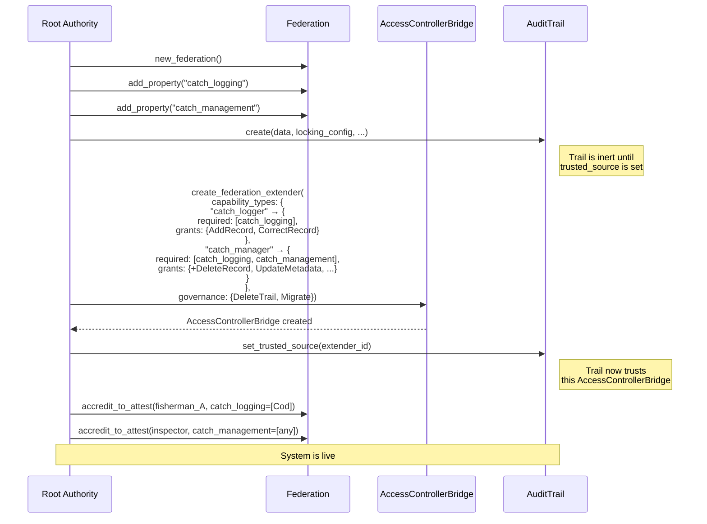
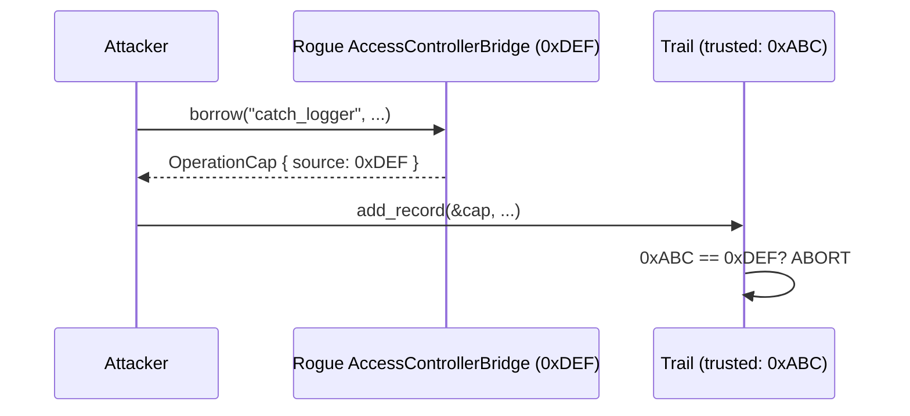
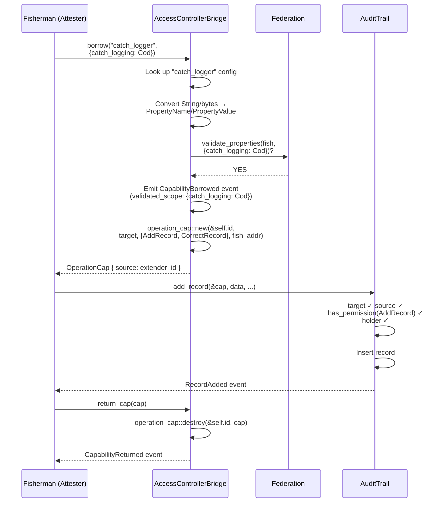
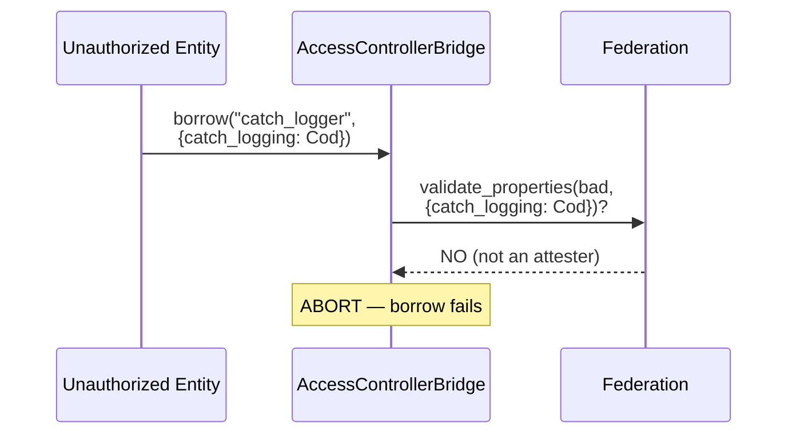
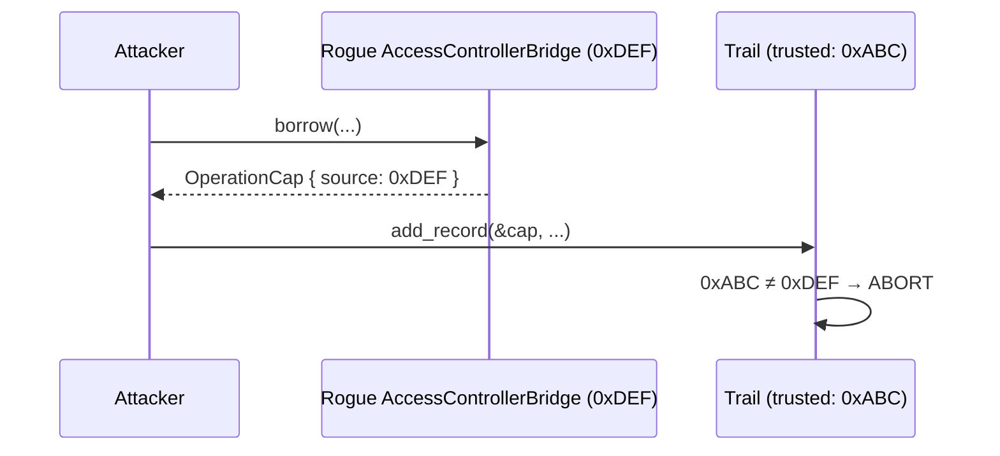
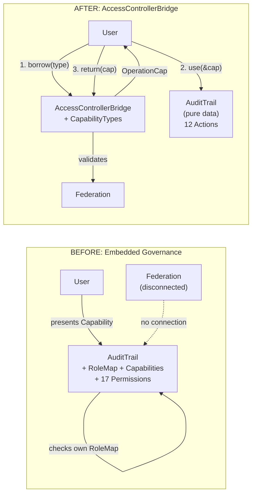
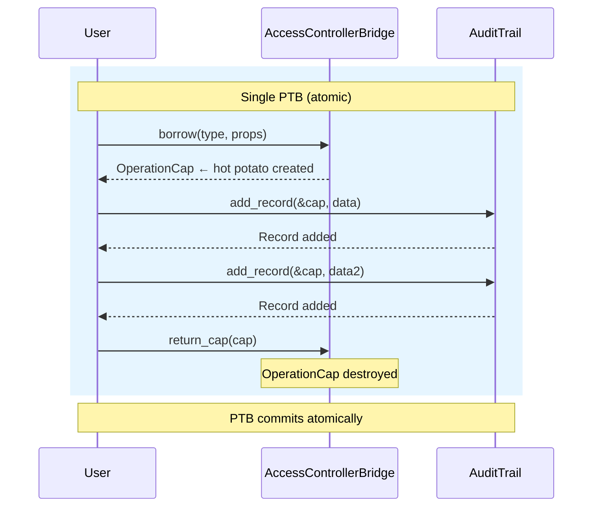

# Access Controller Bridge v3

## Bridging Hierarchies and Component Authorization via Capability Borrowing

**Status**: Proposal \
**Date**: 2026-03-24 \
**Supersedes**: Access Controller Bridge v2 (ComponentLink approach) \
**Scope**: IOTA Trust Framework — cross-component authorization architecture

---

## Table of Contents

1. [Problem Statement](#1-problem-statement)
2. [Current State Analysis](#2-current-state-analysis)
3. [Architectural Critique](#3-architectural-critique)
4. [Departure from ComponentLink](#4-departure-from-componentlink)
5. [The Access Controller Bridge Concept](#5-the-access-controller-bridge-concept)
6. [Guiding Principles](#6-guiding-principles)
7. [Detailed Design](#7-detailed-design)
8. [Process: Initialization](#8-process-initialization)
9. [Process: Authorization (Borrow–Use–Return)](#9-process-authorization-borrowusereturn)
10. [Process: Lifecycle Management](#10-process-lifecycle-management)
11. [Impact on the Audit Trail](#11-impact-on-the-audit-trail)
12. [Permission Lifecycle](#12-permission-lifecycle)
13. [Account Abstraction Considerations](#13-account-abstraction-considerations)
14. [Security Analysis](#14-security-analysis)
15. [Compliance Analysis (GDPR, ISO 27001)](#15-compliance-analysis-gdpr-iso-27001)
16. [Trade-offs and Alternatives Considered](#16-trade-offs-and-alternatives-considered)
17. [Conclusion](#17-conclusion)

- [Appendix A: Architecture Diagram](#appendix-a-architecture-diagram)
- [Appendix B: End-to-End Examples](#appendix-b-end-to-end-examples)
- [Appendix C: Flow Diagrams](#appendix-c-flow-diagrams)
- [Appendix D: Referenced Materials](#appendix-d-referenced-materials)

---

## 1. Problem Statement

The IOTA Trust Framework is a modular suite of components — Hierarchies, Notarization (including Audit Trails), Identity — that together establish trust in digital multi-stakeholder environments.

Currently these components solve authorization independently:

- **Hierarchies** manages delegated trust through federations, accreditations, and attestations. It answers: *"Is entity X trusted to make claims about property Y?"*
- **Audit Trails** embeds a full RBAC system (`RoleMap` from `tf_components`) inside each trail instance. It answers: *"Can holder of Capability C perform action A on this specific trail?"*
- **Notarization** (base) relies on Move's native object ownership — owner controls the object.

There is no mechanism for these authorization models to communicate. An entity accredited by a federation to attest domain properties still needs a separately-issued `Capability` from the trail's embedded `RoleMap` to add a record. The two systems exist in parallel, disconnected.

---

## 2. Current State Analysis

### 2.1 Hierarchies (`hierarchies::main`)

Hierarchies implements an **organized delegation of trust** — authority distributed according to competence and context. A certified fish inspector's catch report carries weight because of demonstrated capability; a fishing vessel's sustainability claim carries weight because of accreditation by a recognized maritime authority.

The Federation is the core governance object:

```text
Federation
  ├── Properties         (what claims are recognized: "catch_species", "fishing_zone", etc.)
  ├── Root Authorities   (ultimate governance — define properties, manage accreditations)
  ├── Accreditations to Accredit  (right to DELEGATE trust to others)
  └── Accreditations to Attest    (right to MAKE verifiable claims)
```

The trust chain models three roles:

| Role | Meaning | Interfaces With |
| --- | --- | --- |
| Root Authority | Defines the domain, manages all governance | The federation itself |
| Accreditor | Can delegate trust to others within property scope | The trust chain |
| Attester | Can make verifiable claims within property scope | The real world |

Each accreditation is **scoped to specific properties** with specific allowed values — an entity accredited for `catch_species = [Cod, Haddock]` cannot attest `catch_species = Mackerel` or `vessel_safety` at all.

**Key characteristic**: Hierarchies is an **authority source** that expresses domain-level trust. Its properties represent real-world domain concepts, not operational buttons. The **attester** is the output — the entity at the leaf of the trust chain that actually interfaces with the real world.

**Key API methods** (the "business output" of hierarchies):

```move
/// Single-property validation: is this attester accredited for this property+value?
public fun validate_property(
    self: &Federation, attester_id: &ID,
    property_name: PropertyName, property_value: PropertyValue,
    clock: &Clock,
): bool

/// Batch validation: are ALL properties valid for this attester?
public fun validate_properties(
    self: &Federation, attester_id: &ID,
    properties: VecMap<PropertyName, PropertyValue>,
    clock: &Clock,
): bool
```

These two functions are the **external integration surface** of hierarchies. All other methods manage the federation's internal trust chain. The result of the hierarchy in federation is whether someone is accredited to attest about something (property name and property value).

### 2.2 Audit Trails (`audit_trail::main`)

The Audit Trail is a shared object storing sequential, tamper-proof records with embedded RBAC:

```move
public struct AuditTrail<D: store + copy> has key, store {
    id: UID,
    records: LinkedTable<u64, Record<D>>,      // DATA
    roles: RoleMap<Permission, RecordTags>,     // GOVERNANCE (embedded)
    locking_config: LockingConfig,
    // ...
}
```

The `Permission` enum defines 17 distinct operations — 12 domain operations and 5 self-governance permissions (`AddRoles`, `UpdateRoles`, `DeleteRoles`, `AddCapabilities`, `RevokeCapabilities`).

Every protected operation requires presenting a `tf_components::Capability` validated against the trail's embedded `RoleMap`.

**Key characteristic**: The audit trail is both the **resource** (records) and the **governor** (its embedded RoleMap decides access). Authorization is fully self-contained per trail instance.

### 2.3 Notarization (`iota_notarization::notarization`)

The Notarization object is **owned** (not shared). Authorization is Move's native object ownership. `TimeLock` adds temporal constraints. Correct for single-owner objects.

### 2.4 Product-Core (`tf_components`)

Shared primitives:

- **`Capability`**: Transferable authorization token. Persistent (`key` + `store`). Scoped to a target, with role, temporal validity, optional address binding.
- **`RoleMap<P, D>`**: Generic RBAC. Embedded inside managed objects. Self-governing via admin Capabilities. Uses a denylist for revocation. Requires off-chain tracking.
- **`TimeLock`**: Time-based restrictions. Orthogonal to authorization.

---

## 3. Architectural Critique

### 3.1 The Audit Trail Embeds Governance Inside the Resource

The `RoleMap` living inside `AuditTrail` creates fundamental problems:

**Every trail is a governance silo.** Each trail creates its own admin, roles, and capabilities from scratch. No way to express "entity X is authorized across all trails in domain Y."

**Permission lifecycle is entangled with data lifecycle.** The same object stores records (which persist for decades) and authorization rules (which evolve as organizations change).

**It reinvents what hierarchies solves.** Hierarchies exists to manage delegated trust. Yet the audit trail ignores it entirely.

**5 of 17 permissions are self-governance.** These exist because the trail manages its own access control. Externalize authorization and they disappear.

### 3.2 The Analogy

A fisherman's authority to log certified catches comes from the maritime authority, not from the logbook. The audit trail should verify you hold a valid fishing license — not decide who gets one.

### 3.3 Persistent Tokens Create Stale Authorization

The `Capability` model uses persistent bearer tokens with denylist-based revocation. The Capability object persists in the user's wallet after revocation. If the denylist check has a bug, or if the Capability is presented to a system that doesn't share the denylist, revocation leaks.

The RoleMap README itself acknowledges: *"Users of the RoleMap need to have an off-chain tracking mechanism for issued capabilities, their IDs and optional constraints."*

---

## 4. Departure from ComponentLink

### 4.1 What ComponentLink Proposed

The v2 design introduced a `ComponentLink<phantom P>` — a configuration object that mapped property names to action code sets. The authorization flow was:

```text
1. Component.request_action()   → ActionRequest<P>    (hot potato)
2. ComponentLink.approve()      → ActionApproval<P>    (hot potato)
3. Component.execute_action()   ← consumes both        (operation proceeds)
```

Both `ActionRequest` and `ActionApproval` were ephemeral hot potatoes created and consumed within a single PTB. The ComponentLink held policy (property → action mapping) and the `approve()` function validated against the federation.

### 4.2 Why We Changed

The ComponentLink approach was architecturally sound but introduced a protocol-layer ceremony that pushed the authorization abstraction into the component itself. The component needed to:

1. Create `ActionRequest` objects with specific scope parameters
2. Know about `PropertyScope`, `ActionRequest`, and `ActionApproval` types
3. Implement `verify_and_consume` logic
4. Carry a `trusted_source: ID` field

While the component didn't know *how* authorization worked, it was deeply coupled to the *protocol shape* of the authorization system. Every component needed request-generating functions, approval-consuming logic, and protocol-awareness baked into its API.

### 4.3 The New Direction

Instead of a protocol ceremony flowing through the component, we introduce the **AccessControllerBridge** — a component that sits between hierarchies and the target component. The user:

1. **Borrows** a capability from the AccessControllerBridge (hierarchies validation happens here)
2. **Uses** the capability with the target component (audit trail)
3. **Returns** the capability to the AccessControllerBridge (capability lifecycle closes)

The capability is a hot potato — no `drop` ability — so it must be returned within the same PTB. The target component simply checks the capability's permissions and source, without knowing anything about hierarchies, federations, or property validation.

### 4.4 Key Differences

| Aspect | ComponentLink (v2) | AccessControllerBridge (v3) |
| --- | --- | --- |
| Authorization token | ActionRequest + ActionApproval pair | Single OperationCap |
| Token lifecycle | Created by component, consumed by component | Borrowed from AccessControllerBridge, returned to AccessControllerBridge |
| Component coupling | Must create requests, consume approvals | Only reads OperationCap by reference |
| Protocol types in component | ActionRequest, ActionApproval, PropertyScope | OperationCap only (read-only) |
| Mapping direction | Property → action codes | CapabilityType → (properties + permissions) |
| User-facing concept | Property scope per request | Capability type per borrow |
| Hierarchies integration | Inside approve() on ComponentLink | Inside borrow() on AccessControllerBridge |

---

## 5. The Access Controller Bridge Concept

### 5.1 Core Idea

The AccessControllerBridge is a **capability issuer** that translates hierarchies' trust assertions into operational permissions for target components. It belongs to the hierarchies ecosystem and acts as the adapter between the world of properties/attestations and the world of component operations.

The AccessControllerBridge holds **capability type definitions** — named configurations that specify:
- **Which properties** must be validated against the federation for the requesting entity
- **Which permissions** (action codes) the resulting capability grants on the target component

When a user wants to perform an operation on a protected component (e.g., add a record to an audit trail), they:

1. Ask the AccessControllerBridge for a capability of the appropriate type
2. The AccessControllerBridge validates their standing in the federation
3. If valid, the AccessControllerBridge issues an `OperationCap` — a hot potato with the granted permissions
4. The user presents the `OperationCap` to the target component
5. The component checks permissions and proceeds
6. The user returns the `OperationCap` to the AccessControllerBridge

### 5.2 The Borrow–Use–Return Pattern

```text
┌─────────────┐     borrow()      ┌───────────────┐     validate_properties()     ┌────────────┐
│    User      │ ───────────────► │  AccessControllerBridge  │ ──────────────────────────► │ Federation │
│ (Attester)   │ ◄─────────────── │                │ ◄────────────────────────── │            │
│              │   OperationCap   │                │        true/false           │            │
│              │                  └───────────────┘                              └────────────┘
│              │
│              │     &OperationCap       ┌──────────────┐
│              │ ──────────────────────► │  Audit Trail  │
│              │ ◄────────────────────── │  (component)  │
│              │     operation result    │               │
│              │                         └──────────────┘
│              │
│              │     return_cap()        ┌───────────────┐
│              │ ──────────────────────► │  AccessControllerBridge  │
│              │                         │  (destroys     │
└─────────────┘                         │   OperationCap)│
                                        └───────────────┘
```

All three steps occur within a **single PTB** (Programmable Transaction Block). The `OperationCap` has no `drop` ability — the transaction aborts if it's not returned.

### 5.3 Why Borrowing, Not Creating

In the ComponentLink model, authorization tokens (ActionRequest/ActionApproval) were created fresh by the component and the bridge, then consumed. The AccessControllerBridge model uses a **borrow** metaphor instead:

- **Intuitive**: "Borrow permission, use it, return it" maps to real-world patterns (borrow a badge, access the building, return the badge).
- **Single token**: One `OperationCap` instead of two hot potatoes (request + approval).
- **Cleaner component API**: The component receives a read-only reference to the cap. No request creation. No approval consumption.
- **Auditable lifecycle**: The AccessControllerBridge emits events on both borrow and return, creating a complete authorization audit trail.
- **The AccessControllerBridge owns the authorization logic**: The translation from properties to permissions happens entirely inside the AccessControllerBridge. Components are pure data stores.

### 5.4 The Attester Remains the Output

The fundamental design principle from v2 carries forward unchanged:

```text
Root Authority (Maritime Authority)
  └─ defines property "catch_logging" (values: Cod, Haddock, Mackerel)
  └─ accredits Regional Inspector as accreditor for catch_logging
  └─ accredits Regional Inspector as attester for catch_management

Regional Inspector (Accreditor for catch_logging)
  └─ accredits Fisherman A as attester for catch_logging = [Cod, Haddock]
  └─ accredits Fisherman B as attester for catch_logging = [Mackerel]
```

Only **attesters** can borrow capabilities from the AccessControllerBridge. Accreditors, as accreditors, have no component access — their job is trust delegation within the federation. If an accreditor needs component access, they must also hold attester accreditations.

**Root authorities** access governance operations through a separate path (no property validation — identity check only).

---

## 6. Guiding Principles

### 7.1 Separation of Concerns

Three clean layers, each with a single responsibility:

| Layer | Responsibility | Package |
| --- | --- | --- |
| **Protocol** | Defines `OperationCap` — the universal authorization token | `tf_components` |
| **Adapter** | Translates hierarchies trust → OperationCap | `access_controller_bridge` |
| **Component** | Performs operations, checks OperationCap | `audit_trail`, etc. |

The adapter knows about both hierarchies and the protocol layer. The component only knows about the protocol layer. Hierarchies knows about neither.

### 7.2 Composability via PTBs

IOTA's programmable transaction blocks compose multiple package calls in a single atomic transaction. The Borrow–Use–Return pattern works within this model: all three calls happen atomically. If any step fails, the entire transaction aborts.

### 7.3 Move-Native Idioms

- **Hot potatoes** (no `drop` ability): OperationCap must be returned. Cannot be ignored or leaked.
- **`&UID` witness**: Only the AccessControllerBridge module can create and destroy OperationCaps stamped with its ID. Unforgeable.
- **Phantom types**: `OperationCap<phantom P>` provides compile-time type safety between components.
- **By-reference consumption**: The target component reads the cap via `&OperationCap<P>` — it never takes ownership.

### 7.4 Component Agnosticism

The OperationCap pattern works for any shared object with protected operations: audit trails, identity credentials, future data registries. The component stores one `trusted_source: ID` and checks incoming caps against it.

### 7.5 Authority Source Agnosticism

The component stores `trusted_source: ID`. It doesn't know whether the source is a federation-backed AccessControllerBridge, a standalone AccessControllerBridge, or a future AA adapter. Any authority that can produce `OperationCap<P>` with the right source ID works.

### 7.6 Respect Hierarchies' Design

The AccessControllerBridge uses hierarchies exactly as designed:
- `validate_property()` / `validate_properties()` for attester authorization
- `is_root_authority()` for governance authorization
- No modifications to hierarchies. No new functions needed.

---

## 7. Detailed Design

### 7.1 Protocol Layer: `OperationCap` (`tf_components::operation_cap`)

The `OperationCap` is the universal authorization token — a hot potato that carries permissions from the authority source to the target component.

```move
module tf_components::operation_cap;

use iota::object::{Self, UID, ID};
use iota::vec_set::{Self, VecSet};

/// The operational capability — a hot potato authorization token.
///
/// Created by an authority source (AccessControllerBridge) after validating
/// the requester's trust standing. Consumed by the same authority
/// source after the component operation completes.
///
/// No `drop` — MUST be returned. No `key` — cannot become an owned
/// object. No `store` — cannot be persisted. No `copy` — cannot
/// be duplicated. Pure hot potato.
///
/// Phantom P provides compile-time type safety between components.
///
/// IMPORTANT: The OperationCap is a pure authorization token. It carries
/// WHAT actions are permitted, not WHY they were permitted. The "why"
/// (which properties were validated, under what scope) is the ACB's
/// internal concern, captured in events for auditability. This keeps the
/// protocol layer free of domain knowledge (hierarchies properties) and
/// ensures components never interpret authorization context they don't own.
public struct OperationCap<phantom P> {
    /// The component instance this cap authorizes operations on
    target: ID,
    /// The set of action codes this cap grants (component-specific u16 constants)
    permissions: VecSet<u16>,
    /// The address that was authorized
    holder: address,
    /// Unforgeable identity of the authority object that issued this cap.
    /// Set by passing &UID — cannot be spoofed.
    source: ID,
}

/// Create a new OperationCap.
///
/// CRITICAL: requires `&UID` of the actual authority object.
/// Since struct fields are private in Move, only the module that
/// defines the authority type can access its UID.
/// This makes the `source` field unforgeable.
public fun new<P>(
    authority_uid: &UID,
    target: ID,
    permissions: VecSet<u16>,
    holder: address,
): OperationCap<P> {
    OperationCap {
        target,
        permissions,
        holder,
        source: object::uid_to_inner(authority_uid),
    }
}

/// Destroy an OperationCap. Consumes the hot potato.
///
/// CRITICAL: requires `&UID` of the authority that issued the cap.
/// Only the issuing authority can destroy it, ensuring the return
/// goes to the correct AccessControllerBridge.
public fun destroy<P>(
    authority_uid: &UID,
    cap: OperationCap<P>,
) {
    let OperationCap {
        target: _, permissions: _,
        holder: _, source,
    } = cap;
    assert!(source == object::uid_to_inner(authority_uid));
}

// === Accessors (read-only, for components) ===

public fun target<P>(cap: &OperationCap<P>): ID { cap.target }

public fun has_permission<P>(cap: &OperationCap<P>, action: u16): bool {
    cap.permissions.contains(&action)
}

public fun permissions<P>(cap: &OperationCap<P>): &VecSet<u16> {
    &cap.permissions
}

public fun holder<P>(cap: &OperationCap<P>): address { cap.holder }

public fun source<P>(cap: &OperationCap<P>): ID { cap.source }
```

**Design decisions:**

1. **No abilities** — pure hot potato. Cannot be dropped, stored, copied, or become an owned object. Forces consumption through `destroy()`.
2. **`&UID` witness for creation AND destruction** — the same unforgeable source binding from v2, applied to both ends of the lifecycle.
3. **No validated scope** — the OperationCap carries WHAT actions are permitted, not WHY. The "why" (which properties were validated) is the ACB's internal concern, captured in `CapabilityBorrowed` events for auditability. This keeps the protocol type free of domain knowledge and prevents components from interpreting authorization context they don't own. Scope changes (e.g., new property formats in hierarchies) never require changes to the protocol layer.
4. **`permissions: VecSet<u16>`** — the cap carries multiple permissions. The component checks `has_permission(cap, specific_action)` per operation.
5. **Minimal, stable surface** — four fields, all essential for authorization checking. This type should rarely if ever change, insulating all consumers from churn.

### 7.2 The AccessControllerBridge Structure

```move
module access_controller_bridge::main;

use tf_components::operation_cap::{Self, OperationCap};
use hierarchies::main::Federation;
use hierarchies::property_name::{Self, PropertyName};
use hierarchies::property_value::{Self, PropertyValue};
use iota::object::{Self, UID, ID};
use iota::vec_map::{Self, VecMap};
use iota::vec_set::{Self, VecSet};
use iota::clock::Clock;
use iota::event;
use iota::tx_context::TxContext;

/// The AccessControllerBridge — adapter between hierarchies' trust model and
/// component operations.
///
/// Each AccessControllerBridge governs one component instance (e.g., one AuditTrail).
/// It holds capability type definitions that map user-facing capability
/// names to hierarchies property validations and component permissions.
///
/// Phantom P provides compile-time type safety — an
/// AccessControllerBridge<AuditTrailPerm> can only issue
/// OperationCap<AuditTrailPerm>.
public struct AccessControllerBridge<phantom P> has key, store {
    id: UID,
    /// The component instance being governed
    target_id: ID,
    /// How authorization is determined
    authority: AuthorityMode,
    /// Named capability types and their configurations.
    /// Key: capability type name (e.g., "catch_logger", "catch_manager")
    /// Value: configuration defining required properties and granted permissions
    capability_types: VecMap<String, CapabilityTypeConfig>,
    /// Action codes reserved for governance (root authority or admin).
    /// These require no property validation — identity check only.
    governance_actions: VecSet<u16>,
    /// Package version for migration support
    version: u64,
}

/// How the AccessControllerBridge determines authorization.
public enum AuthorityMode has store {
    /// Federation-backed: delegates trust determination to a
    /// hierarchies Federation.
    FederationBacked {
        federation_id: ID,
    },
    /// Standalone: managed directly. No federation needed.
    Standalone {
        groups: VecMap<String, GroupConfig>,
        admins: VecSet<address>,
    },
}

/// Configuration for a named capability type.
///
/// Defines the mapping from a user-facing capability name to:
/// 1. Which properties must be validated in the federation
/// 2. Which permissions the resulting OperationCap grants
public struct CapabilityTypeConfig has copy, drop, store {
    /// Property names that must be validated for the requesting entity.
    /// The AccessControllerBridge calls validate_properties() with these names
    /// and the values provided by the requester.
    required_properties: vector<String>,
    /// Action codes granted by this capability type.
    /// These become the OperationCap's permissions.
    granted_permissions: VecSet<u16>,
}

/// A named group of addresses sharing the same action permissions.
/// Used in Standalone mode.
public struct GroupConfig has copy, drop, store {
    members: VecSet<address>,
    actions: VecSet<u16>,
}
```

### 7.3 CapabilityType Mapping: The Translation Layer

The `capability_types` map is the **core translation layer** — it defines how hierarchies' property-based trust translates into component-level permissions.

```text
AccessControllerBridge for "CatchRecords" trail:

  capability_types:
    "catch_logger" → {
        required_properties: ["catch_logging"],
        granted_permissions: {AddRecord, CorrectRecord}
    }
    "catch_manager" → {
        required_properties: ["catch_management"],
        granted_permissions: {AddRecord, CorrectRecord, DeleteRecord,
                              UpdateMetadata, DeleteMetadata,
                              UpdateLockingConfig}
    }
    "catch_inspector" → {
        required_properties: ["catch_logging", "catch_management"],
        granted_permissions: {AddRecord, CorrectRecord, DeleteRecord,
                              UpdateMetadata, DeleteMetadata,
                              UpdateLockingConfig, DeleteAllRecords}
    }

  governance_actions: {DeleteAuditTrail, Migrate}
```

**Reading this mapping:**

- A user borrowing capability type `"catch_logger"` must be an attester for the `catch_logging` property. They provide the property value (e.g., `Cod`). The AccessControllerBridge validates `catch_logging = Cod` against the federation. If valid, they get an `OperationCap` with `{AddRecord, CorrectRecord}`.

- A user borrowing `"catch_inspector"` must be an attester for BOTH `catch_logging` AND `catch_management`. They provide values for both. Both must validate. If valid, they get the full permission set.

- Governance actions (`DeleteAuditTrail`, `Migrate`) are not part of any capability type. They require root authority status, checked separately.

### 7.4 Action Codes

Same as v2 — each component defines its action codes as `u16` constants with public accessor functions:

```move
module audit_trail::actions;

// Operational actions (require capability type + property validation)
const ADD_RECORD: u16 = 1;
const CORRECT_RECORD: u16 = 2;
const DELETE_RECORD: u16 = 3;
const DELETE_ALL_RECORDS: u16 = 4;
const UPDATE_METADATA: u16 = 5;
const DELETE_METADATA: u16 = 6;
const UPDATE_LOCKING_CONFIG: u16 = 7;
const UPDATE_LOCKING_CONFIG_FOR_DELETE_RECORD: u16 = 8;
const UPDATE_LOCKING_CONFIG_FOR_DELETE_TRAIL: u16 = 9;
const UPDATE_LOCKING_CONFIG_FOR_WRITE: u16 = 10;

// Governance actions (root authority / admin only, no property validation)
const DELETE_AUDIT_TRAIL: u16 = 100;
const MIGRATE: u16 = 101;

// Public accessors
public fun add_record(): u16 { ADD_RECORD }
public fun correct_record(): u16 { CORRECT_RECORD }
public fun delete_record(): u16 { DELETE_RECORD }
public fun delete_all_records(): u16 { DELETE_ALL_RECORDS }
public fun update_metadata(): u16 { UPDATE_METADATA }
public fun delete_metadata(): u16 { DELETE_METADATA }
public fun update_locking_config(): u16 { UPDATE_LOCKING_CONFIG }
public fun delete_audit_trail(): u16 { DELETE_AUDIT_TRAIL }
public fun migrate(): u16 { MIGRATE }
// ...
```

The 5 self-governance permissions (`AddRoles`, `UpdateRoles`, `DeleteRoles`, `AddCapabilities`, `RevokeCapabilities`) are eliminated. Governance is external — managed through the AccessControllerBridge and the federation.

### 7.5 The Type System: Phantom P

Each component defines a zero-size marker type:

```move
module audit_trail::marker;

/// Phantom type marker for audit trail authorization.
public struct AuditTrailPerm has drop {}
```

This enables compile-time type safety:

```text
AccessControllerBridge<AuditTrailPerm>  →  OperationCap<AuditTrailPerm>  →  AuditTrail accepts only <AuditTrailPerm>
AccessControllerBridge<IdentityPerm>    →  OperationCap<IdentityPerm>    →  Identity accepts only <IdentityPerm>
```

An `OperationCap<IdentityPerm>` **cannot** be passed to an audit trail function expecting `OperationCap<AuditTrailPerm>`. The compiler rejects it.

The AccessControllerBridge is generic — P flows through opaquely from `borrow()` to the returned `OperationCap<P>`. It converts caller-provided scope to hierarchies types internally at the boundary, without exposing scope in the protocol token.

### 7.6 Source Binding via `&UID` Witness

The component stores `trusted_source: ID` — the ID of its governing AccessControllerBridge. When the component receives an `OperationCap`, it checks:

```move
assert!(operation_cap::source(&cap) == trail.trusted_source);
```

The AccessControllerBridge stamps each OperationCap with its own ID via `operation_cap::new(&self.id, ...)`. Since Move's field privacy prevents any external module from accessing `self.id`, the source field is **unforgeable**.

```text
  AccessControllerBridge.id ──── only accessible by ──── access_controller_bridge module
        │                                            │ calls
        ▼                                            ▼
  &UID ──────────── required by ──────── operation_cap::new(&UID, ...)
                                                     │ produces
                                                     ▼
                                           OperationCap { source: ID }
                                                     │ verified against
                                                     ▼
                                    trail.trusted_source: ID
```

A rogue AccessControllerBridge can only stamp its own ID. It cannot forge the trusted source's ID. **The type system is the trust infrastructure.**

### 7.7 Events (ISO 27001 A.8.15)

```move
/// Emitted when an AccessControllerBridge is created
public struct AccessControllerBridgeCreated has copy, drop {
    extender_id: ID,
    target_id: ID,
    federation_id: Option<ID>,
    created_by: address,
    capability_type_names: vector<String>,
}

/// Emitted when a capability is borrowed
public struct CapabilityBorrowed has copy, drop {
    extender_id: ID,
    target_id: ID,
    capability_type: String,
    holder: address,
    validated_scope: VecMap<String, vector<u8>>,
    timestamp: u64,
}

/// Emitted when a capability is returned
public struct CapabilityReturned has copy, drop {
    extender_id: ID,
    target_id: ID,
    holder: address,
    timestamp: u64,
}

/// Emitted when a governance capability is borrowed
public struct GovernanceCapBorrowed has copy, drop {
    extender_id: ID,
    target_id: ID,
    action: u16,
    holder: address,
    timestamp: u64,
}

/// Emitted when the AccessControllerBridge configuration is updated
public struct AccessControllerBridgeUpdated has copy, drop {
    extender_id: ID,
    updated_by: address,
    change_type: String,
}

/// Emitted when the AccessControllerBridge is deleted
public struct AccessControllerBridgeDeleted has copy, drop {
    extender_id: ID,
    deleted_by: address,
}
```

---

## 8. Process: Initialization

### 8.1 Overview

Initialization creates the full authorization ecosystem. The goal: after initialization, attesters can borrow capabilities and operate on the component, with all trust validated through the federation.

```text
Step 1: Create Federation + define properties
Step 2: Create the target component (AuditTrail)
Step 3: Create the AccessControllerBridge with capability type mappings
Step 4: Bind the component to the AccessControllerBridge (trusted_source)
Step 5: Accredit participants in the federation
```

### 8.2 Step 1: Create Federation and Properties

This is standard hierarchies setup — independent of the AccessControllerBridge:

```move
// Root Authority creates the federation
let federation = hierarchies::new_federation(ctx);

// Define properties recognized by the federation
hierarchies::add_property(
    &mut federation,
    property_name::new(b"catch_logging"),
    allowed_values,   // [Cod, Haddock, Mackerel, ...]
    shape,            // Optional pattern matching
    timespan,         // Validity window
    ctx,
);

hierarchies::add_property(
    &mut federation,
    property_name::new(b"catch_management"),
    allowed_values,   // [allow_any] or specific values
    shape,
    timespan,
    ctx,
);
```

### 8.3 Step 2: Create the Target Component

```move
// Root Authority creates the audit trail
let trail = audit_trail::create(
    initial_data,
    locking_config,
    metadata,
    clock,
    ctx,
);
// Trail is inert until trusted_source is set
```

### 8.4 Step 3: Create the AccessControllerBridge

```move
/// Create a new federation-backed AccessControllerBridge.
/// Only callable by a root authority of the specified federation.
public fun create_federation_extender<P>(
    federation: &Federation,
    target_id: ID,
    capability_types: VecMap<String, CapabilityTypeConfig>,
    governance_actions: VecSet<u16>,
    clock: &Clock,
    ctx: &mut TxContext,
): AccessControllerBridge<P> {
    // Verify caller is root authority
    let sender_id = ctx.sender().to_id();
    assert!(federation.is_root_authority(&sender_id));

    let extender = AccessControllerBridge {
        id: object::new(ctx),
        target_id,
        authority: AuthorityMode::FederationBacked {
            federation_id: federation.federation_id(),
        },
        capability_types,
        governance_actions,
        version: PACKAGE_VERSION,
    };

    event::emit(AccessControllerBridgeCreated {
        extender_id: object::uid_to_inner(&extender.id),
        target_id,
        federation_id: option::some(federation.federation_id()),
        created_by: ctx.sender(),
        capability_type_names: capability_types.keys(),
    });

    extender
}
```

**Creating the `CapabilityTypeConfig` values:**

```move
// Build the catch_logger config
let catch_logger = capability_type_config::new(
    vector[string::utf8(b"catch_logging")],           // required_properties
    vec_set::from_keys(vector[                         // granted_permissions
        actions::add_record(),
        actions::correct_record(),
    ]),
);

// Build the catch_manager config
let catch_manager = capability_type_config::new(
    vector[string::utf8(b"catch_logging"),
           string::utf8(b"catch_management")],
    vec_set::from_keys(vector[
        actions::add_record(),
        actions::correct_record(),
        actions::delete_record(),
        actions::update_metadata(),
        actions::delete_metadata(),
        actions::update_locking_config(),
    ]),
);

// Assemble the capability types map
let mut cap_types = vec_map::empty();
cap_types.insert(string::utf8(b"catch_logger"), catch_logger);
cap_types.insert(string::utf8(b"catch_manager"), catch_manager);

// Governance actions
let gov_actions = vec_set::from_keys(vector[
    actions::delete_audit_trail(),
    actions::migrate(),
]);

// Create the AccessControllerBridge
let extender = access_controller_bridge::create_federation_extender<AuditTrailPerm>(
    &federation, trail_id, cap_types, gov_actions, clock, ctx,
);
```

### 8.5 Step 4: Bind the Component to the AccessControllerBridge

```move
/// Set the trusted authority source for this trail.
/// Only callable by the trail creator (or root authority).
public fun set_trusted_source<D: store + copy>(
    trail: &mut AuditTrail<D>,
    trusted_source: ID,
    ctx: &TxContext,
) {
    assert!(ctx.sender() == trail.creator);
    trail.trusted_source = trusted_source;
}
```

```move
// Bind trail to extender
audit_trail::set_trusted_source(
    &mut trail,
    object::id(&extender),
    ctx,
);
```

After this step, the trail only accepts `OperationCap` values whose `source` matches the AccessControllerBridge's ID.

### 8.6 Step 5: Accredit Participants

Standard hierarchies operations — accredit attesters for the properties used in capability type configurations:

```move
// Accredit fishermen as attesters
hierarchies::accredit_to_attest(
    &mut federation,
    fisherman_a_id,
    property_name::new(b"catch_logging"),
    vec[property_value::new_string(b"Cod"),
        property_value::new_string(b"Haddock")],
    ctx,
);

hierarchies::accredit_to_attest(
    &mut federation,
    fisherman_b_id,
    property_name::new(b"catch_logging"),
    vec[property_value::new_string(b"Mackerel")],
    ctx,
);

// Accredit inspector as attester for management
hierarchies::accredit_to_attest(
    &mut federation,
    inspector_id,
    property_name::new(b"catch_management"),
    vec[property_value::new_string(b"allow_any")],
    ctx,
);
// Inspector also needs catch_logging if they want "catch_manager" capability type
hierarchies::accredit_to_attest(
    &mut federation,
    inspector_id,
    property_name::new(b"catch_logging"),
    vec[property_value::new_string(b"allow_any")],
    ctx,
);

// Accredit inspector as accreditor (trust delegation)
hierarchies::accredit_to_accredit(
    &mut federation,
    inspector_id,
    property_name::new(b"catch_logging"),
    ctx,
);
```

### 8.7 "Known to Both Systems"

After initialization, the AccessControllerBridge and the target component are mutually aware:

| System | What It Knows |
| --- | --- |
| **AccessControllerBridge** | `target_id` — which component it governs. `federation_id` — which federation validates trust. `capability_types` — what capabilities it can issue. |
| **Target Component** | `trusted_source` — the AccessControllerBridge's ID. Accepts only OperationCaps from this source. |
| **Federation** | Nothing about components or AccessControllerBridges. It only knows about properties, accreditors, and attesters. |

The `OperationCap` type in `tf_components` is the shared protocol — both the AccessControllerBridge (creates/destroys) and the component (reads) depend on it. Neither depends on each other directly.

### 8.8 Full Bootstrap Sequence Diagram



---

## 9. Process: Authorization (Borrow–Use–Return)

### 9.1 The Borrow Step (Federation-Backed)

```move
/// Borrow an OperationCap by providing a capability type and
/// property values for validation.
///
/// The AccessControllerBridge:
/// 1. Looks up the capability type configuration
/// 2. Pairs provided property values with required property names
/// 3. Calls validate_properties() on the federation
/// 4. If valid, creates and returns an OperationCap with the
///    configured permissions
///
/// The returned OperationCap is a hot potato — MUST be returned
/// via return_cap() within the same PTB.
public fun borrow<P>(
    extender: &AccessControllerBridge<P>,
    federation: &Federation,
    capability_type: String,
    property_values: VecMap<String, vector<u8>>,
    clock: &Clock,
    ctx: &TxContext,
): OperationCap<P> {
    assert!(extender.version == PACKAGE_VERSION);

    // 1. Look up capability type
    assert!(extender.capability_types.contains(&capability_type));
    let config = extender.capability_types.get(&capability_type);

    // 2. Verify federation matches
    let federation_id = match (&extender.authority) {
        AuthorityMode::FederationBacked { federation_id } => *federation_id,
        _ => abort,  // Use borrow_standalone for standalone mode
    };
    assert!(federation_id == federation.federation_id());

    // 3. Build hierarchies-typed properties for validation
    let required = &config.required_properties;
    let mut props = vec_map::empty<PropertyName, PropertyValue>();
    let mut i = 0;
    while (i < required.length()) {
        let prop_name_str = &required[i];
        // Verify the caller provided a value for this required property
        assert!(property_values.contains(prop_name_str));
        let prop_value_bytes = property_values.get(prop_name_str);

        // Convert generic types to hierarchies types at the boundary
        let prop_name = property_name::from_string(prop_name_str);
        let prop_value = property_value::from_bytes(*prop_value_bytes);
        props.insert(prop_name, prop_value);
        i = i + 1;
    };

    // 4. Validate ALL required properties against the federation
    let requester_id = ctx.sender().to_id();
    assert!(federation.validate_properties(
        &requester_id,
        props,
        clock,
    ));

    // 5. Issue the OperationCap
    // 5. Issue the OperationCap (minimal — no scope, just permissions)
    let cap = operation_cap::new<P>(
        &extender.id,
        extender.target_id,
        config.granted_permissions,
        ctx.sender(),
    );

    // 6. Emit event with full scope for auditability
    // The validated scope lives in the event, NOT in the OperationCap.
    // This keeps the protocol token free of domain knowledge while
    // providing full traceability for auditors.
    event::emit(CapabilityBorrowed {
        extender_id: object::uid_to_inner(&extender.id),
        target_id: extender.target_id,
        capability_type,
        holder: ctx.sender(),
        validated_scope: property_values,
        timestamp: clock::timestamp_ms(clock),
    });

    cap
}
```

**Key design points:**

1. **Capability type as user input**: The user provides a named capability type (e.g., `"catch_logger"`), not raw property names. This is the abstraction layer — users think in terms of capabilities, not properties.

2. **Property values as user input**: The user provides the property values they claim. The federation validates them. This is the same caller-provided-scope principle from v2, but channeled through capability types.

3. **Type conversion at the boundary**: The AccessControllerBridge converts `String` → `PropertyName` and `vector<u8>` → `PropertyValue` before calling hierarchies. This is the **only place** in the entire system that couples to hierarchies' type system.

4. **`validate_properties()` — batch validation**: One call validates all required properties. Hierarchies checks: is the sender an attester? For each property: is the name valid? Is the value within the attester's accredited scope? Is the timespan valid?

5. **Scope in events, not in OperationCap**: The validated scope is captured in the `CapabilityBorrowed` event — the authoritative audit record. The OperationCap carries only permissions, not the reasoning behind them. This enforces clean separation: the component checks WHAT you may do, the ACB events record WHY you were authorized.

### 9.2 The Borrow Step (Governance)

Governance operations don't go through capability types — they check root authority status:

```move
/// Borrow an OperationCap for a governance action.
/// Only root authorities of the linked federation can borrow governance caps.
public fun borrow_governance<P>(
    extender: &AccessControllerBridge<P>,
    federation: &Federation,
    action: u16,
    clock: &Clock,
    ctx: &TxContext,
): OperationCap<P> {
    assert!(extender.version == PACKAGE_VERSION);

    // Verify this is a governance action
    assert!(extender.governance_actions.contains(&action));

    // Verify federation matches
    let federation_id = match (&extender.authority) {
        AuthorityMode::FederationBacked { federation_id } => *federation_id,
        _ => abort,
    };
    assert!(federation_id == federation.federation_id());

    // Verify caller is root authority
    let requester_id = ctx.sender().to_id();
    assert!(federation.is_root_authority(&requester_id));

    // Issue governance cap (single permission, no property scope)
    let mut permissions = vec_set::empty();
    permissions.insert(action);

    let cap = operation_cap::new<P>(
        &extender.id,
        extender.target_id,
        permissions,
        ctx.sender(),
    );

    event::emit(GovernanceCapBorrowed {
        extender_id: object::uid_to_inner(&extender.id),
        target_id: extender.target_id,
        action,
        holder: ctx.sender(),
        timestamp: clock::timestamp_ms(clock),
    });

    cap
}
```

### 9.3 The Use Step

The target component receives the `OperationCap` **by reference**. It checks:

1. The cap targets this component
2. The cap has the required permission
3. The cap's source matches the trusted source

```move
/// Add a record with external authorization.
public fun add_record<D: store + copy>(
    trail: &mut AuditTrail<D>,
    cap: &OperationCap<AuditTrailPerm>,
    stored_data: D,
    record_metadata: Option<String>,
    clock: &Clock,
    ctx: &mut TxContext,
) {
    assert!(trail.version == PACKAGE_VERSION);
    assert!(!locking::is_write_locked(&trail.locking_config, clock));

    // Authorization checks
    assert!(operation_cap::target(cap) == trail.id());
    assert!(operation_cap::source(cap) == trail.trusted_source);
    assert!(operation_cap::has_permission(cap, actions::add_record()));
    assert!(operation_cap::holder(cap) == ctx.sender());

    // Proceed with operation
    let caller = ctx.sender();
    let timestamp = clock::timestamp_ms(clock);
    let seq = trail.sequence_number;

    let record = record::new(stored_data, record_metadata, seq, caller, timestamp);
    linked_table::push_back(&mut trail.records, seq, record);
    trail.sequence_number = seq + 1;

    event::emit(RecordAdded {
        trail_id: trail.id(),
        sequence_number: seq,
        added_by: caller,
        timestamp,
    });
}
```

**What the component sees:**

The audit trail is **completely unaware** of hierarchies, federations, property validation, or how the OperationCap was produced. It receives a typed, source-verified capability and checks permissions. That's it.

The trail is a **pure data component** — records, locking, events. No embedded governance.

### 9.4 The Return Step

```move
/// Return an OperationCap to the AccessControllerBridge. Consumes the hot potato.
///
/// This MUST be called within the same PTB as borrow().
/// The OperationCap has no `drop` ability — the transaction aborts
/// if this is not called.
public fun return_cap<P>(
    extender: &AccessControllerBridge<P>,
    cap: OperationCap<P>,
    clock: &Clock,
) {
    let holder = operation_cap::holder(&cap);

    event::emit(CapabilityReturned {
        extender_id: object::uid_to_inner(&extender.id),
        target_id: extender.target_id,
        holder,
        timestamp: clock::timestamp_ms(clock),
    });

    // Destroy the hot potato — verifies source matches
    operation_cap::destroy(&extender.id, cap);
}
```

### 9.5 Complete PTB Flow

Within a single Programmable Transaction Block:

```move
// === Single PTB ===

// Step 1: Borrow capability from AccessControllerBridge
let mut prop_values = vec_map::empty();
prop_values.insert(string::utf8(b"catch_logging"), b"Cod");

let cap = access_controller_bridge::borrow(
    &extender,
    &federation,
    string::utf8(b"catch_logger"),
    prop_values,
    clock,
    ctx,
);
// cap is a hot potato — must be returned before PTB ends

// Step 2: Use capability with audit trail
audit_trail::add_record(
    &mut trail,
    &cap,             // by reference — cap is not consumed
    catch_data,
    metadata,
    clock,
    ctx,
);

// Step 3: Return capability to AccessControllerBridge
access_controller_bridge::return_cap(&extender, cap, clock);
// cap is consumed (destroyed) — hot potato fulfilled
```

If any step fails, the entire PTB aborts. No partial authorization. No leaked capabilities.

### 9.6 Multiple Operations Per Borrow

Since the cap is passed by reference, the user can perform **multiple operations** with a single borrow — as long as the cap has the necessary permissions:

```move
let cap = access_controller_bridge::borrow(
    &extender, &federation,
    string::utf8(b"catch_manager"),     // has multiple permissions
    prop_values, clock, ctx,
);

// Multiple operations with the same cap
audit_trail::add_record(&mut trail, &cap, data1, metadata1, clock, ctx);
audit_trail::add_record(&mut trail, &cap, data2, metadata2, clock, ctx);
audit_trail::correct_record(&mut trail, &cap, seq, data3, clock, ctx);
audit_trail::update_metadata(&mut trail, &cap, new_metadata, ctx);

access_controller_bridge::return_cap(&extender, cap, clock);
```

This is more efficient than v2's model where each operation needed its own ActionRequest + ActionApproval pair.

### 9.7 Standalone Mode

For simple scenarios without a federation:

```move
/// Borrow an OperationCap in standalone mode.
/// Checks sender against groups. No federation needed.
public fun borrow_standalone<P>(
    extender: &AccessControllerBridge<P>,
    capability_type: String,
    clock: &Clock,
    ctx: &TxContext,
): OperationCap<P> {
    assert!(extender.version == PACKAGE_VERSION);
    assert!(extender.capability_types.contains(&capability_type));
    let config = extender.capability_types.get(&capability_type);

    let requester = ctx.sender();

    let (groups, _admins) = match (&extender.authority) {
        AuthorityMode::Standalone { groups, admins } => (groups, admins),
        _ => abort,
    };

    // Check if requester is in any group that grants
    // all required permissions for this capability type
    let group_names = groups.keys();
    let mut authorized = false;
    let mut i = 0;
    while (i < group_names.length()) {
        let group = groups.get(&group_names[i]);
        if (group.members.contains(&requester)) {
            // Check if this group's actions are a superset of granted_permissions
            let required = &config.granted_permissions;
            let mut all_present = true;
            let perm_keys = required.into_keys();
            let mut j = 0;
            while (j < perm_keys.length()) {
                if (!group.actions.contains(&perm_keys[j])) {
                    all_present = false;
                    break
                };
                j = j + 1;
            };
            if (all_present) {
                authorized = true;
                break
            };
        };
        i = i + 1;
    };

    assert!(authorized);

    let cap = operation_cap::new<P>(
        &extender.id,
        extender.target_id,
        config.granted_permissions,
        requester,
    );

    event::emit(CapabilityBorrowed {
        extender_id: object::uid_to_inner(&extender.id),
        target_id: extender.target_id,
        capability_type,
        holder: requester,
        validated_scope: vec_map::empty(),
        timestamp: clock::timestamp_ms(clock),
    });

    cap
}
```

Standalone mode ignores property validation — there's no federation. Group membership determines access. If you need property-level scoping, use a federation.

### 9.8 Standalone Governance

```move
/// Borrow a governance cap in standalone mode. Admin only.
public fun borrow_governance_standalone<P>(
    extender: &AccessControllerBridge<P>,
    action: u16,
    clock: &Clock,
    ctx: &TxContext,
): OperationCap<P> {
    assert!(extender.version == PACKAGE_VERSION);
    assert!(extender.governance_actions.contains(&action));

    let requester = ctx.sender();
    let admins = match (&extender.authority) {
        AuthorityMode::Standalone { admins, .. } => admins,
        _ => abort,
    };
    assert!(admins.contains(&requester));

    let mut permissions = vec_set::empty();
    permissions.insert(action);

    let cap = operation_cap::new<P>(
        &extender.id,
        extender.target_id,
        permissions,
        requester,
    );

    event::emit(GovernanceCapBorrowed {
        extender_id: object::uid_to_inner(&extender.id),
        target_id: extender.target_id,
        action,
        holder: requester,
        timestamp: clock::timestamp_ms(clock),
    });

    cap
}
```

---

## 10. Process: Lifecycle Management

### 10.1 Modifying Capability Type Configurations

Root authorities can update what a capability type requires and grants:

```move
/// Update an existing capability type configuration.
/// Federation-backed: only root authority. Standalone: only admin.
public fun update_capability_type<P>(
    extender: &mut AccessControllerBridge<P>,
    federation: &Federation,
    capability_type: String,
    new_config: CapabilityTypeConfig,
    ctx: &TxContext,
) {
    assert_governor(extender, federation, ctx);
    assert!(extender.capability_types.contains(&capability_type));

    // Replace the config
    extender.capability_types.remove(&capability_type);
    extender.capability_types.insert(capability_type, new_config);

    event::emit(AccessControllerBridgeUpdated {
        extender_id: object::uid_to_inner(&extender.id),
        updated_by: ctx.sender(),
        change_type: string::utf8(b"update_capability_type"),
    });
}
```

**Effect**: Immediate. The next `borrow()` call uses the updated configuration. No outstanding capabilities are affected (OperationCaps are ephemeral — they exist only within the current PTB).

**Example — Adding `DeleteRecord` to the catch_logger type:**

```move
let updated_config = capability_type_config::new(
    vector[string::utf8(b"catch_logging")],
    vec_set::from_keys(vector[
        actions::add_record(),
        actions::correct_record(),
        actions::delete_record(),   // newly added
    ]),
);

access_controller_bridge::update_capability_type(
    &mut extender,
    &federation,
    string::utf8(b"catch_logger"),
    updated_config,
    ctx,
);
```

### 10.2 Adding and Removing Capability Types

```move
/// Add a new capability type to the AccessControllerBridge.
public fun add_capability_type<P>(
    extender: &mut AccessControllerBridge<P>,
    federation: &Federation,
    capability_type: String,
    config: CapabilityTypeConfig,
    ctx: &TxContext,
) {
    assert_governor(extender, federation, ctx);
    assert!(!extender.capability_types.contains(&capability_type));
    extender.capability_types.insert(capability_type, config);

    event::emit(AccessControllerBridgeUpdated {
        extender_id: object::uid_to_inner(&extender.id),
        updated_by: ctx.sender(),
        change_type: string::utf8(b"add_capability_type"),
    });
}

/// Remove a capability type from the AccessControllerBridge.
public fun remove_capability_type<P>(
    extender: &mut AccessControllerBridge<P>,
    federation: &Federation,
    capability_type: String,
    ctx: &TxContext,
) {
    assert_governor(extender, federation, ctx);
    assert!(extender.capability_types.contains(&capability_type));
    extender.capability_types.remove(&capability_type);

    event::emit(AccessControllerBridgeUpdated {
        extender_id: object::uid_to_inner(&extender.id),
        updated_by: ctx.sender(),
        change_type: string::utf8(b"remove_capability_type"),
    });
}
```

### 10.3 Updating Governance Actions

```move
/// Update the set of governance actions.
public fun update_governance_actions<P>(
    extender: &mut AccessControllerBridge<P>,
    federation: &Federation,
    governance_actions: VecSet<u16>,
    ctx: &TxContext,
) {
    assert_governor(extender, federation, ctx);
    extender.governance_actions = governance_actions;

    event::emit(AccessControllerBridgeUpdated {
        extender_id: object::uid_to_inner(&extender.id),
        updated_by: ctx.sender(),
        change_type: string::utf8(b"update_governance_actions"),
    });
}
```

### 10.4 Standalone Permission Management

```move
/// Add a member to a standalone group. Admin only.
public fun add_group_member<P>(
    extender: &mut AccessControllerBridge<P>,
    group_name: String,
    member: address,
    ctx: &TxContext,
) {
    assert_standalone_admin(extender, ctx.sender());
    match (&mut extender.authority) {
        AuthorityMode::Standalone { groups, .. } => {
            groups.get_mut(&group_name).members.insert(member);
        },
        _ => abort,
    };
}

/// Remove a member from a standalone group. Admin only.
public fun remove_group_member<P>(
    extender: &mut AccessControllerBridge<P>,
    group_name: String,
    member: address,
    ctx: &TxContext,
) {
    assert_standalone_admin(extender, ctx.sender());
    match (&mut extender.authority) {
        AuthorityMode::Standalone { groups, .. } => {
            groups.get_mut(&group_name).members.remove(&member);
        },
        _ => abort,
    };
}
```

Revocation is immediate — remove an address, their next `borrow_standalone()` fails.

### 10.5 Migration: Standalone → Federation

One-way upgrade:

```move
/// Upgrade to federation-backed mode.
/// Caller must be standalone admin AND federation root authority.
public fun upgrade_to_federation<P>(
    extender: &mut AccessControllerBridge<P>,
    federation: &Federation,
    ctx: &TxContext,
) {
    assert_standalone_admin(extender, ctx.sender());
    assert!(federation.is_root_authority(&ctx.sender().to_id()));

    extender.authority = AuthorityMode::FederationBacked {
        federation_id: federation.federation_id(),
    };

    event::emit(AccessControllerBridgeUpdated {
        extender_id: object::uid_to_inner(&extender.id),
        updated_by: ctx.sender(),
        change_type: string::utf8(b"upgrade_to_federation"),
    });
}
```

The target component is untouched — same `trusted_source: ID`.

### 10.6 Upgrading the AccessControllerBridge Package

When the `access_controller_bridge` package is upgraded (new version published):

1. **OperationCap is unaffected**: It lives in `tf_components`, not in `access_controller_bridge`. No change to the protocol token.
2. **AccessControllerBridge object needs migration**: The `version` field tracks compatibility.
3. **Target component is unaffected**: It depends on `tf_components::operation_cap`, not on `access_controller_bridge`.
4. **Federation is unaffected**: It has no knowledge of the AccessControllerBridge.

```move
/// Migrate the AccessControllerBridge to the new package version.
/// Only governance (root authority / admin) can migrate.
public fun migrate<P>(
    extender: &mut AccessControllerBridge<P>,
    federation: &Federation,
    ctx: &TxContext,
) {
    assert_governor(extender, federation, ctx);
    assert!(extender.version < PACKAGE_VERSION);

    // Perform any structural migration here
    // e.g., add new fields via dynamic fields

    extender.version = PACKAGE_VERSION;

    event::emit(AccessControllerBridgeUpdated {
        extender_id: object::uid_to_inner(&extender.id),
        updated_by: ctx.sender(),
        change_type: string::utf8(b"migrate"),
    });
}
```

**During migration downtime**: Between package upgrade and object migration, `borrow()` calls fail (`version != PACKAGE_VERSION`). This is a deliberate safety gate — the governance must explicitly migrate the object to the new version.

### 10.7 Upgrading the Audit Trail Package

When the `audit_trail` package is upgraded:

1. **AccessControllerBridge is unaffected**: It creates OperationCaps using `tf_components`. It doesn't call audit trail functions.
2. **AuditTrail object needs migration**: Standard audit trail migration (already has `version` field and `migrate()` function).
3. **Action codes may change**: If the audit trail adds new operations (new action codes), the AccessControllerBridge's capability type configs can be updated to include them.
4. **OperationCap is unaffected**: The protocol token doesn't change.

**Sequence for adding a new audit trail operation:**

```text
1. Publish new audit_trail package with new action code
2. Migrate AuditTrail object to new version
3. Update AccessControllerBridge capability type configs to include new action code
4. New operation is available
```

Steps 2 and 3 can happen in separate PTBs. Between steps 2 and 3, the new operation exists but no capability type grants it — secure by default.

### 10.8 Upgrading the Hierarchies Package

When the `hierarchies` package is upgraded:

1. **The AccessControllerBridge calls `validate_properties()`**: If the function signature changes, the AccessControllerBridge package MUST be upgraded too.
2. **If hierarchies is backward-compatible** (same API, internal changes only): No changes needed to AccessControllerBridge.
3. **If hierarchies changes `validate_properties()` signature**: AccessControllerBridge package must be upgraded and its object migrated.
4. **Target component is unaffected**: It has no dependency on hierarchies.
5. **OperationCap is unaffected**: It has no dependency on hierarchies.

**Sequence for a breaking hierarchies change:**

```text
1. Publish new hierarchies package
2. Migrate Federation object
3. Publish new access_controller_bridge package (updated for new hierarchies API)
4. Migrate AccessControllerBridge object
5. System is live with new hierarchies
```

### 10.9 Upgrading tf_components (Protocol Layer)

This is the most impactful upgrade — `OperationCap` lives here.

1. **If OperationCap fields change**: ALL consumers (AccessControllerBridge, audit trail, identity, etc.) must be upgraded.
2. **If only new functions are added**: No impact on existing consumers.
3. **If accessor signatures change**: Consumers must be updated.

**Mitigation**: `tf_components` should be treated as the most stable layer. Changes to `OperationCap` should be extremely rare and backward-compatible where possible.

### 10.10 Replacing an AccessControllerBridge Instance

If the AccessControllerBridge object itself needs to be replaced (not just upgraded):

```text
1. Create new AccessControllerBridge (with updated configuration)
2. Update target component: set_trusted_source(new_extender_id)
3. Old AccessControllerBridge can be deleted
```

**Critical**: Between step 2 and the update, any in-flight PTBs using the old AccessControllerBridge will fail (source mismatch). This is a brief service interruption. For zero-downtime replacement:

```text
1. Create new AccessControllerBridge
2. Support dual trusted_source on the component (temporarily)
3. Switch over
4. Remove old trusted_source support
5. Delete old AccessControllerBridge
```

However, dual trusted_source adds complexity. For most scenarios, the brief interruption during `set_trusted_source` is acceptable.

### 10.11 Version Compatibility Matrix

```text
┌─────────────────────┬──────────────────────┬────────────┬───────────────┬───────────────┐
│ Component Upgraded  │ AccessControllerBridge Impact  │ Trail      │ Federation    │ tf_components │
│                     │                      │ Impact     │ Impact        │ Impact        │
├─────────────────────┼──────────────────────┼────────────┼───────────────┼───────────────┤
│ access_controller_bridge       │ Migrate object       │ NONE       │ NONE          │ NONE          │
│ audit_trail         │ Maybe update configs │ Migrate    │ NONE          │ NONE          │
│ hierarchies         │ Maybe upgrade pkg    │ NONE       │ Migrate       │ NONE          │
│ tf_components       │ Upgrade pkg+migrate  │ Upgrade    │ NONE          │ Migrate       │
│                     │                      │ pkg+migrate│               │               │
└─────────────────────┴──────────────────────┴────────────┴───────────────┴───────────────┘
```

---

## 11. Impact on the Audit Trail

### 11.1 What Is Removed

- The `roles: RoleMap<Permission, RecordTags>` field
- The 5 self-governance permissions (`AddRoles`, `UpdateRoles`, `DeleteRoles`, `AddCapabilities`, `RevokeCapabilities`)
- All role/capability administration functions
- `create()` no longer returns a `Capability`
- All `&Capability` parameters in protected functions

### 11.2 Refactored AuditTrail

```move
public struct AuditTrail<D: store + copy> has key, store {
    id: UID,
    creator: address,
    created_at: u64,
    sequence_number: u64,
    records: LinkedTable<u64, Record<D>>,
    locking_config: LockingConfig,
    immutable_metadata: Option<ImmutableMetadata>,
    updatable_metadata: Option<String>,
    version: u64,
    /// The authority source this trail trusts.
    /// Points to the AccessControllerBridge's ID.
    trusted_source: ID,
}
```

### 11.3 Protected Functions Accept `&OperationCap`

Every protected function takes `&OperationCap<AuditTrailPerm>` instead of the old `&Capability`:

```move
public fun add_record<D>(trail: &mut AuditTrail<D>, cap: &OperationCap<AuditTrailPerm>, ...) { ... }
public fun delete_record<D>(trail: &mut AuditTrail<D>, cap: &OperationCap<AuditTrailPerm>, ...) { ... }
public fun correct_record<D>(trail: &mut AuditTrail<D>, cap: &OperationCap<AuditTrailPerm>, ...) { ... }
public fun update_metadata<D>(trail: &mut AuditTrail<D>, cap: &OperationCap<AuditTrailPerm>, ...) { ... }
public fun delete_metadata<D>(trail: &mut AuditTrail<D>, cap: &OperationCap<AuditTrailPerm>, ...) { ... }
public fun delete_all_records<D>(trail: &mut AuditTrail<D>, cap: &OperationCap<AuditTrailPerm>, ...) { ... }
public fun update_locking_config<D>(trail: &mut AuditTrail<D>, cap: &OperationCap<AuditTrailPerm>, ...) { ... }
public fun delete_trail<D>(trail: AuditTrail<D>, cap: &OperationCap<AuditTrailPerm>, ...) { ... }
public fun migrate<D>(trail: &mut AuditTrail<D>, cap: &OperationCap<AuditTrailPerm>, ...) { ... }
```

Each function checks exactly three things:

```move
assert!(operation_cap::target(cap) == trail.id());           // right component
assert!(operation_cap::source(cap) == trail.trusted_source); // right authority
assert!(operation_cap::has_permission(cap, EXPECTED_ACTION)); // right permission
assert!(operation_cap::holder(cap) == ctx.sender());          // right sender
```

### 11.4 What the Component Sees

The audit trail is **completely unaware** of how authorization works. It stores one `trusted_source: ID`, receives `OperationCap` references, and checks permissions + source. It doesn't know about:
- Hierarchies or federations
- Properties or attestations
- Capability types or mappings
- Whether the AccessControllerBridge is federation-backed or standalone

The trail is a **pure data component**.

---

## 12. Permission Lifecycle

All permission lifecycle operations happen at the federation or AccessControllerBridge level. The target component is never modified.

### 12.1 Granting Access

Grant accreditation in the federation. The entity's next `borrow()` call succeeds. No changes to any trail or AccessControllerBridge.

### 12.2 Revoking Access

Revoke accreditation. Immediate and universal. No stale tokens — every borrow checks live federation state. There is nothing to revoke on the component side.

**Comparison**: In the current model, revoking access means adding a Capability ID to a denylist. The Capability object still exists in the user's wallet. In the proposed model, there is no persistent token — the authority check is against live state at borrow time.

### 12.3 Changing Scope

Add or remove accreditations for different properties. Immediate effect. The next borrow validates against the updated accreditations.

### 12.4 Changing the Permission Mapping

Update capability type configurations on the AccessControllerBridge. Only root authorities (federation) or admins (standalone) can do this. Immediately effective.

### 12.5 Promoting / Demoting

Promotion: grant `accreditation_to_accredit` (trust delegation) and/or `accreditation_to_attest` for additional properties (operational access).

Demotion: revoke the relevant accreditations. Immediate.

### 12.6 Summary

| Operation | Embedded RBAC (current) | AccessControllerBridge |
| --- | --- | --- |
| Grant access | Create role + issue Capability per trail | Single federation accreditation |
| Revoke access | Add to denylist. Token still in wallet | Revoke accreditation. Immediate |
| Change scope | Issue new Capability, revoke old, per trail | Update accreditation. Immediate everywhere |
| Change capability type mapping | N/A | Update AccessControllerBridge config. One object |
| Multi-trail governance | Manual per-trail setup | One federation + one AccessControllerBridge per trail |

---

## 13. Account Abstraction Considerations

### 13.1 Authentication vs. Authorization

Account Abstraction (AA) introduces AI Accounts with programmable authentication. AA addresses **authentication** ("Is this Alice?"). The OperationCap pattern addresses **authorization** ("Alice MAY add records"). They are orthogonal.

### 13.2 AA as an Authority Source

An AA adapter can produce `OperationCap` using its own `&UID`. The `trusted_source: ID` can point to an AA adapter just as easily as to an AccessControllerBridge:

```move
module aa_adapter::main;

public fun borrow<P>(
    adapter: &AAAdapter<P>,
    auth_context: &AuthContext,
    action: u16,
    clock: &Clock,
    ctx: &TxContext,
): OperationCap<P> {
    // AA verified authorization during authentication
    // Translate to OperationCap
    operation_cap::new<P>(&adapter.id, ...)
}
```

### 13.3 Why the Pattern Is AA-Ready

The target component doesn't care HOW the `OperationCap` is produced. AA is just another adapter. When AA ships, existing components and AccessControllerBridges continue to work — and new AA adapters can serve the same components.

---

## 14. Security Analysis

### 14.1 Source Binding (Rogue AccessControllerBridge Attack)

**Attack**: An attacker creates their own federation and AccessControllerBridge targeting someone else's trail.

**Mitigation**: The trail's `trusted_source` points to the legitimate AccessControllerBridge (0xABC). The rogue AccessControllerBridge (0xDEF) can only stamp its own ID. The trail checks `source == trusted_source`: `0xABC ≠ 0xDEF` → ABORT.



### 14.2 Cross-Component Confusion

**Mitigated by phantom P at compile time.** `OperationCap<AuditTrailPerm>` cannot satisfy `OperationCap<IdentityPerm>`. The compiler rejects it.

Source binding provides independent runtime protection. Phantom P is defense in depth.

### 14.3 Accreditor Tries to Borrow

```text
Inspector (accreditor only, NOT attester) tries: borrow("catch_logger", {catch_logging: Cod})

1. validate_properties(inspector, {catch_logging: Cod})?
   → is_attester(inspector)? NO → Returns false
2. ABORT. Borrow fails.
```

### 14.4 Fisherman Claims Wrong Capability Type

```text
Fisherman A: attester for catch_logging = [Cod]
Tries: borrow("catch_manager", {catch_logging: Cod, catch_management: Cod})

1. Capability type "catch_manager" requires: [catch_logging, catch_management]
2. validate_properties(A, {catch_logging: Cod, catch_management: Cod})?
   → A's accreditations do NOT include catch_management → false
3. ABORT.
```

### 14.5 Fisherman Claims Right Type, Wrong Value

```text
Fisherman A: attester for catch_logging = [Cod, Haddock]
Tries: borrow("catch_logger", {catch_logging: Mackerel})

1. validate_properties(A, {catch_logging: Mackerel})?
   → Allowed values are [Cod, Haddock], not Mackerel → false
2. ABORT.
```

### 14.6 The Lying Caller (Scope vs. Data Mismatch)

The caller provides property values. They could claim `catch_logging = Cod` but record Mackerel data. The authorization layer doesn't inspect record content.

**Mitigation**: The `CapabilityBorrowed` event records the validated scope (property names and values) on-chain. An auditor can correlate the event's `validated_scope` with the record data to detect mismatches — evidence of fraud. The scope lives in the event (the authoritative audit record), not in the OperationCap, keeping the protocol token clean while preserving full traceability.

### 14.7 Hot Potato Bypass Attempt

**Attack**: The user borrows an OperationCap and tries to avoid returning it (keeping the authorization "active").

**Mitigation**: `OperationCap` has no `drop`, `key`, `store`, or `copy` ability. Within a PTB:
- Cannot be dropped (transaction aborts)
- Cannot be stored as a dynamic field (no `store`)
- Cannot be transferred (no `key`)
- Cannot be copied (no `copy`)
- Cannot be passed to another PTB (hot potatoes don't cross PTB boundaries)

The **only** way to consume it is through `operation_cap::destroy()` — which requires the AccessControllerBridge's `&UID`.

### 14.8 Unauthorized destroy() Call

**Attack**: A malicious module calls `operation_cap::destroy()` with its own `&UID` to consume someone else's OperationCap.

**Mitigation**: `destroy()` asserts `cap.source == uid_to_inner(authority_uid)`. The cap's source is the legitimate AccessControllerBridge's ID. The malicious module's UID has a different ID. Assertion fails → ABORT.

### 14.9 Front-Running Revocation

An attacker who monitors pending revocation can front-run with last-moment borrows.

**Severity**: Medium. Records are attributable (`added_by`) and correctable (`CorrectRecord`).

**Mitigation**: Correction mechanism exists. For high-security: consider time-delayed record finalization.

### 14.10 AccessControllerBridge Configuration Manipulation

A compromised root authority can modify capability type configs (adding permissions, reducing required properties).

**Mitigation**: Multiple root authorities. Events on modification. Consider M-of-N approval for privilege escalation.

### 14.11 Complete Security Properties

| Property | Enforcement |
| --- | --- |
| Can't skip authorization | Hot potato — no `drop` on OperationCap |
| Can't forge authority | `operation_cap::new(&UID)` — Move's field privacy |
| Can't use rogue authority | Source binding: `cap.source == trail.trusted_source` |
| Can't confuse components | Phantom P — compile-time type check |
| Can't exceed property scope | `validate_properties(names, values)` — federation |
| Can't exceed action scope | `cap.permissions` set by AccessControllerBridge config |
| Can't operate without attestation | `validate_properties` only passes for attesters |
| Can't do governance without authority | `is_root_authority` check for governance borrows |
| Can't keep borrowed cap | Hot potato — no `store`, `key`, `copy`, or `drop` |
| Can't destroy cap elsewhere | `destroy(&UID)` checks source matches authority |
| Revocation is immediate | No persistent tokens. Live state checks at borrow time |

---

## 15. Compliance Analysis (GDPR, ISO 27001)

### 15.1 GDPR

#### Personal Data on Chain

All on-chain data on IOTA is public and permanent. If addresses are linkable to natural persons, GDPR applies.

**Recommendation**: Store hashes on-chain, actual data off-chain. The audit trail becomes a hash chain proving integrity without exposing content.

#### Right to Erasure (Article 17)

`delete_record` removes data from current state but transaction history is permanent. Not GDPR-compliant erasure.

**Recommendation**: Hash-only on-chain. Off-chain data in a system that supports deletion.

#### Public Accreditation Status

Federation accreditation maps are public. Reveals who holds what role.

**Recommendation**: Pseudonymous identifiers (DIDs). Consider ZK proofs for accreditation verification.

#### Validated Scope in Events

The `CapabilityBorrowed` event includes `validated_scope` — the property names and values that were checked. If property values contain personal data, this is on-chain exposure.

**Recommendation**: Use non-PII property values. Use hashes or codes instead of names/identifiers in property values.

#### Data Protection by Design (Article 25)

| Requirement | Status | Recommendation |
| --- | --- | --- |
| Encryption at rest | Not implemented | Encrypt before on-chain storage |
| Pseudonymization | Not implemented | Use DIDs |
| Purpose limitation | Not enforced | Application-level concern |
| Data minimization | Not enforced | Hash-only on-chain |
| Retention policies | Partial (locking/deletion) | No automatic expiration |

### 15.2 ISO 27001

#### Strengths

**A.8 Access Control**: Least privilege via capability type configurations. Immediate revocation. Segregation of duties between attesters, accreditors, root authorities. Temporal scoping via hierarchies' timespan validity.

**A.8.15 Logging**: On-chain events for all operations. Complete borrow–return lifecycle tracking. `CapabilityBorrowed` and `CapabilityReturned` events create paired authorization audit records. The `CapabilityBorrowed` event's `validated_scope` field provides on-chain evidence of what properties were checked.

**Traceability**: The `CapabilityBorrowed` event records the exact property scope that was validated — stronger provenance than implicit authorization. Auditors can independently correlate the event's validated scope with component operation events to verify that the right properties were checked for each operation.

**A.8.24 Segregation of Duties**: Three distinct roles (Root Authority, Accreditor, Attester) with non-overlapping access patterns. Governance actions are structurally separated from operational actions.

#### Concerns

**A.8.2 Root Authority Key Risk**:

| Risk | Severity | Mitigation |
| --- | --- | --- |
| Single root authority compromise | High | Multi-root-authority: others revoke the compromised one |
| All root authority keys compromised | Critical | **Gap**: No break-glass recovery |
| All root authority keys lost | Critical | **Gap**: Federation becomes ungovernable |

**Recommendation**: Time-locked recovery or social recovery mechanism at the hierarchies level.

**A.8.3 AccessControllerBridge Configuration Escalation**: Single root authority can modify AccessControllerBridge capability type permissions.

**Recommendation**: M-of-N approval for privilege escalation. At minimum, emit events for monitoring.

**A.5.29 No Emergency Freeze**: No mechanism to immediately halt all operations during a security incident.

**Recommendation**: Add a `frozen: bool` field to AccessControllerBridge. When frozen, `borrow()` always fails. Root authority can freeze/unfreeze. This provides an emergency brake without modifying the target component.

```move
public fun freeze<P>(
    extender: &mut AccessControllerBridge<P>,
    federation: &Federation,
    ctx: &TxContext,
) {
    assert_governor(extender, federation, ctx);
    extender.frozen = true;
    event::emit(AccessControllerBridgeFrozen { ... });
}

public fun unfreeze<P>(
    extender: &mut AccessControllerBridge<P>,
    federation: &Federation,
    ctx: &TxContext,
) {
    assert_governor(extender, federation, ctx);
    extender.frozen = false;
    event::emit(AccessControllerBridgeUnfrozen { ... });
}
```

### 15.3 Summary of Compliance Gaps

| # | Area | Finding | Severity | Recommendation |
| --- | --- | --- | --- | --- |
| 1 | GDPR Art. 17 | On-chain data cannot be truly erased | High | Hash-only on-chain, data off-chain |
| 2 | GDPR Art. 25 | No encryption or pseudonymization | Medium | Encrypt before storage; use DIDs |
| 3 | GDPR Art. 6 | Public accreditation status | Medium | Pseudonymous identifiers; ZK proofs |
| 4 | GDPR Art. 25 | Validated scope in events may contain PII | Medium | Non-PII property values; hashes/codes |
| 5 | ISO A.8.2 | No recovery for total root key loss | Critical | Social recovery mechanism |
| 6 | ISO A.8.3 | AccessControllerBridge escalation is single-key | High | M-of-N approval |
| 7 | ISO A.5.29 | No emergency freeze | Medium | `frozen` flag on AccessControllerBridge |

---

## 16. Trade-offs and Alternatives Considered

### 16.1 Rejected: ComponentLink (v2 Approach)

ActionRequest/ActionApproval hot-potato pair flowing through the component.

**Why rejected**: The component needed protocol awareness (request creation, approval consumption). Higher coupling. The AccessControllerBridge's borrow-use-return pattern gives the component a simpler interface — just read an `&OperationCap`.

### 16.2 Rejected: Persistent Capabilities Held by AccessControllerBridge

The AccessControllerBridge creates and stores persistent `Capability` objects (from `tf_components`). On borrow, it wraps a stored Capability in a hot-potato shell. On return, it unwraps and re-stores.

**Why rejected**: Requires the audit trail to keep its RoleMap (defeating the purpose of externalization). Creates state management complexity inside the AccessControllerBridge (tracking stored capabilities). Pre-created capabilities need synchronization with the audit trail's RoleMap.

The ephemeral `OperationCap` approach is cleaner — create on borrow, destroy on return, no persistent state.

### 16.3 Rejected: Embedded RBAC

Keep RoleMap inside each component. Have hierarchies issue Capabilities.

**Why rejected**: Per-trail governance silos. Stale tokens. Entangled data and governance lifecycle. Reinvents what hierarchies solves.

### 16.4 Rejected: Three-Level Permission Model

Three flat permission sets (attester/accreditor/admin). All attesters get the same permissions.

**Why rejected**: Discards hierarchies' property-level granularity. Gives accreditors operational access they shouldn't have. `validate_property` only works for attesters — the design was fighting hierarchies.

### 16.5 Rejected: Drop All Generics

One concrete `Permission` type for all components. No phantom P.

**Why rejected**: Loses compile-time type safety between components. Source binding provides runtime safety, but phantom P is cheap defense in depth.

### 16.6 Accepted: u16 Action Codes

Less readable than enum variants. Mitigated by named accessor functions (`actions::add_record()`).

### 16.7 Accepted: Caller-Provided Property Values

The caller declares which property values they're claiming. This could be seen as a trust concern (caller controls the input). But the federation validates the claim against live state — lying about values is caught. And the values are recorded on-chain for audit.

### 16.8 Accepted: PTB Complexity (Three Steps)

Borrow–Use–Return is three calls per PTB. The explicit flow is a feature for security and auditability. SDK helpers can compose the steps:

```typescript
// SDK helper
async function addRecord(trail, extender, federation, capType, propValues, data) {
  const tx = new PTB();
  const cap = tx.moveCall("access_controller_bridge::borrow", [extender, federation, capType, propValues, clock]);
  tx.moveCall("audit_trail::add_record", [trail, cap, data, metadata, clock]);
  tx.moveCall("access_controller_bridge::return_cap", [extender, cap, clock]);
  return tx.execute();
}
```

### 16.9 Accepted: Multiple Operations Per Borrow

A single `OperationCap` can be used for multiple operations. This is more efficient than per-operation authorization but means the cap's permissions are "live" for the entire PTB duration.

**Mitigation**: The PTB is atomic — either all operations succeed or none do. The cap is always returned in the same PTB. There's no window where the cap exists without being returned.

### 16.10 Trade-off: OperationCap Carries All Permissions

The `OperationCap` carries the full permission set of the capability type, not just the specific action being performed. The component checks the specific permission per operation.

**Pro**: One borrow for multiple operations. Simple user experience.

**Con**: The cap has more permissions than the user might need for a single operation. A malicious module could use the `&OperationCap` for more operations than intended.

**Mitigation**: The user controls which functions they call with `&cap`. A malicious module would need the user to pass `&cap` to it — which requires explicit action by the user.

---

## 17. Conclusion

The AccessControllerBridge externalizes authorization from components through a **Borrow–Use–Return** pattern. Components become pure data containers. The AccessControllerBridge — positioned as part of the hierarchies ecosystem — translates federation trust assertions into ephemeral operational capabilities.

The design rests on six key decisions:

1. **Capability Type as abstraction**: Users borrow named capability types, not raw property-to-action mappings. The AccessControllerBridge translates internally. Users think in terms of "what role am I?" not "which properties grant which actions?"

2. **Borrow–Use–Return lifecycle**: A single `OperationCap` is borrowed from the AccessControllerBridge, used (by reference) with the target component, and returned. The hot potato pattern (no `drop`) enforces this lifecycle structurally.

3. **Attester as output**: Only attesters can borrow operational capabilities. `validate_properties()` is the federation API. No modifications to hierarchies.

4. **Ephemeral capabilities**: `OperationCap` is created at borrow time, destroyed at return time. No persistent tokens, no denylists, no off-chain tracking. Revocation is immediate (federation state check at borrow time).

5. **Component simplicity**: The target component receives `&OperationCap`, checks permissions and source. It knows nothing about hierarchies, federations, properties, or the AccessControllerBridge's internals. Pure data store with permission checks.

6. **Protocol layer decoupled from hierarchies**: `tf_components::operation_cap` contains no domain knowledge — just `target`, `permissions`, `holder`, `source`. No property names, no property values, no dependency on hierarchies. The AccessControllerBridge converts hierarchies types internally and captures validated scope in events. This means `tf_components` is a pure protocol layer, and components have zero coupling to the authority system. Any authority adapter (federation-backed, standalone, AA) that can produce `OperationCap` with the right source works.

**The AccessControllerBridge is the single translation layer** between the world of trust (hierarchies) and the world of operations (components). It transforms "you are accredited to attest about X" into "you may perform actions Y on component Z" — within a single PTB, with full on-chain traceability, and with immediate revocation through live federation state checks.

---

## Appendix A: Architecture Diagram

```text
┌─────────────────────────────────────────────────────────────────────┐
│ tf_components::operation_cap                                          │
│                                                                       │
│  OperationCap<phantom P> {                                            │
│    target: ID,                                                        │
│    permissions: VecSet<u16>,                                          │
│    holder: address,                                                   │
│    source: ID        ← unforgeable via &UID witness                  │
│  }                                                                    │
│                                                                       │
│  new(&UID, ...)     destroy(&UID, cap)     has_permission(&cap, u16) │
│                                                                       │
│  Minimal authorization token. No domain knowledge. Phantom P safety. │
└──────────────────────────────┬────────────────────────────────────────┘
                               │
              ┌────────────────┼────────────────┐
              ▼                                 ▼
┌──────────────────────────┐     ┌──────────────────────────────────┐
│ audit_trail::main         │     │ identity::main (future)           │
│                           │     │                                   │
│ AuditTrail<D> {           │     │ IdentityComponent {               │
│   trusted_source: ID      │     │   trusted_source: ID              │
│   records: LinkedTable    │     │   credentials: ...                │
│ }                         │     │ }                                 │
│                           │     │                                   │
│ add_record(&cap, data)    │     │ create_credential(&cap, data)     │
│   checks: target, source, │     │   checks: target, source,         │
│   has_permission, holder  │     │   has_permission, holder          │
└──────────────────────────┘     └──────────────────────────────────┘
              ▲                                 ▲
              │         &OperationCap           │
              │              │                  │
              └──────────────┼──────────────────┘
                             │
                        ┌────┴─────┐
                        │   User   │
                        └────┬─────┘
                   borrow()  │  return_cap()
                             ▼
┌─────────────────────────────────────────────────────────────────────┐
│ access_controller_bridge::main                                                    │
│                                                                       │
│  AccessControllerBridge<phantom P> {                                            │
│    target_id: ID,                                                     │
│    authority: FederationBacked { federation_id }                      │
│              | Standalone { groups, admins },                         │
│    capability_types: VecMap<String, CapabilityTypeConfig>,            │
│    governance_actions: VecSet<u16>,                                   │
│  }                                                                    │
│                                                                       │
│  borrow(extender, federation, cap_type, prop_values, clock, ctx)     │
│    → look up capability type config                                  │
│    → convert String/vec<u8> → PropertyName/PropertyValue             │
│    → validate_properties(names, values)           [federation call]  │
│    → operation_cap::new(&extender.id, ...)        [issue cap]        │
│                                                                       │
│  return_cap(extender, cap, clock)                                    │
│    → operation_cap::destroy(&extender.id, cap)    [consume cap]      │
│                                                                       │
│  One adapter. All components. Phantom P flows through.               │
└──────────────────────────────┬────────────────────────────────────────┘
                               │
                               ▼
┌─────────────────────────────────────────────────────────────────────┐
│ hierarchies::main::Federation                                         │
│                                                                       │
│  validate_property(attester_id, name, value, clock)                  │
│  validate_properties(attester_id, props, clock)                      │
│  is_root_authority(id)                                               │
│                                                                       │
│  Existing public API. No changes.                                    │
└─────────────────────────────────────────────────────────────────────┘
```

---

## Appendix B: End-to-End Examples

### B.1 Fisherman Logs a Cod Catch

```move
// === Single PTB ===

// Step 1: Borrow capability
let mut props = vec_map::empty();
props.insert(string::utf8(b"catch_logging"), b"Cod");

let cap = access_controller_bridge::borrow(
    &extender,
    &federation,
    string::utf8(b"catch_logger"),
    props,
    clock,
    ctx,
);
// AccessControllerBridge internally:
//   1. Looks up "catch_logger" → requires [catch_logging]
//   2. Converts "catch_logging" → PropertyName, "Cod" → PropertyValue
//   3. validate_properties(fisherman, {catch_logging: Cod})? YES
//   4. Creates OperationCap { permissions: {AddRecord, CorrectRecord} }

// Step 2: Use capability
audit_trail::add_record(&mut trail, &cap, catch_data, metadata, clock, ctx);
// Trail checks: target ✓, source ✓, has_permission(AddRecord) ✓, holder ✓

// Step 3: Return capability
access_controller_bridge::return_cap(&extender, cap, clock);
```

### B.2 Fisherman Tries Mackerel (Not Accredited)

```move
let mut props = vec_map::empty();
props.insert(string::utf8(b"catch_logging"), b"Mackerel");

let cap = access_controller_bridge::borrow(
    &extender, &federation,
    string::utf8(b"catch_logger"),
    props, clock, ctx,
);
// validate_properties(fisherman_A, {catch_logging: Mackerel})?
// Fisherman A only has [Cod, Haddock]. ABORT.
```

### B.3 Inspector Deletes an Erroneous Record

```move
let mut props = vec_map::empty();
props.insert(string::utf8(b"catch_logging"), b"allow_any");
props.insert(string::utf8(b"catch_management"), b"allow_any");

let cap = access_controller_bridge::borrow(
    &extender, &federation,
    string::utf8(b"catch_manager"),
    props, clock, ctx,
);
// validate_properties(inspector,
//   {catch_logging: allow_any, catch_management: allow_any})? YES
// OperationCap { permissions: {AddRecord, CorrectRecord, DeleteRecord, ...} }

audit_trail::delete_record(&mut trail, &cap, seq, clock, ctx);
// has_permission(DeleteRecord) ✓

access_controller_bridge::return_cap(&extender, cap, clock);
```

### B.4 Maritime Authority Deletes a Trail

```move
let cap = access_controller_bridge::borrow_governance(
    &extender, &federation,
    actions::delete_audit_trail(),
    clock, ctx,
);
// is_root_authority(maritime_authority)? YES
// OperationCap { permissions: {DeleteAuditTrail} }

audit_trail::delete_trail(trail, &cap, clock, ctx);

access_controller_bridge::return_cap(&extender, cap, clock);
```

### B.5 Multiple Operations in One PTB

```move
let mut props = vec_map::empty();
props.insert(string::utf8(b"catch_logging"), b"Cod");

let cap = access_controller_bridge::borrow(
    &extender, &federation,
    string::utf8(b"catch_logger"),
    props, clock, ctx,
);

// Multiple records with one borrow
audit_trail::add_record(&mut trail, &cap, catch_data_1, metadata1, clock, ctx);
audit_trail::add_record(&mut trail, &cap, catch_data_2, metadata2, clock, ctx);
audit_trail::correct_record(&mut trail, &cap, seq, corrected_data, clock, ctx);

access_controller_bridge::return_cap(&extender, cap, clock);
```

### B.6 Full Bootstrap

```move
// 1. Federation
let federation = hierarchies::new_federation(ctx);
hierarchies::add_property(&mut federation, property_name::new(b"catch_logging"), values, ctx);
hierarchies::add_property(&mut federation, property_name::new(b"catch_management"), values, ctx);

// 2. Trail
let trail = audit_trail::create(data, locking_config, metadata, clock, ctx);

// 3. AccessControllerBridge
let catch_logger = capability_type_config::new(
    vector[string::utf8(b"catch_logging")],
    vec_set::from_keys(vector[actions::add_record(), actions::correct_record()]),
);
let catch_manager = capability_type_config::new(
    vector[string::utf8(b"catch_logging"), string::utf8(b"catch_management")],
    vec_set::from_keys(vector[
        actions::add_record(), actions::correct_record(),
        actions::delete_record(), actions::update_metadata(),
    ]),
);

let mut cap_types = vec_map::empty();
cap_types.insert(string::utf8(b"catch_logger"), catch_logger);
cap_types.insert(string::utf8(b"catch_manager"), catch_manager);
let gov_actions = vec_set::from_keys(vector[
    actions::delete_audit_trail(), actions::migrate(),
]);

let extender = access_controller_bridge::create_federation_extender<AuditTrailPerm>(
    &federation, trail.id(), cap_types, gov_actions, clock, ctx,
);

// 4. Bind trail to extender
audit_trail::set_trusted_source(&mut trail, object::id(&extender), ctx);

// 5. Accredit participants
hierarchies::accredit_to_attest(&mut federation, fisherman_a,
    property_name::new(b"catch_logging"),
    vec[property_value::new_string(b"Cod"), property_value::new_string(b"Haddock")], ctx);
hierarchies::accredit_to_attest(&mut federation, fisherman_b,
    property_name::new(b"catch_logging"),
    vec[property_value::new_string(b"Mackerel")], ctx);
hierarchies::accredit_to_attest(&mut federation, inspector,
    property_name::new(b"catch_management"),
    vec[property_value::new_string(b"allow_any")], ctx);
hierarchies::accredit_to_attest(&mut federation, inspector,
    property_name::new(b"catch_logging"),
    vec[property_value::new_string(b"allow_any")], ctx);
hierarchies::accredit_to_accredit(&mut federation, inspector,
    property_name::new(b"catch_logging"), ctx);
```

---

## Appendix C: Flow Diagrams

### C.1 Operational Flow (Attester Adds Record)



### C.2 Unauthorized Entity Rejected



### C.3 Rogue AccessControllerBridge Mitigated



### C.4 Multi-Component Governance

```text
Federation "NorthAtlanticFisheries"
  │
  ├── AccessControllerBridge<AuditTrailPerm>    ──► AuditTrail "CatchRecords"
  │     capability_types:
  │       "catch_logger"  → requires [catch_logging],
  │                         grants {AddRecord, CorrectRecord}
  │       "catch_manager" → requires [catch_logging, catch_management],
  │                         grants {+DeleteRecord, UpdateMetadata}
  │     governance: {DeleteTrail, Migrate}
  │
  ├── AccessControllerBridge<AuditTrailPerm>    ──► AuditTrail "SafetyInspections"
  │     capability_types:
  │       "safety_inspector" → requires [vessel_safety],
  │                            grants {AddRecord, CorrectRecord, UpdateMetadata}
  │     governance: {DeleteTrail, Migrate}
  │
  └── AccessControllerBridge<IdentityPerm>      ──► IdentityComponent (future)
        capability_types:
          "crew_manager" → requires [crew_identity],
                           grants {CreateCredential, UpdateCredential}
        governance: {DeleteIdentity, Migrate}

Fisherman (attester for catch_logging=[Cod]):
  ✓ CatchRecords: borrow("catch_logger", {catch_logging: Cod})
  ✗ SafetyInspections: not accredited for vessel_safety → borrow fails
  ✗ IdentityComponent: compiler rejects OperationCap<AuditTrailPerm>
```

### C.5 Before vs. After



### C.6 Borrow–Use–Return within PTB



---

## Appendix D: Referenced Materials

- **IOTA Trust Framework**: https://docs.iota.org/developer/iota-trust-framework
- **IOTA Network**: https://docs.iota.org/
- **Move Book**: https://move-book.com/object/ , https://move-book.com/storage/
- **Hierarchies**: https://github.com/iotaledger/hierarchies , https://docs.iota.org/developer/iota-hierarchies/
- **Notarization**: https://github.com/iotaledger/notarization , https://docs.iota.org/developer/iota-notarization/
- **Product-Core (tf_components)**: https://github.com/iotaledger/product-core
- **Account Abstraction IIP**: https://github.com/iotaledger/IIPs/discussions/35
- **IOTA Kiosk TransferPolicy**: https://docs.iota.org/developer/standards/kiosk/
- **Access Controller Bridge v2**: See `access-controller-bridge-v2.md` in this repository