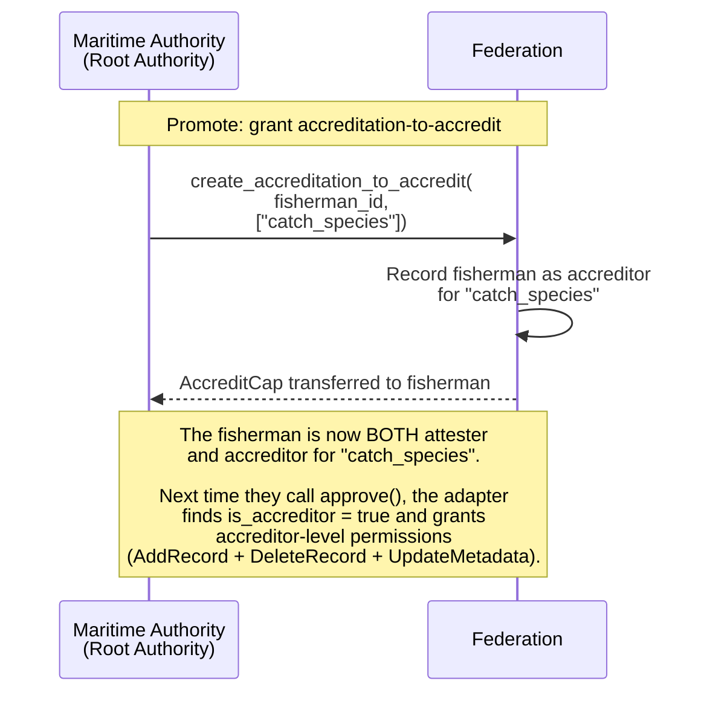
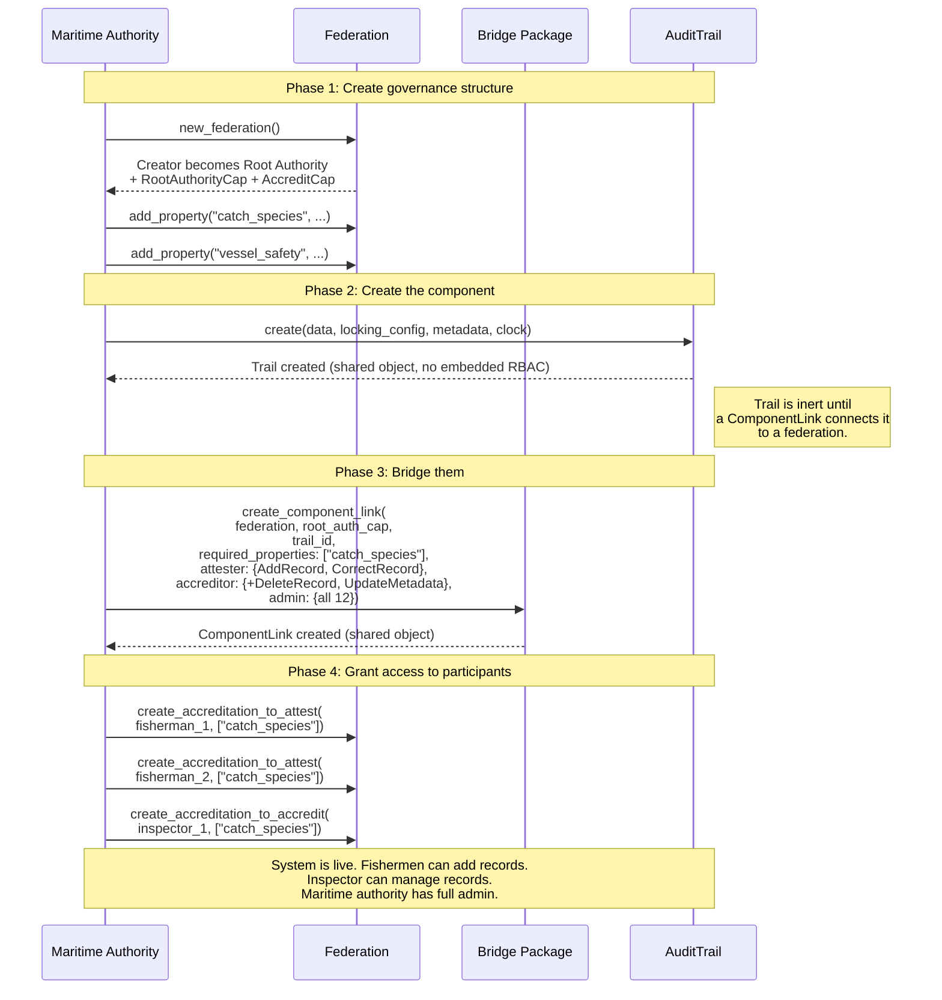
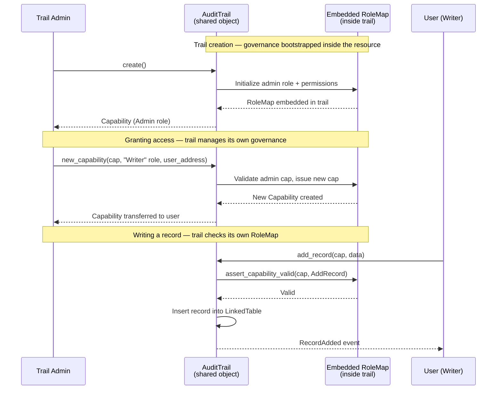
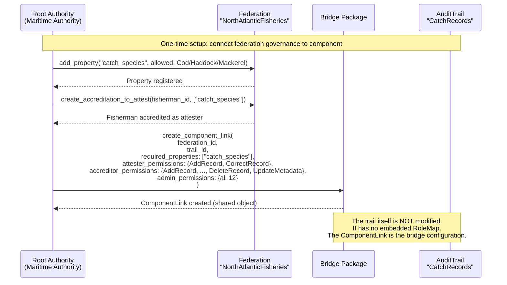
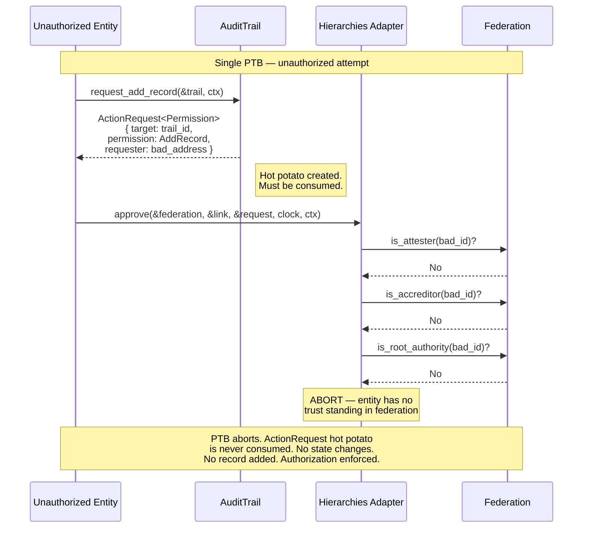
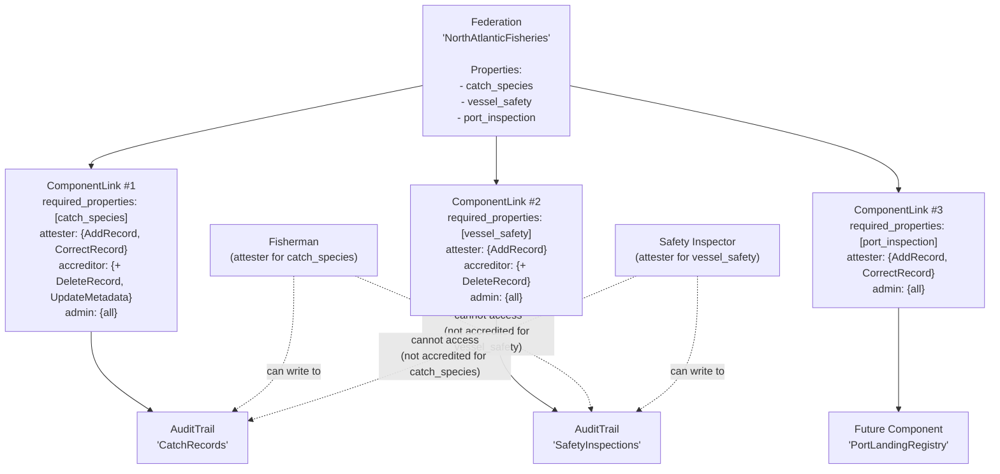
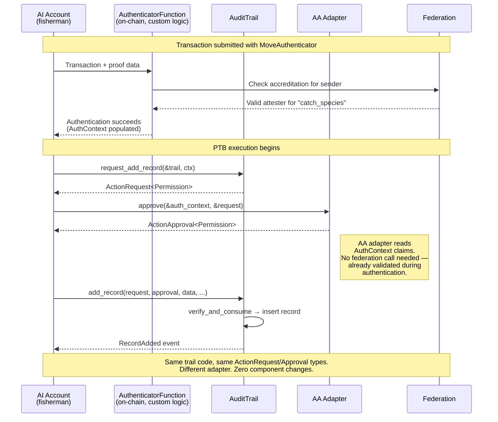
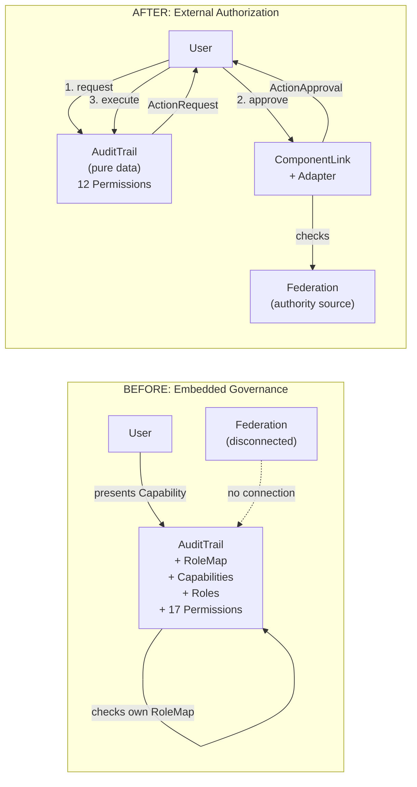

# Access Controller Bridge: Architectural Proposal

## Integrating Hierarchies, Audit Trails, and Future Components via a Universal Authorization Pattern

**Status**: Proposal \
**Date**: 2026-03-19 \
**Scope**: IOTA Trust Framework — cross-component authorization architecture

---

## Table of Contents

1. [Problem Statement](#1-problem-statement)
2. [Current State Analysis](#2-current-state-analysis)
3. [Architectural Critique](#3-architectural-critique)
4. [Guiding Principles](#4-guiding-principles)
5. [Proposed Solution: The Authorization Receipt Pattern](#5-proposed-solution-the-authorization-receipt-pattern)
6. [Hierarchies as Authority Source — Respecting Original Intent](#6-hierarchies-as-authority-source--respecting-original-intent)
7. [Detailed Design](#7-detailed-design)
8. [Impact on the Audit Trail](#8-impact-on-the-audit-trail)
9. [Permission Lifecycle: Granting, Changing, Revoking](#9-permission-lifecycle-granting-changing-revoking)
10. [Account Abstraction Considerations](#10-account-abstraction-considerations)
11. [Incremental Delivery](#11-incremental-delivery)
12. [Trade-offs and Alternatives Considered](#12-trade-offs-and-alternatives-considered)
13. [Compliance and Security Analysis (GDPR, ISO 27001)](#13-compliance-and-security-analysis-gdpr-iso-27001)
14. [Conclusion](#14-conclusion)

- [Appendix A: Architecture Diagram](#appendix-a-architecture-diagram)
- [Appendix B: Trust Level Mapping Example](#appendix-b-trust-level-mapping--concrete-example)
- [Appendix C: Flow Diagrams](#appendix-c-flow-diagrams)
- [Appendix D: Referenced Materials](#appendix-d-referenced-materials)

---

## 1. Problem Statement

The IOTA Trust Framework is a modular suite of components — Hierarchies, Notarization (including Audit Trails), Identity — that together establish trust in digital multi-stakeholder environments.

Currently these components solve authorization independently:

- **Hierarchies** manages delegated trust through federations, accreditations, and attestations. It answers: *"Is entity X trusted to make claims about property Y?"*
- **Audit Trails** embeds a full RBAC system (`RoleMap` from `tf_components`) inside each trail instance. It answers: *"Can holder of Capability C perform action A on this specific trail?"*
- **Notarization** (base) relies on Move's native object ownership — owner controls the object.

There is no mechanism for these authorization models to communicate. An entity accredited by a federation to attest domain properties still needs a separately-issued `Capability` from the trail's embedded `RoleMap` to add a record. The two systems exist in parallel, disconnected.

**The goal**: Define a universal architectural pattern — an access controller bridge — that allows any component to accept authorization from any authority source. Hierarchies is the primary authority source today, but the pattern must not be coupled to it. It should be a reusable process flow that connects any component needing authorization with any system providing it.

---

## 2. Current State Analysis

### 2.1 Hierarchies (`hierarchies::main`)

Hierarchies implements an **organized delegation of trust** — not a binary choice between centralization and decentralization, but authority distributed according to competence and context. A certified fish inspector's catch report carries weight because of demonstrated capability; a fishing vessel's sustainability claim carries weight because of accreditation by a recognized maritime authority.

The Federation is the core governance object:

```text
Federation
  ├── Properties         (what claims are recognized: "catch_species", "fishing_zone", etc.)
  ├── Root Authorities   (ultimate governance — define properties, manage accreditations)
  ├── Accreditations to Accredit  (right to DELEGATE trust to others)
  └── Accreditations to Attest    (right to MAKE verifiable claims)
```

Three natural **trust levels** emerge from this structure:

| Role | Trust Level | Meaning |
| --- | --- | --- |
| Root Authority | Sovereign | Defines the domain, manages all governance |
| Accreditor | Delegator | Can delegate trust to others within property scope |
| Attester | Claimant | Can make verifiable claims within property scope |

Each accreditation is **scoped to specific properties** — an entity accredited for "catch_species" cannot attest "vessel_safety". This property-scoping is a first-class concept in hierarchies.

**Key characteristic**: Hierarchies is an **authority source** that expresses domain-level trust. It determines who is trusted to say what, within which domain. It is not a general-purpose permission system — its properties represent real-world domain concepts, not operational buttons.

### 2.2 Audit Trails (`audit_trail::main`)

The Audit Trail is a shared object storing sequential, tamper-proof records with embedded RBAC:

```move
public struct AuditTrail<D: store + copy> has key, store {
    id: UID,
    records: LinkedTable<u64, Record<D>>,      // DATA
    roles: RoleMap<Permission, RecordTags>,     // GOVERNANCE (embedded)
    locking_config: LockingConfig,
    // ...
}
```

The `Permission` enum defines 17 distinct operations:

- **Data**: `AddRecord`, `DeleteRecord`, `CorrectRecord`, `DeleteAllRecords`
- **Metadata**: `UpdateMetadata`, `DeleteMetadata`
- **Configuration**: `UpdateLockingConfig`, `UpdateLockingConfigForDeleteRecord`, `UpdateLockingConfigForDeleteTrail`, `UpdateLockingConfigForWrite`
- **Lifecycle**: `DeleteAuditTrail`, `Migrate`
- **Self-governance**: `AddRoles`, `UpdateRoles`, `DeleteRoles`, `AddCapabilities`, `RevokeCapabilities`

Every protected operation requires presenting a `tf_components::Capability` validated against the trail's embedded `RoleMap`.

**Key characteristic**: The audit trail is both the **resource** (records) and the **governor** (its embedded RoleMap decides access). Authorization is fully self-contained per trail instance.

### 2.3 Notarization (`iota_notarization::notarization`)

The Notarization object is **owned** (not shared). Authorization is Move's native object ownership: if you own it, you control it. `TimeLock` adds temporal constraints.

**Key characteristic**: Correct for single-owner objects. No custom authorization needed.

### 2.4 Product-Core (`tf_components`)

Shared primitives for the trust framework:

- **`Capability`**: Transferable authorization token scoped to a target (`target_key`), with role, temporal validity (`valid_from`/`valid_until`), and optional address binding.
- **`RoleMap<P, D>`**: Generic RBAC mapping roles to custom permission types. Manages role lifecycle, capability issuance/revocation, denylist.
- **`TimeLock`**: Time-based restrictions (`UnlockAt`, `UntilDestroyed`, `Infinite`, `None`).

**Key limitation**: `Capability` creation is gated through `RoleMap` — only an existing admin Capability (validated by the RoleMap) can issue new Capabilities. No external authority can issue them independently.

---

## 3. Architectural Critique

### 3.1 The Audit Trail Embeds Governance Inside the Resource

The `RoleMap` living inside `AuditTrail` creates fundamental problems:

**Every trail is a governance silo.** Each trail creates its own admin, roles, and capabilities from scratch. There is no way to express "entity X is authorized across all trails in domain Y." Cross-trail authorization requires manual, per-trail capability delegation.

**Permission lifecycle is entangled with data lifecycle.** The same object stores records (which may persist for decades in compliance) and authorization rules (which evolve as organizations change). Deleting or migrating the trail affects its governance.

**It reinvents what hierarchies solves.** Hierarchies exists to manage delegated trust. Yet the audit trail ignores it, building a parallel authorization system.

**5 of 17 permissions are self-governance.** `AddRoles`, `UpdateRoles`, `DeleteRoles`, `AddCapabilities`, `RevokeCapabilities` — these exist because the trail manages its own access control. If authorization is externalized, these meta-permissions disappear entirely. The trail's permission surface shrinks to the 12 permissions that describe actual domain operations.

### 3.2 The Analogy

A fisherman's authority to log certified catches comes from the maritime authority, not from the logbook. A port inspector's ability to certify a landing comes from their accreditation, not from the form they fill in.

The audit trail is currently a logbook that decides who can write in it. It should be a logbook that verifies you hold a valid fishing license — issued by the maritime authority.

### 3.3 Notarization Gets It Right (For Its Scope)

The base Notarization module uses Move's native object ownership. This is correct for single-owner objects: no custom authorization needed. It doesn't reinvent governance.

The audit trail can't use this approach because it's a shared object (multi-party access). But the answer isn't embedding governance — it's accepting governance from external sources.

---

## 4. Guiding Principles

### 4.1 Separation of Concerns

Components define **what operations exist** (permission types). They do not decide **who is authorized** — that is a governance concern delegated to external authority sources.

### 4.2 Composability via PTBs

IOTA's programmable transaction blocks compose multiple package calls in a single atomic transaction. Authorization should work within this model: obtain proof in one call, use it in the next.

### 4.3 Move-Native Idioms

Use established Move patterns: **hot potatoes** (types without `drop` — must be consumed), **witness pattern**, **phantom types**. The closest precedent is IOTA's **Kiosk TransferPolicy** pattern.

### 4.4 Component Agnosticism

The pattern works for any shared object with protected operations: audit trails, identity credentials, future data registries. Not tied to any specific component.

### 4.5 Authority Source Agnosticism

The pattern works with any authority source: hierarchies today, Account Abstraction tomorrow, DAO governance in the future. No source is privileged.

### 4.6 Respect Hierarchies' Original Intent

Hierarchies is a trust delegation framework for domain-level properties. It must not be repurposed as a raw operational permission store. The bridge translates **trust standing** (your role + property scope in a federation) into **operational access**, not the other way around.

### 4.7 No Invented Concepts

The solution applies the existing Kiosk TransferPolicy pattern to authorization. No new paradigms.

---

## 5. Proposed Solution: The Authorization Receipt Pattern

### 5.1 Core Idea

Two hot-potato types defined in `tf_components`:

- **`ActionRequest<phantom P>`** — created by a component before a protected operation. Declares what permission `P` is needed. Has no `drop` — **must be consumed**, enforcing that authorization cannot be skipped.

- **`ActionApproval<phantom P>`** — produced by an authority source after verifying authorization. Also no `drop` — **must be consumed** by the component to complete the operation.

The phantom type `P` is the component's permission type, ensuring type-safe matching.

### 5.2 The Flow (Within a Single PTB)

```text
1. Component.request_action()  →  ActionRequest<P>     (hot potato: must be fulfilled)
2. AuthorityAdapter.approve()  →  ActionApproval<P>     (hot potato: must be consumed)
3. Component.execute_action()  ←  consumes both          (operation proceeds)
```

If step 2 fails (unauthorized), the `ActionRequest` cannot be consumed, and the entire PTB aborts. Authorization is structurally impossible to bypass.

### 5.3 Why Hot Potatoes

- **Cannot be skipped**: Must be consumed. No way to ignore authorization.
- **Cannot be replayed**: No `store` ability. Single-use within one transaction.
- **Type-safe**: `ActionApproval<audit_trail::Permission>` cannot satisfy `ActionApproval<identity::Permission>`.
- **Auditable**: Created and consumed on-chain in a single transaction.

### 5.4 Precedent: IOTA Kiosk TransferPolicy

This is not a new pattern. IOTA (inherited from Sui) uses exactly this for kiosk item transfers:

```text
Kiosk.list()        →  TransferRequest    (hot potato: "I want to transfer item X")
Rule.check()        →  adds Receipt        (rule satisfied)
Policy.confirm()    ←  consumes request    (transfer completes)
```

The proposed pattern generalizes this from "transfer authorization" to "any operation authorization."

---

## 6. Hierarchies as Authority Source — Respecting Original Intent

### 6.1 What Hierarchies IS and IS NOT

**IS**: A trust delegation framework. It expresses *"Entity X is trusted by federation F to make claims about property P."* This is semantic, domain-level trust — a fishing vessel trusted to report catches, a port inspector trusted to certify landings.

**IS NOT**: A general-purpose permission database. It does not store "User X can click button Y." Properties like "catch_species", "fishing_zone", "vessel_capacity" are domain concepts, not operational flags.

### 6.2 The Natural Mapping: Trust Level + Property Scope

The bridge does NOT create arbitrary mappings from properties to permissions. Instead, it recognizes that hierarchies already expresses two dimensions of authorization:

**Dimension 1: Trust Level** — your role in the federation determines what TYPE of operations you can perform:

| Federation Role | Operational Meaning | Example Component Operations |
| --- | --- | --- |
| Root Authority | Administrative control | Delete trail, migrate, configure locking |
| Accreditor | Management within scope | Delete records, update metadata, manage locking windows |
| Attester | Operational use within scope | Add records, correct records |

**Dimension 2: Property Scope** — your accreditation properties determine WHICH component instances you can access:

- Accredited for "catch_species" → can operate on the catch records audit trail
- Accredited for "vessel_safety" → can operate on the safety inspection audit trail
- NOT accredited for "port_inspection" → cannot touch the port landing records trail

This mapping is natural, not forced. It preserves hierarchies' intent:

- The federation still manages trust over domain properties
- Properties remain meaningful domain concepts, not operational flags
- The bridge translates trust standing into operational access

### 6.3 The ComponentLink Object

A `ComponentLink` is a small shared object that connects a federation to a component instance:

```move
/// Connects a federation to a specific component instance.
/// Defines which federation properties are relevant to this component
/// and how federation trust levels map to component operations.
public struct ComponentLink<phantom P: drop> has key, store {
    id: UID,
    /// The federation providing trust governance
    federation_id: ID,
    /// The component instance being governed
    target_id: ID,
    /// Which federation properties relate to this component.
    /// An entity must be accredited for at least one of these
    /// properties to access the component.
    required_properties: vector<PropertyName>,
    /// Permissions granted to entities with attester-level trust
    attester_permissions: VecSet<P>,
    /// Permissions granted to entities with accreditor-level trust
    accreditor_permissions: VecSet<P>,
    /// Permissions granted to root authorities
    admin_permissions: VecSet<P>,
}
```

This is created once per federation-component pairing. For example: *"Federation 'NorthAtlanticFisheries' governs audit trail 'CatchRecords'. Entities accredited for property 'catch_species' can access it. Attesters (fishermen) can add/correct records. Accreditors (regional inspectors) can also delete records and update metadata. Root authorities (maritime authority) have full admin access."*

### 6.4 Why This Preserves Hierarchies' Intent

The federation doesn't know about audit trails or their operations. It continues to manage trust over domain properties exactly as designed.

The `ComponentLink` is the bridge's configuration — it lives in the bridge package, not in hierarchies. Hierarchies is not modified. The bridge reads federation state (accreditation checks) and translates it.

Properties are NOT repurposed as permission names. "catch_species" remains a domain property. The bridge uses the fact that a fisherman is accredited for "catch_species" to determine their trust level for the catch records trail — the same way a port authority uses the fact that a vessel holds a valid fishing license to determine its access to landing documentation.

---

## 7. Detailed Design

### 7.1 Core Types (in `tf_components::authorization`)

```move
module tf_components::authorization;

use std::type_name::TypeName;

/// Created by a component at the start of a protected operation.
/// Hot potato: no `drop` — MUST be consumed.
public struct ActionRequest<phantom P: drop> {
    /// The shared object being acted upon
    target: ID,
    /// The component-specific permission required for this operation
    required_permission: P,
    /// The address requesting the action
    requester: address,
}

/// Produced by an authority source after verifying authorization.
/// Hot potato: no `drop` — MUST be consumed by the component.
public struct ActionApproval<phantom P: drop> {
    /// Must match the ActionRequest's target
    target: ID,
    /// Must match the ActionRequest's required_permission
    approved_permission: P,
    /// Identifies which authority source approved this
    authority: TypeName,
}

/// Create a new action request (called by components)
public fun new_request<P: drop>(
    target: ID,
    required_permission: P,
    requester: address,
): ActionRequest<P> {
    ActionRequest { target, required_permission, requester }
}

/// Verify that an approval matches a request and consume both.
/// Called by the component to gate the protected operation.
public fun verify_and_consume<P: drop>(
    request: ActionRequest<P>,
    approval: ActionApproval<P>,
) {
    let ActionRequest { target, required_permission: _, requester: _ } = request;
    let ActionApproval {
        target: approved_target,
        approved_permission: _,
        authority: _,
    } = approval;
    assert!(target == approved_target);
    // Both hot potatoes consumed (destructured). Operation may proceed.
}

/// Accessors for inspecting requests (used by authority adapters)
public fun request_target<P: drop>(r: &ActionRequest<P>): ID { r.target }
public fun request_permission<P: drop>(r: &ActionRequest<P>): &P { &r.required_permission }
public fun request_requester<P: drop>(r: &ActionRequest<P>): address { r.requester }
```

### 7.2 Hierarchies Adapter (in bridge package)

```move
module access_controller_bridge::hierarchies_adapter;

use hierarchies::main::{Self, Federation, RootAuthorityCap};
use hierarchies::property_name::PropertyName;
use tf_components::authorization::{Self, ActionRequest, ActionApproval};
use iota::vec_set::VecSet;
use std::type_name;

/// Connects a federation to a specific component instance.
/// Created by a federation root authority. Shared object.
///
/// Governance:
///   Only root authorities of the linked federation can create or modify this object.
///   The federation's root authorities are the ultimate governors of the bridge.
public struct ComponentLink<phantom P: drop> has key, store {
    id: UID,
    federation_id: ID,
    target_id: ID,
    required_properties: vector<PropertyName>,
    attester_permissions: VecSet<P>,
    accreditor_permissions: VecSet<P>,
    admin_permissions: VecSet<P>,
}

/// Create a new ComponentLink. Only callable by a root authority
/// of the specified federation.
public fun create_component_link<P: drop + copy>(
    federation: &Federation,
    cap: &RootAuthorityCap,
    target_id: ID,
    required_properties: vector<PropertyName>,
    attester_permissions: VecSet<P>,
    accreditor_permissions: VecSet<P>,
    admin_permissions: VecSet<P>,
    ctx: &mut TxContext,
): ComponentLink<P> {
    assert!(federation.is_root_authority(&ctx.sender().to_id()));

    let link = ComponentLink {
        id: object::new(ctx),
        federation_id: federation.federation_id(),
        target_id,
        required_properties,
        attester_permissions,
        accreditor_permissions,
        admin_permissions,
    };
    link
}

/// Update the permission sets. Only callable by a root authority.
public fun update_permissions<P: drop + copy>(
    link: &mut ComponentLink<P>,
    federation: &Federation,
    cap: &RootAuthorityCap,
    attester_permissions: VecSet<P>,
    accreditor_permissions: VecSet<P>,
    admin_permissions: VecSet<P>,
    ctx: &TxContext,
) {
    assert!(link.federation_id == federation.federation_id());
    assert!(federation.is_root_authority(&ctx.sender().to_id()));
    link.attester_permissions = attester_permissions;
    link.accreditor_permissions = accreditor_permissions;
    link.admin_permissions = admin_permissions;
}

/// Approve an action request based on the caller's trust standing
/// in the linked federation.
///
/// NOTE: No AccreditCap or RootAuthorityCap parameter is needed.
/// The adapter only READS federation state through public functions
/// (is_root_authority, is_accreditor, is_attester, validate_property).
/// The caller's identity is verified through ctx.sender(), which is
/// cryptographically guaranteed by the IOTA runtime.
///
/// The flow:
/// 1. Verify the link matches the request's target
/// 2. Determine the caller's trust level in the federation
///    (root authority, accreditor, or attester)
/// 3. Verify the caller's accreditation covers required properties
/// 4. Check that the trust level grants the requested permission
/// 5. Produce an ActionApproval
public fun approve<P: drop + copy>(
    federation: &Federation,
    link: &ComponentLink<P>,
    request: &ActionRequest<P>,
    clock: &Clock,
    ctx: &TxContext,
): ActionApproval<P> {
    let requester = authorization::request_requester(request);
    let required_perm = authorization::request_permission(request);
    let target = authorization::request_target(request);

    // 1. Verify link matches
    assert!(link.target_id == target);
    assert!(link.federation_id == federation.federation_id());

    // 2. Determine trust level and check permission
    let requester_id = requester.to_id();

    let authorized = if (federation.is_root_authority(&requester_id)) {
        // Root authorities get admin-level permissions
        link.admin_permissions.contains(required_perm)
    } else if (federation.is_accreditor(&requester_id)) {
        // Accreditors get accreditor-level permissions
        // Also verify their property scope covers required properties
        verify_property_scope(federation, &requester_id, &link.required_properties, clock);
        link.accreditor_permissions.contains(required_perm)
    } else if (federation.is_attester(&requester_id)) {
        // Attesters get attester-level permissions
        verify_property_scope_for_attester(
            federation, &requester_id, &link.required_properties, clock,
        );
        link.attester_permissions.contains(required_perm)
    } else {
        false
    };

    assert!(authorized);

    ActionApproval {
        target,
        approved_permission: *required_perm,
        authority: type_name::get<ComponentLink<P>>(),
    }
}
```

### 7.3 Audit Trail — Refactored (No Embedded RBAC)

The `AuditTrail` struct loses its embedded `RoleMap`. The 5 self-governance permissions disappear:

```move
public struct AuditTrail<D: store + copy> has key, store {
    id: UID,
    creator: address,
    created_at: u64,
    sequence_number: u64,
    records: LinkedTable<u64, Record<D>>,
    locking_config: LockingConfig,
    immutable_metadata: Option<ImmutableMetadata>,
    updatable_metadata: Option<String>,
    version: u64,
    // NO roles: RoleMap<Permission, RecordTags>
}
```

The `Permission` enum simplifies to actual domain operations:

```move
public enum Permission has copy, drop, store {
    // Data operations (attester level)
    AddRecord,
    CorrectRecord,
    // Data management (accreditor level)
    DeleteRecord,
    DeleteAllRecords,
    UpdateMetadata,
    DeleteMetadata,
    // Configuration (accreditor level)
    UpdateLockingConfig,
    UpdateLockingConfigForDeleteRecord,
    UpdateLockingConfigForDeleteTrail,
    UpdateLockingConfigForWrite,
    // Lifecycle (admin level)
    DeleteAuditTrail,
    Migrate,
    // REMOVED: AddRoles, UpdateRoles, DeleteRoles,
    //          AddCapabilities, RevokeCapabilities
    // These were self-governance — no longer needed.
}
```

Protected functions use the authorization receipt pattern:

```move
/// Create an authorization request for adding a record.
public fun request_add_record<D: store + copy>(
    trail: &AuditTrail<D>,
    ctx: &TxContext,
): ActionRequest<Permission> {
    authorization::new_request(
        trail.id(),
        permission::add_record(),
        ctx.sender(),
    )
}

/// Add a record with external authorization.
public fun add_record<D: store + copy>(
    trail: &mut AuditTrail<D>,
    request: ActionRequest<Permission>,
    approval: ActionApproval<Permission>,
    stored_data: D,
    record_metadata: Option<String>,
    clock: &Clock,
    ctx: &mut TxContext,
) {
    assert!(trail.version == PACKAGE_VERSION, EPackageVersionMismatch);
    assert!(!locking::is_write_locked(&trail.locking_config, clock), ETrailWriteLocked);

    // Verify and consume authorization
    authorization::verify_and_consume(request, approval);

    // Pure data operation
    let caller = ctx.sender();
    let timestamp = clock::timestamp_ms(clock);
    let trail_id = trail.id();
    let seq = trail.sequence_number;

    let record = record::new(
        stored_data,
        record_metadata,
        seq,
        caller,
        timestamp,
        record::new_correction(),
    );

    linked_table::push_back(&mut trail.records, seq, record);
    trail.sequence_number = trail.sequence_number + 1;

    event::emit(RecordAdded {
        trail_id,
        sequence_number: seq,
        added_by: caller,
        timestamp,
    });
}
```

### 7.4 End-to-End Example: Full PTB

A fisherman (attester in federation "NorthAtlanticFisheries") adds a catch record to the "CatchRecords" audit trail:

```move
// === Single Programmable Transaction Block ===

// Step 1: Audit trail creates the request (hot potato)
let request = audit_trail::request_add_record(&trail, ctx);

// Step 2: Hierarchies adapter verifies trust standing and approves
//         No capability object needed — adapter reads federation state
//         and verifies ctx.sender() against accreditation maps
let approval = hierarchies_adapter::approve(
    &federation,        // NorthAtlanticFisheries federation (shared object, read-only)
    &component_link,    // links this federation to this trail
    &request,           // borrows the request to inspect it
    clock,
    ctx,
);

// Step 3: Audit trail consumes both and adds the record
audit_trail::add_record(
    &mut trail,
    request,            // consumed (hot potato)
    approval,           // consumed (hot potato)
    catch_data,
    some(b"Atlantic Cod, 320kg, Zone 5a"),
    clock,
    ctx,
);
```

---

## 8. Impact on the Audit Trail

### 8.1 What Is Removed

- The `roles: RoleMap<Permission, RecordTags>` field is removed from `AuditTrail`
- The 5 self-governance permissions (`AddRoles`, `UpdateRoles`, `DeleteRoles`, `AddCapabilities`, `RevokeCapabilities`) are removed from the `Permission` enum
- All role/capability administration functions are removed (`create_role`, `update_role_permissions`, `delete_role`, `new_capability`, `revoke_capability`, `destroy_capability`, `destroy_initial_admin_capability`, `revoke_initial_admin_capability`)
- The `create()` function no longer returns a `Capability` — there are no embedded capabilities

### 8.2 What Changes

- Every protected function gains `request` and `approval` parameters instead of `cap: &Capability`
- Each protected function has a corresponding `request_*` function that creates the `ActionRequest`
- The `create()` function takes simpler arguments (no role initialization)

### 8.3 What Stays the Same

- `AuditTrail` remains a shared object
- All data operations (add/delete/correct records) work identically
- Locking logic is unchanged (time-based, count-based, trail-level locks)
- Events are unchanged
- Record structure is unchanged
- All query functions are unchanged

### 8.4 Net Effect

The audit trail becomes a **pure data component** — it stores records, enforces locking constraints, and emits events. It no longer manages access control. The trail surface area shrinks, its responsibilities are clearer, and it becomes composable with any authority source.

---

## 9. Permission Lifecycle: Granting, Changing, Revoking

A critical property of the proposed architecture: **all permission lifecycle operations happen at the federation or ComponentLink level. The component (audit trail) is never modified.** This section traces every lifecycle event through the system.

### 9.1 Granting Access

**Scenario**: The maritime authority wants a new fisherman to be able to log catches.

```mermaid
sequenceDiagram
    participant MA as Maritime Authority<br/>(Root Authority)
    participant Fed as Federation<br/>"NorthAtlanticFisheries"
    participant Link as ComponentLink<br/>(already exists)
    participant Trail as AuditTrail<br/>"CatchRecords"
    participant Fish as New Fisherman

    Note over MA,Fish: Step 1: Grant accreditation in the federation

    MA->>Fed: create_accreditation_to_attest(<br/>  fisherman_id,<br/>  ["catch_species"])
    Fed->>Fed: Record fisherman as attester<br/>for "catch_species"
    Fed-->>MA: Accreditation recorded

    Note over Link,Trail: Nothing happens here.<br/>The ComponentLink already exists.<br/>The trail is not touched.

    Note over MA,Fish: Step 2: Fisherman can now operate (next PTB)

    Fish->>Trail: request_add_record(&trail, ctx)
    Trail-->>Fish: ActionRequest

    Fish->>Link: approve(&federation, &link, &request, clock, ctx)
    Note over Link: Checks federation:<br/>is_attester(fisherman_id)? YES<br/>property scope matches? YES<br/>attester can AddRecord? YES
    Link-->>Fish: ActionApproval

    Fish->>Trail: add_record(request, approval, catch_data, ...)
    Trail-->>Fish: RecordAdded event
```

**Key property**: Granting access is a single federation operation. No changes to any trail, no changes to the ComponentLink, no capability objects issued. The fisherman's next call to `approve()` succeeds because the federation state has changed.

### 9.2 Revoking Access

**Scenario**: A fisherman's license is suspended. They must immediately lose the ability to log catches.

```mermaid
sequenceDiagram
    participant Insp as Regional Inspector<br/>(Accreditor)
    participant Fed as Federation<br/>"NorthAtlanticFisheries"
    participant Link as ComponentLink
    participant Trail as AuditTrail<br/>"CatchRecords"
    participant Fish as Suspended Fisherman

    Note over Insp,Fish: Step 1: Revoke accreditation in the federation

    Insp->>Fed: revoke_accreditation_to_attest(<br/>  fisherman_id,<br/>  permission_id)
    Fed->>Fed: Remove fisherman from<br/>attesters for "catch_species"
    Fed-->>Insp: Accreditation revoked

    Note over Link,Trail: Nothing happens here.<br/>No trail modification. No capability to chase down.

    Note over Insp,Fish: Step 2: Fisherman's next attempt is denied

    Fish->>Trail: request_add_record(&trail, ctx)
    Trail-->>Fish: ActionRequest

    Fish->>Link: approve(&federation, &link, &request, clock, ctx)
    Note over Link: Checks federation:<br/>is_attester(fisherman_id)? NO<br/>is_accreditor(fisherman_id)? NO<br/>is_root_authority(fisherman_id)? NO
    Note over Link: ABORT — no trust standing

    Note over Fish,Trail: PTB aborts. No record added.<br/>Revocation is immediate.
```

**Key property**: Revocation is immediate and universal. There are no stale capability objects floating in the fisherman's wallet that could be presented elsewhere. Every operation checks live federation state. The moment accreditation is revoked, all access through all ComponentLinks for that federation is denied.

**Comparison with embedded RBAC**: In the current model, revoking access means adding a Capability ID to the RoleMap's denylist. The Capability object still exists in the user's wallet. If the denylist check has a bug, or if the Capability is presented to a different system that doesn't share the denylist, revocation leaks. In the proposed model, there is no token to revoke — the authority check is against live state.

### 9.3 Changing Scope (Promoting / Demoting)

**Scenario**: A fisherman proves reliable and is promoted to regional inspector (accreditor).



No ComponentLink changes. No trail changes. The adapter's trust-level check now returns a higher level, so the entity gains more permissions automatically.

**Demotion** works the same way in reverse — revoke the accreditation-to-accredit, and the entity drops back to attester level.

### 9.4 Changing the Permission Mapping

**Scenario**: Regulations change — attesters (fishermen) should now also be able to `DeleteRecord` their own erroneous entries.

```mermaid
sequenceDiagram
    participant MA as Maritime Authority<br/>(Root Authority)
    participant Link as ComponentLink
    participant Trail as AuditTrail

    Note over MA,Trail: Update the bridge configuration

    MA->>Link: update_permissions(<br/>  federation, root_auth_cap,<br/>  attester: {AddRecord, CorrectRecord, DeleteRecord},<br/>  accreditor: {... same ...},<br/>  admin: {... same ...})
    Link->>Link: attester_permissions updated
    Link-->>MA: Done

    Note over Trail: Trail is not modified.<br/>No migration, no upgrade.

    Note over MA,Trail: Immediately effective:<br/>all attesters can now DeleteRecord<br/>through this ComponentLink.
```

**Governance of ComponentLink**: Only root authorities of the linked federation can call `update_permissions`. This is enforced by checking `federation.is_root_authority(&ctx.sender().to_id())` and verifying the `RootAuthorityCap`. The federation's root authorities are the ultimate governors of both the federation AND the bridge configuration.

### 9.5 Property Revocation in the Federation

**Scenario**: The federation decides to phase out "catch_species" as a recognized property (e.g., replaced by a more specific "catch_species_v2").

```mermaid
sequenceDiagram
    participant MA as Maritime Authority<br/>(Root Authority)
    participant Fed as Federation
    participant Link as ComponentLink
    participant Fish as Any Fisherman

    MA->>Fed: revoke_property("catch_species", clock)
    Fed->>Fed: Set valid_until_ms on "catch_species"
    Fed-->>MA: Property revoked

    Note over Link,Fish: All ComponentLinks requiring "catch_species"<br/>are now effectively disabled.

    Fish->>Link: approve(&federation, &link, &request, clock, ctx)
    Note over Link: Checks required_properties against federation:<br/>"catch_species" is_valid_at_time? NO (revoked)
    Note over Link: ABORT — required property no longer valid

    Note over Fish: All access via this ComponentLink stops.<br/>A new ComponentLink with "catch_species_v2"<br/>must be created for the new property.
```

### 9.6 Root Authority Revocation

**Scenario**: A root authority (e.g., a regional maritime office) is removed from the federation.

The revoked root authority immediately loses:

- Admin access to all linked components (adapter checks `is_root_authority` → false)
- Ability to modify any `ComponentLink` (governance function checks `is_root_authority` → false)
- Ability to grant/revoke accreditations in the federation

If reinstated (`reinstate_root_authority`), all access is restored immediately.

### 9.7 Bootstrapping: Creating the Initial Setup

The full initial setup follows this sequence:



**Trail creation is decoupled from governance.** The trail is created as a simple shared data container. It only becomes operational when a ComponentLink connects it to a federation. This separation means:

- Anyone can create a trail (it's just data storage)
- Only a federation root authority can connect it to governance
- An unlinked trail is dormant — no operations possible (no way to produce ActionApproval)

### 9.8 Summary: No Stale Tokens, No Per-Trail Governance

| Operation | Current Model (Embedded RBAC) | Proposed Model (External Authorization) |
| --- | --- | --- |
| Grant access | Create role on trail + issue Capability per trail | Single federation accreditation (applies to all linked trails) |
| Revoke access | Add Capability to trail's denylist. Capability object still in user's wallet | Revoke federation accreditation. No tokens to chase. Immediate |
| Change scope | Issue new Capability with different role, revoke old one, per trail | Update federation accreditation. Immediate across all trails |
| Change what permissions mean | Update role permissions on each trail's RoleMap, per trail | Update ComponentLink (one object). Immediate |
| Promote entity | Create new role + capability on each trail | Grant accreditation-to-accredit in federation. Immediate everywhere |
| Revoke property domain | Not possible (RBAC has no concept of domain properties) | Revoke property in federation. All related access stops |
| Multi-trail governance | Manual per-trail setup for every new trail | One federation + one ComponentLink per trail. Accreditations apply automatically |

---

## 10. Account Abstraction Considerations

### 10.1 Authentication vs. Authorization

Account Abstraction (AA, per [IIP #35](https://github.com/iotaledger/IIPs/discussions/35)) introduces AI Accounts with programmable authentication — custom Move functions replace cryptographic signature verification.

AA addresses **authentication**: *"Is this transaction genuinely from who it claims?"* \
The ActionRequest/Approval pattern addresses **authorization**: *"Is this authenticated entity allowed to perform this operation?"*

```text
AA (AuthenticatorFunction)    →  "This IS Alice"
ActionRequest/Approval        →  "Alice MAY add records to trail X"
```

These are orthogonal. AA doesn't replace the pattern — it complements it.

### 10.2 AA as an Authority Source

An AA adapter would translate authenticated context into `ActionApproval`:

```move
module aa_bridge::adapter;

/// The AI Account's authenticator has validated the transaction.
/// Extract authorization claims from the authentication context.
public fun approve<P: drop + copy>(
    auth_context: &AuthContext,
    request: &ActionRequest<P>,
): ActionApproval<P> {
    // The authenticator function has already verified authorization
    // (e.g., checked a hierarchies federation, validated a multisig,
    // enforced spending limits) as part of authentication.
    // This adapter extracts the result.
}
```

### 10.3 Patterns AA Enables

- **Implicit authorization**: The AI Account's authenticator checks federation accreditation as part of authentication. The PTB becomes simpler — no explicit adapter call needed.
- **Account-level policies**: Authorization rules live in the account definition, reducing on-chain configuration objects.
- **Key rotation resilience**: Trust is tied to the account (persistent object with stable address), not to a specific key.

### 10.4 Why the Pattern Is AA-Ready

The ActionRequest/Approval protocol doesn't care HOW the approval is produced. AA is just another adapter. When AA ships, existing components and existing `ComponentLink` objects continue to work — you simply swap the adapter used in the PTB.

---

## 11. Incremental Delivery

Each increment is independently valuable and deployable.

### Increment 1: Authorization Types in `tf_components`

**Delivers**: `ActionRequest<P>`, `ActionApproval<P>`, `new_request()`, `verify_and_consume()` in a new `tf_components::authorization` module.

**Why standalone**: These types have no dependencies on hierarchies, audit trails, or any other component. They are pure primitives. Other increments build on them.

**Effort**: Small. One new module, ~50 lines of Move.

### Increment 2: Refactor Audit Trail to External Authorization

**Delivers**: Audit trail with embedded RoleMap removed. All protected functions accept `ActionRequest`/`ActionApproval`. Permission enum simplified (5 self-governance permissions removed).

**Why standalone**: Even without the hierarchies adapter, the audit trail is now composable. Any package can produce `ActionApproval<Permission>` objects. Simple test adapters can be written for development.

**Consideration**: This is the largest change. The audit trail is in active development, making this the right time.

### Increment 3: Hierarchies Adapter (The Bridge Proper)

**Delivers**: `ComponentLink<P>` struct, `approve()` function, and helper functions for creating/managing component links. This IS the access controller bridge.

**Why standalone**: Hierarchies package is not modified — the adapter is a new package that reads federation state. Components that have adopted Increment 2 immediately gain hierarchies-based authorization.

### Increment 4: AA Adapter (When AA Ships)

**Delivers**: Adapter translating AA `AuthContext` into `ActionApproval`. Components gain AA-based authorization with no further changes.

---

## 12. Trade-offs and Alternatives Considered

### 12.1 Rejected: Hierarchies Issues Capabilities for Audit Trail RoleMaps

**Idea**: Keep embedded RoleMap. Have hierarchies issue `tf_components::Capability` objects for each trail's RoleMap.

**Why rejected**: Doesn't fix the architecture. The trail is still its own governance silo. Each trail still needs per-trail capability setup. Hierarchies becomes an admin of the trail's embedded RBAC rather than a sovereign authority source. And it couples hierarchies to the specific RoleMap implementation.

### 12.2 Rejected: Generic Authorization Policy Object With Runtime Dispatch

**Idea**: A `Policy<P>` shared object that dispatches to different authorization backends at runtime.

**Why rejected**: Move doesn't have dynamic dispatch or trait objects. Would require enumerating all backends at compile time. The hot potato pattern achieves the same goal through composition in PTBs — more aligned with Move's design.

### 12.3 Rejected: Map Individual Properties to Individual Permissions

**Idea**: An earlier version of this proposal mapped federation properties (e.g., "record_writer") directly to audit trail permissions (e.g., `AddRecord`).

**Why rejected**: This misuses hierarchies. It requires inventing artificial properties that are really operational flags. Properties should remain domain concepts ("catch_species", "fishing_zone"). The correct abstraction is the two-dimensional mapping: trust level (root/accreditor/attester) determines operation category, property scope determines which component instances.

### 12.4 Trade-off: PTB Complexity

The pattern requires three steps per operation in a PTB (request → approve → execute) versus one step today (call with Capability).

**Why acceptable**: The explicit flow is a *feature* in security-sensitive contexts — authorization is visible and auditable. SDK helpers and client libraries can compose the PTB steps, hiding complexity from end users. The on-chain semantics are clearer than implicit Capability checking.

### 12.5 Trade-off: ComponentLink Configuration Objects

Each federation-component pairing needs a `ComponentLink` shared object.

**Why acceptable**: These are small, infrequently modified objects. Created once when establishing a governance relationship. Storage cost is negligible. They can be made immutable once established.

---

## 13. Compliance and Security Analysis (GDPR, ISO 27001)

This section examines the proposed architecture from a regulatory and security audit perspective. It identifies concerns an auditor would raise and proposes mitigations where possible.

### 13.1 GDPR Analysis

#### 13.1.1 Personal Data on a Public Blockchain

GDPR applies when personal data of EU natural persons is processed. In the proposed architecture, personal data appears in several places:

| Data Point | Location | Personal Data? |
| --- | --- | --- |
| `added_by: address` in records | AuditTrail (on-chain) | Yes, if address is linkable to a natural person |
| `requester: address` in ActionRequest | PTB execution (transient, but in tx history) | Yes, same reason |
| Entity IDs in `accreditations_to_attest` map | Federation (on-chain, public) | Yes — reveals who holds what role |
| `creator: address` in trail | AuditTrail (on-chain) | Yes |
| Event data (`RecordAdded`, `RecordDeleted`) | On-chain event log (permanent) | Yes — contains addresses and timestamps |
| Record `data: D` (generic) | AuditTrail (on-chain) | Depends on what is stored |

**GDPR concern**: All on-chain data on IOTA is **public and permanent** (readable by any validator or full node). If any of these fields can be linked to a natural person, GDPR applies to the entire data flow.

#### 13.1.2 Right to Erasure (Article 17) — The Fundamental Tension

The audit trail is designed for **tamper-evident immutability**. GDPR's right to erasure directly contradicts this design goal.

The audit trail does provide `delete_record` and `delete_records_batch` functions, which remove records from the current on-chain state. However:

- **Transaction history is permanent**: The `RecordAdded` event that originally stored the data is in the blockchain's event log and cannot be deleted.
- **State snapshots**: Historical state may be accessible through archival nodes or checkpoints.
- **The deletion event itself** (`RecordDeleted`) records `deleted_by` address and `sequence_number`, creating a permanent trace that a deletion occurred.

**Auditor flag**: An auditor would flag that `delete_record` does not constitute GDPR-compliant erasure. The data persists in the blockchain's historical layers.

**Mitigation**: Do not store personal data directly on-chain. Instead:

- Store a **hash** of the data on-chain (the audit trail becomes a hash chain, proving integrity without exposing content).
- Store the actual data **off-chain** in a system that supports deletion (encrypted database, IPFS with unpinning, etc.).
- The on-chain record proves "data with hash X existed at time T" without revealing the data itself. If the off-chain data is deleted, the hash becomes unlinkable.

This is an architectural recommendation that applies regardless of the bridge proposal — it is a property of the audit trail's data model.

#### 13.1.3 Public Visibility of Access Relationships

The federation's accreditation maps are on a shared object, readable by anyone. This means:

- It is publicly visible that "address 0xABC is an attester for catch_species in federation NorthAtlanticFisheries"
- If 0xABC is linked to a specific fisherman, their professional accreditation status is public

**Auditor flag**: Publishing role/accreditation status of natural persons on a public blockchain may require explicit consent and a lawful basis under GDPR Article 6.

**Mitigation**:

- Use **pseudonymous identifiers** (e.g., IOTA Identity DIDs) rather than raw addresses where possible.
- Consider whether accreditation status needs to be on-chain, or if a zero-knowledge proof approach could prove "I am accredited" without revealing the specific identity.
- With Account Abstraction, AI Accounts provide stable addresses decoupled from public keys, offering a layer of pseudonymization.

#### 13.1.4 Data Protection by Design (Article 25)

GDPR requires "data protection by design and by default." Current gaps:

| Requirement | Current Status | Gap |
| --- | --- | --- |
| Encryption at rest | Not implemented — on-chain data is plaintext | Records should encrypt sensitive `data: D` before on-chain storage |
| Pseudonymization | Not implemented — raw addresses throughout | Use DIDs or derived identifiers |
| Purpose limitation | Not enforced — `data: D` is generic with no purpose tagging | `ComponentLink` could include a `purpose` field documenting lawful basis |
| Data minimization | Not enforced — any data can be stored in records | Application-level concern; hash-only on-chain storage addresses this |
| Retention policies | Partially addressed via locking/deletion mechanisms | No built-in automatic expiration or retention enforcement |
| Consent tracking | Not implemented | Application-level concern; not in scope of the smart contract layer |

#### 13.1.5 Data Controller / Processor Roles

GDPR requires clear identification of data controllers and processors:

| Entity | GDPR Role | Reasoning |
| --- | --- | --- |
| Federation Root Authority (e.g., Maritime Authority) | **Data Controller** | Determines the purposes and means of processing (defines properties, grants access, creates governance structure) |
| Accreditor (e.g., Regional Inspector) | **Data Controller** or **Processor** | May determine purposes (if independently deciding what to record) or act on controller's instructions |
| Attester (e.g., Fisherman) | **Data Processor** or **Data Subject** | Acts within scope defined by accreditation; if recording own data, may also be data subject |
| IOTA Network Validators | **Data Processor** | Process transactions on behalf of controllers; do not determine purposes |

**Auditor flag**: The decentralized nature makes controller identification ambiguous. A Data Protection Impact Assessment (DPIA) should be conducted before deployment with personal data.

#### 13.1.6 Cross-Border Data Transfers (Chapter V)

IOTA validators operate globally. On-chain data is replicated to all validators regardless of jurisdiction.

**Auditor flag**: This constitutes international data transfer. If EU personal data is processed, Standard Contractual Clauses (SCCs) or equivalent safeguards may be required for validator operators in non-adequate jurisdictions.

**Mitigation**: This is an IOTA network-level concern, not specific to the bridge. The hash-only on-chain approach eliminates the issue — hashes alone are not personal data.

### 13.2 ISO 27001 Analysis

#### 13.2.1 Strengths — Where the Proposed Architecture Aligns Well

**A.8 Access Control (Access management)**:

- **Least privilege**: Three trust levels (attester/accreditor/root) with escalating permissions. Attesters get minimal write access; admin operations require root authority.
- **Access provisioning**: Explicitly auditable — every accreditation grant is an on-chain transaction with timestamp and authorizer.
- **Timely revocation**: Immediate, universal, no stale tokens. Superior to the embedded RBAC model where Capability objects persist in wallets after revocation.
- **Segregation of duties**: Natural separation between governance (root authority), management (accreditor), and operations (attester).

**A.8.15 Logging (Logging and monitoring)**:

- Every operation emits on-chain events: `RecordAdded`, `RecordDeleted`, `AuditTrailCreated`, `AuditTrailDeleted`.
- Every authorization decision goes through the adapter, which is on-chain and fully auditable.
- Transaction history provides complete forensic capability: who did what, when, authorized by whom.

**A.5.10 Acceptable use of information (Information security in supplier relationships)**:

- The `ComponentLink` explicitly documents what each trust level can do, creating a formal access control policy artifact on-chain.

#### 13.2.2 Concerns — Where Auditors Would Raise Flags

**A.8.2 Privileged access management — Root Authority Key Risk**:

The root authority keys are the highest-privilege credentials in the system. Compromise of ALL root authority keys means:

- Attacker gains full admin access to all linked components
- Attacker can grant themselves accreditations, modify ComponentLinks, revoke legitimate authorities
- There is **no recovery mechanism** — once all root authorities are compromised, the federation is permanently compromised

| Risk | Severity | Current Mitigation | Gap |
| --- | --- | --- | --- |
| Single root authority key compromise | High | Multi-root-authority: others can revoke the compromised one | Adequate if multiple root authorities are used |
| All root authority keys compromised | Critical | None | **No break-glass or recovery procedure** |
| All root authority keys lost | Critical | None | **Federation becomes permanently ungovernable** |

**Recommendation**: Implement a **recovery mechanism** — e.g., a time-locked recovery address set at federation creation, or social recovery requiring M-of-N signatures from a pre-defined recovery set. This should be designed at the hierarchies level.

**A.8.3 Information access restriction — ComponentLink Governance Gap**:

The `ComponentLink` is modified by any single root authority. There is no approval workflow or multi-signature requirement for changes that could escalate privileges:

- A compromised root authority could change `attester_permissions` to include `DeleteAuditTrail`
- A compromised root authority could grant `admin_permissions` to all trust levels

**Auditor flag**: Privilege escalation through ComponentLink modification is a single-key operation.

**Recommendation**: Add a **multi-authority approval** requirement for ComponentLink changes that escalate permissions (e.g., adding admin-level permissions to attester trust level). Or at minimum, emit events on ComponentLink modification for monitoring.

**A.8.15 Logging — Missing Audit Events for Configuration Changes**:

The current design does not emit events when:

- A `ComponentLink` is created
- A `ComponentLink`'s permissions are modified
- A `ComponentLink` is deleted

ISO 27001 (A.8.15) requires logging of access control configuration changes.

**Recommendation**: Add events:

```move
public struct ComponentLinkCreated has copy, drop {
    link_id: ID,
    federation_id: ID,
    target_id: ID,
    created_by: address,
    timestamp: u64,
}

public struct ComponentLinkPermissionsUpdated has copy, drop {
    link_id: ID,
    updated_by: address,
    timestamp: u64,
}
```

**A.8.4 Access to source code — Smart Contract Transparency**:

Move packages deployed on IOTA are public and readable. This is a strength for auditability but means:

- Authorization logic is publicly inspectable (attackers can study it for weaknesses)
- This is accepted practice in blockchain and is generally considered a strength (open-source security model)

**A.5.29 Information security during disruption — No Emergency Freeze**:

If a security incident is detected (e.g., compromised key, suspicious bulk operations), there is no mechanism to immediately freeze all operations on linked components.

The audit trail has `write_lock` and `delete_trail_lock` mechanisms, but these require a separate authorized operation to activate — which the attacker could also block if they've compromised the root authority.

**Recommendation**: Add an **emergency freeze** mechanism — e.g., any root authority can set a federation-wide freeze flag that the adapter checks before producing approvals. This should require only ONE root authority (unlike normal governance which might require consensus) to enable rapid incident response.

**A.8.10 Information deletion — Blockchain Immutability**:

Same concern as GDPR Article 17. ISO 27001 requires that information can be securely deleted when no longer needed. Blockchain immutability prevents this.

**Recommendation**: Same as GDPR — hash-only on-chain, actual data off-chain.

#### 13.2.3 Access Review Support (A.8.2)

ISO 27001 requires regular review of access rights. The proposed architecture has a strong foundation for this:

- All accreditations are queryable on-chain via `get_accreditations_to_attest` and `get_accreditations_to_accredit`
- All ComponentLinks are on-chain objects with explicit permission sets
- Historical accreditation grants/revocations are in the transaction/event log

**Gap**: There is no built-in query that produces a complete "access matrix" — who has what level of access to which components. This would need to be assembled by an off-chain tool that cross-references federation accreditations with ComponentLinks.

**Recommendation**: Provide an off-chain SDK function or indexer query that produces a complete access report for audit purposes.

### 13.3 Security Threat Analysis

#### 13.3.1 Threat: Front-Running Revocation

```text
Timeline:
  T0: Inspector submits tx to revoke fisherman's accreditation
  T1: Fisherman observes pending revocation in mempool
  T2: Fisherman front-runs with a batch of fraudulent records
  T3: Revocation executes — but fraudulent records are already on-chain
```

On IOTA, transaction ordering is determined by validators. An attacker who monitors pending transactions could insert malicious operations before a revocation takes effect.

**Severity**: Medium. The fraudulent records have timestamps and `added_by` fields, so they are attributable and can be corrected or deleted by an accreditor.

**Mitigation**: The audit trail's `CorrectRecord` permission and the correction tracking system (`RecordCorrection` with `replaces` / `is_replaced_by`) provide a mechanism to address this after the fact. For high-security scenarios, a time-delay on new records (e.g., records enter a "pending" state before becoming final) could be considered.

#### 13.3.2 Threat: Compromised Attester Flooding

An attester whose key is compromised can add unlimited garbage records to all trails they have access to.

**Severity**: Medium-High. Records have storage costs (IOTA tokens for storage deposits), which provides some economic rate-limiting, but a well-funded attacker could still cause significant pollution.

**Mitigation**:

- The `write_lock` mechanism can freeze writes when abuse is detected.
- An accreditor or root authority can revoke the compromised attester's accreditation (immediate effect).
- `DeleteRecord` and `DeleteAllRecords` permissions allow cleanup.
- A per-address rate limit in the adapter (e.g., max N records per time window per attester) could be added as a future enhancement.

#### 13.3.3 Threat: ComponentLink Manipulation

A compromised root authority modifies a ComponentLink to grant admin permissions to all trust levels, then uses a low-privilege attester account to delete the trail.

**Severity**: High. This is a privilege escalation attack through configuration manipulation.

**Mitigation**:

- Use multiple root authorities so compromise of one does not enable unilateral configuration changes.
- Emit events on ComponentLink modification (recommended above) so monitoring systems can detect suspicious changes.
- Consider requiring M-of-N root authority approval for permission escalation in ComponentLink.

#### 13.3.4 Threat: Orphaned Trail (Denial of Service)

An attacker creates a ComponentLink pointing to a trail they don't control, with a federation they do control. They can then approve operations on the trail that they shouldn't have access to.

**Severity**: This is NOT actually a threat in the current design. The `verify_and_consume` function checks that `approval.target == request.target`, and the `request.target` is the trail's actual ID (set by the trail itself in `request_add_record`). The trail doesn't care which ComponentLink was used — it only verifies the ActionApproval matches its own ID. However, the ComponentLink's `target_id` must match the request's target in the adapter's `approve()` function, so a ComponentLink pointing to an unrelated trail would only produce approvals for that trail.

**Wait — this IS a concern**: If anyone can create a ComponentLink for any trail, then anyone can create a federation, make themselves root authority, create a ComponentLink targeting someone else's trail, and approve their own operations on it.

**This is a critical design gap.**

**Mitigation**: The trail must have a way to specify which ComponentLinks (or which federations) it trusts. Options:

- The trail stores a `trusted_federation_id` or `trusted_link_ids` set, and `verify_and_consume` checks the approval's `authority` against the trusted set.
- Only the trail creator can register trusted ComponentLinks (via a trail-level configuration function).
- The ComponentLink creation requires proving authority over the target (e.g., presenting a trail-creator capability).

This is a **must-fix** before the design is implemented. Without it, the authorization model is open to bypass.

### 13.4 Summary of Compliance Gaps and Recommendations

| # | Area | Finding | Severity | Recommendation |
| --- | --- | --- | --- | --- |
| 1 | GDPR Art. 17 | On-chain data cannot be truly erased | High | Store hashes on-chain, actual data off-chain |
| 2 | GDPR Art. 25 | No encryption, pseudonymization, or purpose limitation | Medium | Encrypt data before on-chain storage; use DIDs; add purpose field to ComponentLink |
| 3 | GDPR Art. 6 | Public visibility of accreditation status (role assignments) | Medium | Use pseudonymous identifiers; consider ZK proofs for accreditation verification |
| 4 | ISO A.8.2 | No recovery procedure for total root authority key loss/compromise | Critical | Implement time-locked recovery or social recovery mechanism |
| 5 | ISO A.8.3 | ComponentLink permission escalation is single-key operation | High | Require multi-authority approval for permission escalation |
| 6 | ISO A.8.15 | No audit events for ComponentLink creation/modification | High | Emit events for all configuration changes |
| 7 | ISO A.5.29 | No emergency freeze mechanism for incident response | Medium | Add federation-wide emergency freeze flag |
| 8 | Security | **Untrusted ComponentLink bypass** — anyone can create a ComponentLink for any trail | **Critical** | Trail must whitelist trusted federations or ComponentLinks |
| 9 | Security | Front-running revocation allows last-moment malicious writes | Medium | Correction mechanism exists; consider time-delayed record finalization for high-security |
| 10 | Security | No rate limiting for attester record flooding | Medium | Add per-address rate limit in adapter or at trail level |

---

## 14. Conclusion

The IOTA Trust Framework's components currently solve authorization in isolation. The audit trail embeds a full RBAC system, creating per-instance governance silos disconnected from hierarchies — the very component designed to manage delegated trust.

The root cause is a violation of separation of concerns: components simultaneously manage data AND decide who can access it. The resource and the governor are the same object.

The proposed solution applies IOTA's existing **TransferPolicy pattern** to authorization:

1. **Components** define what operations exist and create `ActionRequest` hot potatoes for protected operations.
2. **Authority sources** verify trust and produce `ActionApproval` hot potatoes.
3. **Components** consume both to execute the operation.

For **hierarchies specifically**, the bridge respects its original intent as a trust delegation framework:

- Federation trust levels (root authority / accreditor / attester) naturally map to operation categories (admin / management / write)
- Federation property scope determines which component instances an entity can access
- Properties remain domain concepts — not repurposed as operational flags
- Hierarchies is read, not modified — the adapter is a separate package

The result:

- **Audit trails** become pure data components — records, locking, events. No embedded governance.
- **Hierarchies** remains a trust delegation framework. Its authority now extends naturally to operational components.
- **Future components** adopt the same pattern. Any new shared object with protected operations uses `ActionRequest`/`ActionApproval`.
- **Future authority sources** (Account Abstraction, DAO governance) become adapters that produce `ActionApproval`. No component changes needed.

The bridge is not a module. **The bridge is a protocol** — `ActionRequest<P>` and `ActionApproval<P>` flowing between components and authority sources within a PTB. Adapters translate; components verify; hot potatoes enforce.

---

## Appendix A: Architecture Diagram

```text
                    ┌──────────────────────────────────────────┐
                    │       tf_components::authorization         │
                    │                                            │
                    │   ActionRequest<P>     ActionApproval<P>   │
                    │   (the universal protocol)                 │
                    └─────────────────────┬────────────────────-─┘
                                          │
               ┌──────────────────────────┼────────────────────────────┐
               │                          │                            │
      ┌────────▼─────────┐     ┌──────────▼──────────┐     ┌──────────▼──────────┐
      │   Hierarchies     │     │                     │     │   Account            │
      │   Adapter         │     │   Custom Adapter    │     │   Abstraction        │
      │                   │     │   (any source)      │     │   Adapter (future)   │
      │   Federation +    │     │                     │     │                      │
      │   ComponentLink   │     │   Your logic →      │     │   AuthContext →       │
      │   → Approval      │     │   Approval          │     │   Approval           │
      └──────────────────┘     └─────────────────────┘     └──────────────────────┘
               │                          │                            │
               └──────────────────────────┼────────────────────────────┘
                                          │
               ┌──────────────────────────┼────────────────────────────┐
               │                          │                            │
      ┌────────▼─────────┐     ┌──────────▼──────────┐     ┌──────────▼──────────┐
      │   Audit Trail     │     │   Identity          │     │   Future             │
      │   (records)       │     │   (credentials)     │     │   Component X        │
      │                   │     │                     │     │                      │
      │   ActionRequest   │     │   ActionRequest     │     │   ActionRequest      │
      │   <Permission>    │     │   <IdPermission>    │     │   <XPermission>      │
      └──────────────────┘     └─────────────────────┘     └──────────────────────┘
```

## Appendix B: Trust Level Mapping — Concrete Example

**Scenario**: Federation "NorthAtlanticFisheries" governs audit trail "CatchRecords"

```text
Federation Property:  "catch_species" (values: "Atlantic Cod", "Haddock", "Mackerel")

ComponentLink configuration:
  required_properties: ["catch_species"]
  attester_permissions:    {AddRecord, CorrectRecord}
  accreditor_permissions:  {AddRecord, CorrectRecord, DeleteRecord, UpdateMetadata}
  admin_permissions:       {all 12 permissions}

Result:
  ┌─────────────────────────┬───────────────────────────────────────────┐
  │ Entity                  │ What they can do                          │
  ├─────────────────────────┼───────────────────────────────────────────┤
  │ Maritime Authority      │ Full admin (root authority)               │
  │ (Root Authority)        │ Delete trail, migrate, configure locking  │
  ├─────────────────────────┼───────────────────────────────────────────┤
  │ Regional Inspector      │ Management (accreditor for catch_species) │
  │ (Accreditor)            │ Add/correct/delete records, update metadata│
  ├─────────────────────────┼───────────────────────────────────────────┤
  │ Licensed Fisherman      │ Write access (attester for catch_species) │
  │ (Attester)              │ Add and correct catch records             │
  ├─────────────────────────┼───────────────────────────────────────────┤
  │ Random entity with no   │ Nothing. No accreditation = no access.    │
  │ federation standing     │ Request created, approval denied, PTB     │
  │                         │ aborts.                                   │
  └─────────────────────────┴───────────────────────────────────────────┘
```

## Appendix C: Flow Diagrams

### C.1 Current State — Audit Trail With Embedded RBAC (Before)

How authorization works today. The trail is both resource and governor.



**Problem**: The `Federation` and its trust hierarchy are completely absent. The trail creates its own isolated governance. No connection to domain-level trust.

### C.2 Proposed State — Setup Phase (One-Time Configuration)

A federation root authority creates the `ComponentLink` that connects a federation to a component instance.



**Assets created**:

- `ComponentLink<Permission>` — shared object, the bridge configuration
- `AccreditCap` — transferred to accredited entities
- Federation properties — registered in the federation

### C.3 Proposed State — Authorized Operation (Attester Adds a Record)

The core authorization receipt flow within a single PTB.

```mermaid
sequenceDiagram
    participant Fish as Licensed Fisherman<br/>(Attester)
    participant Trail as AuditTrail<br/>"CatchRecords"
    participant Adapter as Hierarchies Adapter<br/>(bridge package)
    participant Fed as Federation<br/>"NorthAtlanticFisheries"
    participant Link as ComponentLink<br/>(bridge config)

    Note over Fish,Link: Single Programmable Transaction Block (PTB)

    Fish->>Trail: request_add_record(&trail, ctx)
    Trail-->>Fish: ActionRequest<br/>{ target: trail_id,<br/>  permission: AddRecord,<br/>  requester: fisherman_addr }
    Note right of Trail: Hot potato created.<br/>MUST be consumed<br/>or PTB aborts.

    Fish->>Adapter: approve(<br/>  &federation,<br/>  &component_link,<br/>  &request,<br/>  clock, ctx)
    Adapter->>Fed: is_attester(fisherman_id)?
    Fed-->>Adapter: Yes
    Adapter->>Fed: validate_property(fisherman_id, "catch_species", ...)
    Fed-->>Adapter: Valid accreditation
    Adapter->>Link: attester_permissions.contains(AddRecord)?
    Link-->>Adapter: Yes
    Adapter-->>Fish: ActionApproval<br/>{ target: trail_id,<br/>  permission: AddRecord,<br/>  authority: ComponentLink }
    Note right of Adapter: Second hot potato created.

    Fish->>Trail: add_record(<br/>  &mut trail,<br/>  request,<br/>  approval,<br/>  catch_data,<br/>  metadata,<br/>  clock, ctx)
    Trail->>Trail: verify_and_consume(request, approval)<br/>Both hot potatoes destructured.
    Trail->>Trail: Insert record into LinkedTable
    Trail-->>Fish: RecordAdded event

    Note over Fish,Link: Both hot potatoes consumed. PTB succeeds.
```

**Assets exchanged**:

| Step | From | To | Asset | Lifetime |
| --- | --- | --- | --- | --- |
| 1 | Trail | Caller (PTB) | `ActionRequest<Permission>` | Hot potato — consumed in step 3 |
| 2 | Adapter | Caller (PTB) | `ActionApproval<Permission>` | Hot potato — consumed in step 3 |
| 3 | Caller | Trail | Both hot potatoes + record data | Consumed (destructured) |

### C.4 Proposed State — Unauthorized Entity (Rejected)

What happens when an entity without federation standing tries to operate.



### C.5 Multi-Component Governance — One Federation, Multiple Components

A single federation governs multiple components through separate `ComponentLink` objects.



**Key insight**: Property scope determines which `ComponentLink` (and therefore which component instance) an entity can access. The fisherman is accredited for "catch_species" so they can add catch records, but NOT safety inspections. The safety inspector has the opposite access. One federation, multiple components, fine-grained scoping.

### C.6 Future — Account Abstraction Adapter Flow

When AA ships, the adapter changes but the component is untouched.



### C.7 Comparison — Before vs. After



## Appendix D: Referenced Materials

- **IOTA Trust Framework**: <https://docs.iota.org/developer/iota-trust-framework>
- **IOTA Network**: <https://docs.iota.org/>
- **Move Book (Objects, Storage)**: <https://move-book.com/object/> , <https://move-book.com/storage/>
- **Hierarchies**: <https://github.com/iotaledger/hierarchies> , <https://docs.iota.org/developer/iota-hierarchies/>
- **Notarization**: <https://github.com/iotaledger/notarization> , <https://docs.iota.org/developer/iota-notarization/>
- **Product-Core (tf_components)**: <https://github.com/iotaledger/product-core/tree/feat/tf-compoenents-dev-revoked-caps/components_move>
- **Account Abstraction IIP**: <https://github.com/iotaledger/IIPs/discussions/35>
- **IOTA Kiosk TransferPolicy**: <https://docs.iota.org/developer/standards/kiosk/>
